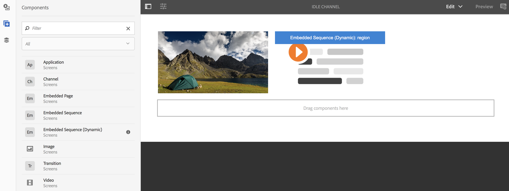

# Lägga till komponenter i en kanal{#adding-components-to-a-channel}

Komponenter är de grundläggande elementen i AEM (Adobe Experience Manager). Du kan använda flera komponenter och lägga till dem i en kanal i ett AEM Screens-projekt.

## Komponenter i AEM Screens {#components-in-aem-screens}

AEM Screens har olika AEM som kan användas i ett skärpeprojekt.

### Visa AEM Screens-komponenter {#viewing-aem-screens-components}

När du skapar ett AEM Screens-projekt visas en lista med standardkomponenter som kan läggas till i projektet.

Följ stegen nedan om du vill visa standardkomponenterna för ditt skärmsprojekt:

1. Klicka på kanalen. Till exempel: **`We.Retail In Store`** > **Kanaler** > **Inaktiv kanal**.

1. Klicka **Redigera** i åtgärdsfältet.
1. I AEM Editor klickar du på **+** -ikonen från sidorutan.
1. Alla komponenter som ingår som standard i ett AEM Screens-projekt visas, vilket visas i bilden nedan.

### Lägga till en ny komponent {#adding-a-new-component}

AEM innehåller flera andra komponenter. Du kan alltid lägga till andra komponenter (ingår inte som standard) i ditt projekt, eftersom dessa komponenter är kompatibla med AEM Screens.

I följande exempel visas hur en Livefyre-komponent läggs till i ett AEM Screens-projekt:

1. Klicka på den kanal där du vill lägga till en komponent. Till exempel: **`We.Retail In Store`** > **Kanaler** > **Inaktiv kanal**.

1. Klicka **Redigera** i åtgärdsfältet.
1. Klicka **Design** läge.
1. Klicka på hela designredigeraren till höger och klicka på inställningssymbolen så att du kan öppna **Parsys Design** -dialogrutan.
1. Du kan klicka på de komponenter du vill importera till ditt AEM Screens-projekt. I följande exempel visas tillägget **Livefyre** till ett AEM Screens-projekt.

>[!NOTE]
>
>På samma sätt kan du lägga till valfritt antal andra komponenter som är kompatibla med AEM Screens i ditt projekt.

## Förstå AEM skärmkomponenter {#understanding-aem-screen-components}

I följande avsnitt förklaras vilka AEM Screens-komponenter du kan använda i ditt projekt.

>[!NOTE]
>
>Om du vill visa egenskaperna för en komponent klickar du på komponenten och sedan på hamsikonen för att öppna/visa egenskaper.

### Program {#application}

The **Program** kan du lägga till ett program i kanalen.

Programkomponenten har följande egenskaper:

| **Egenskap** | **Beskrivning** |
|---|---|
| ***Programsökväg*** | Klicka på den absoluta sökvägen där programmet finns. |
| ***Varaktighet (millisekunder)*** | Klicka på programmets varaktighet. Som standard är längden inställd på -1, vilket innebär att elementet körs för alltid (dvs. ett program med en sida). Om du ställer in varaktighetsvärdet >0 visas elementet för den angivna varaktigheten och fortsätter sedan till nästa. |

I följande exempel visas hur du bäddar in en programkomponent tillsammans med förhandsgranskningen av dess egenskaper:

>[!NOTE]
>
>Se exemplet ovan för att visa egenskaperna för var och en av komponenterna nedan.

### Kanal {#channel}

The **Kanal** kan du lägga till en hel kanal i projektet.

Komponenten Channel har följande egenskaper:

<table>
 <tbody>
  <tr>
   <td><strong>Egenskap</strong></td>
   <td><strong>Beskrivning</strong></td>
  </tr>
  <tr>
   <td><strong><em>Kanalsökväg</em></strong></td>
   <td>Välj den absoluta sökvägen där programmet finns.  </td>
  </tr>
  <tr>
   <td><strong><em>Varaktighet (millisekunder)</em></strong></td>
   <td>Markera kanalens hela längd. Om du anger längden som -1 anger du att den inbäddade kanalen körs i sin fulla längd i en viss kanal.</td>
  </tr>
 </tbody>
</table>

### Inbäddad sida {#embedded-page}

An **Inbäddad sida** Med kan du lägga till en inbäddad sida i projektet. Det kan till exempel vara ett webbprogram eller en produktkatalog.

Den inbäddade sidan har följande egenskaper:

<table>
 <tbody>
  <tr>
   <td><strong>Egenskap</strong></td>
   <td><strong>Beskrivning</strong></td>
  </tr>
  <tr>
   <td><strong><em>Sidsökväg  </em></strong></td>
   <td>Välj den här absoluta sökvägen där kanalen finns.  </td>
  </tr>
  <tr>
   <td><strong><em>Varaktighet (millisekunder)</em></strong></td>
   <td>Markera kanalens hela längd. Om du anger längden som -1 anger du att den inbäddade kanalen körs i sin fulla längd i en viss kanal.</td>
  </tr>
 </tbody>
</table>

### Inbäddad sekvens {#embedded-sequence}

>[!NOTE]
>
>Mer information om inbäddade sekvenser finns i [Inbäddade sekvenser](embedded-sequences.md) under Authoring Screens.

Med en inbäddad sekvens kan du lägga till en inbäddad sekvenskanal i den befintliga kanalen (med andra resurser).

Den inbäddade sekvensen har följande sidegenskaper:

<table>
 <tbody>
  <tr>
   <td><strong>Egenskap</strong></td>
   <td><strong>Beskrivning</strong></td>
  </tr>
  <tr>
   <td>Kanalsökväg</td>
   <td>Välj den absoluta sökvägen för den sekvens som du vill ta med i kanalen.  </td>
  </tr>
  <tr>
   <td><strong><em>Varaktighet (millisekunder)</em></strong></td>
   <td>Markera kanalens hela längd. Om du anger längden som -1 anger du att den inbäddade kanalen körs i sin fulla längd i en viss kanal.</td>
  </tr>
  <tr>
   <td><strong><em>Strategi</em></strong></td>
   <td>Ställ in den på <strong>original</strong> eller <strong>enkel</strong>. Ange värdet för <strong>original</strong> betyder att efterföljande körning körs helt och hållet på varje cykel i den överordnade sekvensen. Det andra möjliga värdet är <strong>enkel</strong>. Ett sådant värde visar bara en post i varje efterföljande körning. Det första objektet i den första slingan och det andra objektet i den andra slingan.</td>
  </tr>
 </tbody>
</table>

### Dynamisk inbyggd sekvens {#dynamic-embedded-sequence}

Med en dynamisk inbäddad sekvens kan du lägga till en sekvens som liknar den ovan nämnda förutom efter kanalroll.

Mer information om inbäddade sekvenser finns i [Inbäddade sekvenser](embedded-sequences.md) under Authoring Screens.

Den dynamiska inbäddade sekvensen har följande egenskaper:

<table>
 <tbody>
  <tr>
   <td><strong>Egenskap</strong></td>
   <td><strong>Beskrivning</strong></td>
  </tr>
  <tr>
   <td><strong><em>Kanaltilldelningsroll</em></strong>  </td>
   <td>Ange kanalrollen.  </td>
  </tr>
  <tr>
   <td><strong><em>Varaktighet (millisekunder)</em></strong></td>
   <td>Markera kanalens hela längd. Om du anger längden som -1 anger du att den inbäddade kanalen körs i sin fulla längd i en viss kanal.</td>
  </tr>
  <tr>
   <td><strong><em>Strategi</em></strong></td>
   <td>Ställ in den på <strong>original</strong> eller <strong>enkel</strong>. Ange värdet för <strong>original</strong> betyder att efterföljande körning körs helt och hållet på varje cykel i den överordnade sekvensen. Det andra möjliga värdet är <strong>enkel</strong>. Ett sådant värde visar bara en post i efterföljande körningar. Det första objektet i den första slingan och det andra objektet i den andra slingan.</td>
  </tr>
 </tbody>
</table>

### Experience Fragment {#experience-fragment}

Med ett Experience Fragment kan du lägga till ett Experience Fragment (en grupp med en eller flera komponenter, inklusive innehåll och layout som kan refereras på sidor) i din AEM Screens-kanal. Dra och släpp komponenten till AEM Editor och klicka på Experience Fragment.

Mer information om hur du skapar en Experience Fragment och använder den i ett AEM Screens-projekt finns i [Använda upplevelsefragment](experience-fragments-in-screens.md).

| **Egenskap** | **Beskrivning** |
|---|---|
| **Experience Fragment** |
| ***Experience Fragment*** | Välj Experience Fragment. |
| ***Varaktighet*** | Markera hela längden på Experience Fragment som spelas upp i kanalen. |
| **Offlinekonfiguration** |
| ***Bibliotek på klientsidan*** | JavaScript- och CSS-filer. |
| ***Statiska filer*** | Statiska filer som du kan lägga till som offlinekonfigurationer i din Experience Fragment. |

>[!NOTE]
>
>The **Bibliotek på klientsidan** och **Statiska filer** som du lägger till från den här komponenten förutom redan konfigurerade **Bibliotek på klientsidan** och de statiska filer som läggs till från Experience Fragment **Egenskaper**.

### Bild {#image}

Med en bild kan du lägga till en bild i kanalen.

Bildresursen har tre flikar, nämligen **Bild**, **Tillgänglighet** och **Sekvens**:

| **Egenskap** | **Beskrivning** |
|---|---|
| **Bild** |
| ***Bildresurs*** | Klicka på bildresursen. |
| ***Titel*** | Bildens namn. |
| ***Länka till*** | Lägg till en länk till bilden. |
| ***Beskrivning*** | Kort beskrivning av bilden. |
| ***Storlek*** | Bildens storlek. |
| **Tillgänglighet** |
| ***Alternativ text*** | Alternativ text till bilden. |
| **Sekvens** |
| ***Varaktighet*** | Som standard är längden inställd på *8 000 millisekunder*. Om du vill ändra uppspelningstiden för bilden uppdaterar du **Varaktighet** fält. |

### Övergång {#transition}

Med komponenten Övergång kan du lägga till en övergång i skärmsprojektet.

I följande bild visas övergångskomponenten (som lagts till med dra och släpp) i redigeraren.

Klicka på övergångsikonen och klicka på **Konfigurera** (skiftnyckelsikon) för att öppna **Övergång** -dialogrutan. Den här dialogrutan innehåller tre flikar:

* **Övergång**
* **Sekvens**
* **Aktivering**

>[!NOTE]
>
>Som standard är sekvensen inställd på 600 millisekunder. Du kan uppdatera övergångssekvensen till andra värden med **Sekvens** -fliken.

Övergångskomponenten har följande egenskaper:

<table>
 <tbody>
  <tr>
   <td><strong>Egenskap</strong></td>
   <td><strong>Beskrivning</strong></td>
  </tr>
  <tr>
   <td><strong>Övergång</strong></td>
   <td></td>
  </tr>
  <tr>
   <td><strong><em>Typ</em></strong></td>
   <td>
Typ av övergång mellan elementet före och det efter. Övergången <strong>Typ</strong> innehåller följande alternativ:

    <ul>
     <li><strong>Normal</strong></li>
     <li><strong>Tona</strong></li>
     <li><strong>Glid in från höger</strong></li>
     <li><strong>Glid in från vänster</strong></li>
     <li><strong>Glid in uppifrån</strong></li>
     <li><strong>Glid in nedifrån</strong></li>
    </ul> </td>
  </tr>
  <tr>
   <td><strong>Sekvens</strong></td>
   <td></td>
  </tr>
  <tr>
   <td><strong><em>Varaktighet</em></strong></td>
   <td>Markera hela övergångstiden. Standardinställningen är 600 millisekunder.</td>
  </tr>
  <tr>
   <td><strong>Aktivering</strong></td>
   <td></td>
  </tr>
  <tr>
   <td><strong><em>Aktiv från</em></strong></td>
   <td>Tidsstämpel som beskriver när övergången kan aktiveras.  </td>
  </tr>
  <tr>
   <td><strong><em>Aktiv tills</em></strong></td>
   <td>Tidsstämpeln beskriver tills när övergången kan vara aktiv.</td>
  </tr>
  <tr>
   <td><strong><em>Schema</em></strong></td>
   <td>Lägg till ett fördefinierat schema.</td>
  </tr>
 </tbody>
</table>

### Video {#video}

Med videokomponenten kan du lägga till en video i skärmsprojektet.

Videokomponenten har följande egenskaper:

<table>
 <tbody>
  <tr>
   <td><strong>Egenskap</strong></td>
   <td><strong>Beskrivning</strong></td>
  </tr>
  <tr>
   <td><em><strong>Videoresurs</strong></em></td>
   <td>Klicka på länken till videon.</td>
  </tr>
  <tr>
   <td><em><strong>Varaktighet</strong></em></td>
   <td>Välj videons längd. Som standard är längden inställd på -1, vilket innebär att elementet körs för alltid. Om du ställer in varaktighetsvärdet &gt;0 visas elementet för den angivna varaktigheten och fortsätter sedan till nästa.  </td>
  </tr>
  <tr>
   <td><em><strong>Återgivning</strong></em></td>
   <td>
Om videoproportionerna inte passar skärmen kan du justera återgivningen till antingen <strong>innehåller</strong> eller <strong>täckning</strong>.
 
<em>Innehåller</em> betyder att hela videon visas och att de saknade områdena har en svart ram.
 
<em>Omslag</em> betyder att videon täcker hela visningsrutan, men vissa delar som flödar över sidorna är dolda.
 </td>
  </tr>
  <tr>
   <td><em><strong>Storlek</strong></em></td>
   <td>Videons storlek.</td>
  </tr>
 </tbody>
</table>
