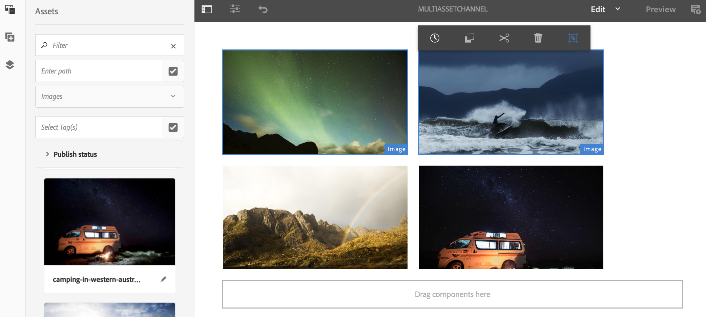

# Aktivering på tillgångsnivå {#asset-level-scheduling}

Den här sidan beskriver resursnivåaktivering för de resurser som används i kanaler.

Följande ämnen behandlas i detta avsnitt:

* Översikt
* Aktiveringsfönster
* Uppspelning av enstaka händelse
* Hantera återkommande i resurser
   * DayParting
   * WeekParting
   * MånadDelning
   * Kombination av partner
* Aktivering av flera resurser

>[!CAUTION]
>
>Denna AEM Screens-funktionalitet är endast tillgänglig om du har installerat AEM 6.3 Feature Pack 3 eller AEM 6.4 Screens Feature Pack 1.
>
>Om du vill få tillgång till det här funktionspaketet måste du kontakta Adobe Support och begära åtkomst. När du har behörighet kan du hämta den från paketresursen.

## Översikt {#overview}

***Aktivering*** på tillgångsnivå gör att du kan aktivera en viss resurs i en kanal för en schemalagd tidsram i spelarens lokala tidszon. Detta är tillgängligt för bilder, videoklipp, övergångar, sidor och inbäddade kanaler (dynamiska eller statiska).

*Du vill till exempel* att en specialkampanj endast ska visas under en glad timme (2:00 till 5:00) på måndagar och onsdagar.

Med den här funktionen kan du inte bara ange start- och slutdatum och sluttid utan även ett upprepningsmönster.

## Aktiveringsfönster {#single-event-playback}

Aktivering på resursnivå görs genom att fliken **Aktivering** konfigureras medan egenskaperna för en resurs nås.

Följ stegen nedan för att utföra planering på tillgångsnivå:

1. Markera en kanal och klicka på **Redigera** i åtgärdsfältet för att lägga till eller redigera innehåll i kanalen.

   

   >[!NOTE]
   >
   >Mer information om hur du
   >
   >* Skapa ett projekt, se [Skapa ett nytt projekt](creating-a-screens-project.md).
   >* Skapa och lägga till innehåll i en kanal, se [Hantera kanaler](managing-channels.md).

1. Klicka på **Redigera** för att öppna kanalredigeraren och välja en resurs som du vill använda schemaläggningen på.

   

1. Markera resursen och klicka på överst till vänster **Konfigurera** (skiftnyckelsikon) för att öppna bildens egenskaper.

   Klicka på fliken **Aktivering**.

   

1. Du kan ange datumet från datumväljaren med hjälp av fälten **Aktiv från** och **Aktiv tills**.

   Om du väljer **Aktiv från** och **Aktiv till** datum och tid visas och upprepas resursen endast mellan startdatumet/tiden respektive slutdatumet/sluttiden.

   

## Hantera upprepning i resurser {#handling-recurrence-in-assets}

Du kan schemalägga att mediefiler ska återkomma med vissa intervall på daglig, veckovis eller månadsbasis efter behov.

Anta att du bara vill visa en bild på fredag från 1:00 till 10:00. Du kan använda fliken **Aktivering** för att ange önskat intervall för resursen.

### Dag som delar {#day-parting}

1. Markera resursen och klicka på **Konfigurera** (skiftnyckelsikon) för att öppna dialogrutan för egenskaper.

1. När du har angett startdatum/tid och slutdatum/tid kan du använda ett uttryck eller en naturlig textversion för att ange upprepningsschemat.

   >[!NOTE]
   >Du kan hoppa över eller ta med fälten **Aktiv från** och **Aktiv tills** och lägga till uttrycket i fältet Scheman efter behov.

1. Ange uttrycket i **Schedule** så visas resursen för det angivna intervallet för dag och tid.

#### Exempeluttryck för dagdelning {#example-one}

I följande tabell sammanfattas några exempeluttryck som du kan lägga till i schemat när du tilldelar kanal till en visning.

| **Uttryck** | **Tolkning** |
|---|---|
| före 08:00 | resursen i kanalen spelas upp innan klockan åtta varje dag |
| efter klockan 2:00 | resursen i kanalen spelas upp efter klockan 17:00 varje dag |
| efter 12:15 och före 12:45 | resursen i kanalen spelas upp efter kl. 12.15 varje dag i 30 minuter |
| före 12:15 även efter 12:45 | resursen i kanalen spelas upp före kl. 12.15 varje dag och även efter kl. 12.45 |

>[!NOTE]
>
>Du kan också använda _militär tid_-notation (d.v.s. 14:00) i stället för *am/pm*-notation (d.v.s. 2:00).

### WeekParting {#week-parting}

1. Markera resursen och klicka på **Konfigurera** (skiftnyckelsikon) för att öppna dialogrutan för egenskaper.

1. När du har angett startdatum/tid och slutdatum/tid kan du använda ett uttryck eller en naturlig textversion för att ange upprepningsschemat.

   >[!NOTE]
   >Du kan hoppa över eller ta med fälten **Aktiv från** och **Aktiv tills** och lägga till uttrycket i fältet Scheman efter behov.

1. Ange uttrycket i **Schedule** så visas resursen för det angivna intervallet för dag och tid.

#### Exempeluttryck för WeekParting {#example-two}

I följande tabell sammanfattas några exempeluttryck som du kan lägga till i schemat när du tilldelar kanal till en visning.

| **Uttryck** | **Tolkning** |
|---|---|
| Mån,Vind,Fre | mediefilen spelas upp i kanalen från måndag, onsdag och fredag |
| mån-Thu | resursen spelas upp i kanalen från måndagar till torsdagar |

>[!NOTE]
>
>Du kan också använda _full_-notation (d.v.s. måndag,onsdag,fredag) i stället för _kort_-notation (d.v.s. Mon,Wed,Fri).

### MonthParting {#month-parting}

1. Markera resursen och klicka på **Konfigurera** (skiftnyckelsikon) för att öppna dialogrutan för egenskaper.

1. När du har angett startdatum/tid och slutdatum/tid kan du använda ett uttryck eller en naturlig textversion för att ange upprepningsschemat.

   >[!NOTE]
   >Du kan hoppa över eller ta med fälten **Aktiv från** och **Aktiv tills** och lägga till uttrycket i fältet Scheman efter behov.

1. Ange uttrycket i **Schedule** så visas resursen för det angivna intervallet för dag och tid.

#### Exempeluttryck för MonthParting {#example-three}

I följande tabell sammanfattas några exempeluttryck som du kan lägga till i schemat när du tilldelar kanal till en visning.

| **Uttryck** | **Tolkning** |
|---|---|
| februari,maj,augusti,november | mediefilen spelas upp i februari, maj, augusti och november |
| februari-juli | tillgången spelas upp i kanalen från februari hela tiden fram till slutet av juli |

>[!NOTE]
>När du definierar veckodagar och månader kan du både använda kort- och fullnamnsnoteringar, till exempel måndag/måndag och januari.

### Kombination av partner {#combined-parting}

1. Markera resursen och klicka på **Konfigurera** (skiftnyckelsikon) för att öppna dialogrutan för egenskaper.

1. När du har angett startdatum/tid och slutdatum/tid kan du använda ett uttryck eller en naturlig textversion för att ange upprepningsschemat.

   >[!NOTE]
   >Du kan hoppa över eller ta med fälten **Aktiv från** och **Aktiv tills** och lägga till uttrycket i fältet Scheman efter behov.

1. Ange uttrycket i **Schedule** så visas resursen för det angivna intervallet för dag och tid.

#### Exempeluttryck för en kombination av partner {#example-four}

I följande tabell sammanfattas några exempeluttryck som du kan lägga till i schemat när du tilldelar kanal till en visning.

| **Uttryck** | **Tolkning** |
|---|---|
| efter 6:00 och före 18:00 i Mon, Wed of Jan-Mar | tillgången spelas upp i kanalen mellan kl. 6.00 och kl. 18.00 måndag och onsdag från januari till slutet av mars |
| den första dagen i januari efter kl. 2:00 också den andra dagen i januari, även den tredje dagen i januari före kl. 3:00 | resursen i kanalen börjar spelas upp efter kl. 2:00 den 1 januari och fortsätter att spela för hela dagen den 2 januari ända till kl. 3:00 den 3 januari |
| den 1-2 januari efter kl. 2:00 också den 2-3 januari före kl. 3:00 | resursen i kanalen startar spelaren efter kl. 2:00 den 1 januari, fortsätter att spelas upp till kl. 17:00 den 2 januari och börjar igen kl. 2:00 och fortsätter att spelas upp till kl. 3:00 den 3 januari |

>[!NOTE]
>När du definierar veckodagar och månader kan du både använda kort- och fullnamnsnoteringar, till exempel måndag/måndag och januari.  Dessutom kan du använda _militär tid_-notation (d.v.s. 14:00) i stället för *am/pm*-notation (d.v.s. 2:00).

## Aktivering av flera resurser {#multi-asset-scheduling}

>[!CAUTION]
>
>Funktionen **Aktivering av flera resurser** är bara tillgänglig om du har installerat AEM 6.3 Feature Pack 5 eller AEM 6.4 Feature Pack 3.

***Aktivering av flera resurser*** gör att användaren kan välja flera resurser och tillämpa ett uppspelningsschema för alla valda resurser.

### Förutsättningar {#prerequisites}

Skapa ett AEM Screens-projekt med en sekvenskanal om du vill använda multimedieaktivering för dina resurser. I följande exempel visas implementeringen av funktionen:

* Skapa ett AEM Screens-projekt med namnet **MultiAssetDemo**
* Skapa en kanal med namnet **MultiAssetChannel** och lägg till innehåll i kanalen enligt bilden nedan

Följ stegen nedan för att välja flera resurser och schemalägga hur de ska visas i ett AEM Screens-projekt:

1. Välj **MultiAssetChannel** och klicka på **Redigera** i åtgärdsfältet för att öppna redigeraren.

   

1. Markera flera resurser i redigeraren och klicka på **Redigera aktivering** (ikonen längst upp till vänster).

   

1. Välj datum och tid i **Aktiv från** och **Aktiv tills** i dialogrutan **Aktivering av komponent**. Klicka på bockmarkeringsikonen när du är klar med att välja scheman.

   

1. Klicka på Uppdatera för att kontrollera de resurser som används i ett schema för flera resurser.

   >[!NOTE]
   >
   >Schemaikonen visas i det övre högra hörnet för resurser som har aktivering av flera resurser.

   

