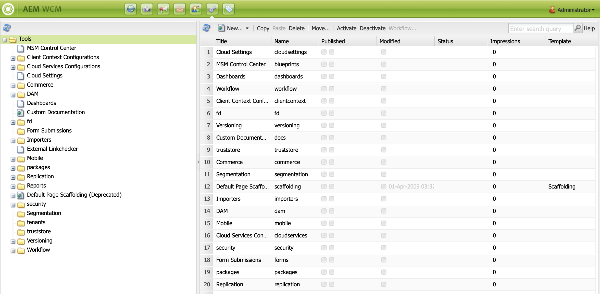

# Konfigurera författare- och publiceringsinstanser i AEM Screens {#configuring-author-and-publish-in-aem-screens}

På den här sidan beskrivs följande ämnen:

* **Konfigurerar författare- och publiceringsinstanser**
* **Konfigurerar publiceringstopologi**
* **Hantera publikation: Levererar innehållsuppdateringar från författaren som ska publiceras på enheten**

## Förutsättningar {#prerequisites}

Innan du börjar använda författar- och publiceringsservrar bör du ha kännedom om:

* **AEM Topology**
* **Skapa och hantera AEM Screens-projekt**
* **Device Registration Process**

>[!NOTE]
>
>Den här AEM Screens-funktionen är endast tillgänglig om du har installerat AEM 6.4 Screens Feature Pack 2. Kontakta Adobe Support och begär åtkomst till detta funktionspaket. När du har behörighet kan du hämta den från paketresursen.

>[!IMPORTANT]
>
>Om du vill använda mer än en Publish-instans med Dispatcher uppdaterar du Dispatcher. Se [Aktivera anteckningssessioner](dispatcher-configurations-aem-screens.md#enable-sticky-session).

## Konfigurera författare- och publiceringsinstanser {#configuring-author-and-publish-instances}

>[!NOTE]
>
>Mer information om översikten över arkitekturen Författare och Publicera och hur innehållet skapas i en AEM Author-instans och sedan vidarebefordras till flera publiceringsinstanser finns i [Översikt över redigerings- och publiceringsarkitekturen](author-publish-architecture-overview.md).

I följande avsnitt beskrivs hur du konfigurerar replikeringsagenter i topologin Författare och Publicera.

Du kan skapa ett enkelt exempel där du har en Author-instans och två Publish-instanser:

* Författare > localhost:4502
* Publicera 1 (pub1) > localhost:4503
* Publicera 2 (pub2) > localhost:4504

## Konfigurera replikeringsagenter på författare {#setting-replication-agents}

Lär dig hur du skapar en standardoperationsagent för replikering när du vill skapa replikeringsagenter.

Det finns tre replikeringsagenter som behövs för Screens:

1. **Standardreplikeringsagent &#x200B;***(anges som&#x200B;*** standardreplikeringsagent**)
1. **Screens Replication Agent**
1. **Agenten för omvänd replikering**

### Steg 1: Skapa en standardreplikeringsagent {#step-creating-a-default-replication-agent}

Följ stegen nedan om du vill skapa en standardsvar för replikering:

1. Navigera till din AEM-instans > hammikon > **Åtgärder** > **Konfiguration**.

   

1. Klicka på **Replikering** i det vänstra navigeringsträdet.

   

1. Klicka på **Agenter på författare** i mappen **Replikering** och klicka på **Nytt** för att skapa en ny standardreplikeringsagent.

   

1. Ange **Titel** och **Namn** så att du kan skapa replikeringsagenten och klicka sedan på **Skapa**.

   

1. Högerklicka på replikeringsagenten och klicka på **Öppna** för att redigera inställningarna.

   

1. Klicka på **Redigera**.

1. Ange informationen i dialogrutan **Agentinställningar**.

   >[!NOTE]
   >
   >Användaren måste kontrollera **Aktiverad** för att aktivera replikeringsagenten. Markera det här alternativet för standardagenter, Screens-agenter och omvända replikeringsagenter.

   

1. Navigera till fliken **Transport** och ange **URI**, **Användare** och **Lösenord**.

   

   >[!NOTE]
   >
   >Du kan också kopiera och byta namn på en befintlig standardreplikeringsagent.

#### Skapa standardreplikeringsagenter {#creating-standard-replication-agents}

1. Skapa en standardreplikeringsagent för pub1 (en standardagent som inte är installerad bör redan vara konfigurerad). Exempel: *`https://<hostname>:4503/bin/receive?sling:authRequestLogin=1`*
1. Skapa en standardreplikeringsagent för pub2. Du kan kopiera som replikeringsagent för pub1 och uppdatera transporten som ska användas för pub2 genom att ändra porten i transportkonfigurationen. Exempel: *`https://<hostname>:4504/bin/receive?sling:authRequestLogin=1`*.

#### Skapa Screens replikeringsagenter {#creating-screens-replication-agents}

1. Skapa en AEM Screens-replikeringsagent för pub1. Det finns en färdig Screens-replikeringsagent som pekar på port 4503. Aktivera det.
1. Skapa en AEM Screens-replikeringsagent för pub2. Kopiera Screens replikeringsagent för pub1 och ändra porten till 4504 för pub2.

   >[!NOTE]
   >Mer information om hur du konfigurerar Screens replikeringsagenter finns i [Konfigurera Screens Replication Agent](https://experienceleague.adobe.com/en/docs/experience-manager-screens/user-guide/administering/configure-screens-replication).

#### Skapa omvända replikeringsagenter för Screens {#creating-screens-reverse-replication-agents}

1. Skapa en omvänd replikeringsagent för pub1.
1. Skapa en omvänd replikeringsagent för pub2. Du kan kopiera den omvända replikeringsagenten för pub1 och uppdatera transporten som ska användas för pub2 genom att ändra porten i transportkonfigurationen.

## Konfigurera publiceringstopologi {#setting-up-publish-topology}

### Steg 1: Konfigurera Apache Sling Oak-baserad identifiering {#step-configure-apache-sling-oak-based-discovery}

Konfigurera Apache Sling Oak-baserad Discovery för alla publiceringsinstanser i topologin

För varje publiceringsinstans:

1. Navigera till `https://<host>:<port>/system/console/configMgr`
1. Klicka på **Konfiguration av Apache Sling Oak-baserad Discovery Service**.
1. Uppdatera topologianslutnings-URL:er: lägg till URL:er för alla tolkande publiceringsinstanser:
   * `https://publish:4503/libs/sling/topology/connector`
   * `https://publish:4504/libs/sling/topology/connector`
1. **Topologianslutning `Whitelist` Lista**: Anpassa till IP-adresser eller undernät som omfattar alla publiceringsinstanser. Kontrollera att du `whitelist` IP-/värdnamnet för alla publiceringsinstanser utan portnumret.

1. Aktivera **Stoppa lokala loopar automatiskt**

Konfigurationen ska vara identisk för varje Publish-instans och Local-loop som automatiskt stoppar förhindrar en oändlig slinga.

#### Steg 2: Verifiera publiceringstopologi {#step-verify-publish-topology}

Navigera till `https://:/system/console/topology` för alla publiceringsinstanser. Du bör se varje Publish-instans representeras i topologin under **Utgående topologianslutningar**.

#### Steg 3: Konfigurera ActiveMQ-objektkluster {#step-setup-activemq-artemis-cluster}

I det här steget kan du skapa ett krypterat lösenord för ActiveMQ Artemis-klustret.
Klusteranvändaren och lösenordet för alla publiceringsinstanser i topologin måste vara identiska. Lösenordet för ActiveMQ Artemis-konfigurationen måste vara krypterat. Eftersom varje instans har en egen krypteringsnyckel måste du använda krypteringsstöd för att skapa en krypterad lösenordssträng. Sedan kan det krypterade lösenordet användas i OSGi-konfigurationen för ActiveMQ.

På varje publiceringsinstans:

1. I OSGi-konsolen går du till **MAIN** > **Crypto Support** (`https://<host>:<port>/system/console/crypto`).
1. Skriv det lösenord för oformaterad text (samma för alla förekomster) i **Oformaterad text**
1. Klicka på **Skydda**.
1. Kopiera värdet **Skyddad text** till ett anteckningsblock eller en textredigerare. Det här värdet kan användas i OSGi-konfigurationen för ActiveMQ.

Eftersom varje publiceringsinstans som standard har unika krypteringsnycklar utför du det här steget på varje pub-instans och sparar den unika nyckeln för nästa konfiguration.

>[!NOTE]
>
>Lösenordet ska börja och sluta med klammerparenteser. Till exempel:
>&#x200B;>`{1ec346330f1c26b5c48255084c3b7272a5e85260322edd59119828d1fa0a610e}`

#### Steg 4: Aktivera ActiveMQ-artemis-kluster {#step-activate-activemq-artemis-cluster}

På varje publiceringsinstans:

1. Navigera till OSGi Config-hanteraren `https://<host>:<port>/system/console/configMgr`
1. Klicka på **Konfiguration för Apache ActiveMQ Artemis JMS Provider**
1. Uppdatera följande:

   * ***Klusterlösenord***: använd krypterat värde från föregående steg per instans
   * ***Ämnen***: `{name: 'commands', address: 'com.adobe.cq.screens.commands', maxConsumers: 50}`

#### Verifiera ActiveMQ-objektkluster {#verify-activemq-artemis-cluster}

Följ stegen nedan för varje publiceringsinstans:

1. Navigera till OSGi Console > Main > ActiveMQ Artemis `https://localhost:4505/system/console/mq`.
1. Verifiera och kontrollera om du vill visa portar för andra instanser under Klusterinformation > Topologi > noder=2, members=2.
1. Skicka ett testmeddelande (högst upp på skärmen under Information om mäklare)
1. Ange följande ändringar i fält:

   1. **Mål**: /com.adobe.cq.screens/devTestTopic
   1. **Text**: Hello World
   1. Visa `error.log` för varje instans så att du kan se att meddelandet skickades och togs emot i klustret.

>[!NOTE]
>
>Det kan ta några sekunder att navigera till OSGi Console efter att konfigurationen har sparats i föregående steg. Du kan också kontrollera error.log för mer information.

Följande bild visas till exempel när ActiveMQ Artemis Server har konfigurerats.

Om du inte ser följande konfiguration från */system/console/mq* går du till */system/console/mq* och klickar på **Starta om** för att starta om mäklaren.

#### Ta bort krav på referensrubrik {#remove-referrer-header-requirement}

Följ stegen i varje publiceringsinstans:

1. Navigera till **OSGi-konsolen** > **Configuration Manager**
1. Klicka på **Refererarfilter för Apache Sling**
1. Uppdatera konfigurationen och **markera Tillåt tomt**

### Konfigurera författare och publiceringsinstans {#configuring-author-and-publish-instance}

När du har konfigurerat publiceringstopologin konfigurerar du författar- och publiceringsinstanserna för att visa de praktiska resultaten av implementeringen:

>[!NOTE]
>
>**Förutsättningar**
>
>För att komma igång med det här exemplet skapar du ett AEM Screens-projekt följt av att du skapar en plats, visning och kanal i ditt projekt. Lägg till innehåll i kanalen och tilldela kanalen till en skärm.

#### Steg 1: Starta en AEM Screens Player (enhet)

1. Starta ett separat webbläsarfönster.
1. Gå till Screens Player med *webbläsaren*, det vill säga `https://localhost:4502/content/mobileapps/cq-screens-player/firmware.html`, eller starta AEM Screens-appen. När du öppnar enheten bör du observera att enhetens status är oregistrerad.

>[!NOTE]
>
>Du kan öppna en AEM Screens Player med den AEM Screens-app du har laddat ned eller med webbläsaren.

#### Steg 2: Registrera en enhet på författaren {#step-registering-a-device-on-author}

1. Gå till `https://localhost:4502/screens.html/content/screens/we-retail` eller klicka på projektet och gå till Enheter > Enhetshanteraren.
1. Klicka på **Registrera enhet**.
1. Klicka på **Enhetsregistrering**.
1. Klicka på den enhet som du vill registrera och klicka sedan på **Registrera enhet**.
1. Verifiera registreringskoden och klicka sedan på **Validera**.
1. Ange en rubrik för enheten och klicka sedan på **Registrera**.

#### Steg 3: Tilldela enheten till visning {#step-assigning-the-device-to-display}

1. Klicka på **Tilldela visning** i dialogrutan från föregående steg.
1. Klicka på kanalens visningssökväg i mappen **Platser**.
1. Klicka på **Tilldela**.
1. Klicka på **Slutför** för att slutföra processen, och nu tilldelas enheten.

Kontrollera spelaren och lägg märke till innehållet som du har lagt till i kanalen.

#### Steg 4: Publicera enhetskonfiguration för publiceringsinstanser {#step-publishing-device-configuration-to-publish-instances}

**Verifiera enheten**

Så här replikerar du enhetsanvändaren:

1. Gå till sidan för användaradministration. Exempel: `https://localhost:4502/useradmin`.
1. Sök efter gruppen **`screens-devices-master`**.
1. Högerklicka på gruppen och klicka på **Aktivera**.

>[!CAUTION]
>
>Aktivera inte författaren-publish-screens-service eftersom det är en systemanvändare som används av författarjobbet.

Du kan även aktivera enheten från enhetshanteringskonsolen. Följ stegen nedan:

1. Gå till ditt Screens-projekt > **Enheter**.
1. Klicka på **Enhetshanteraren** i åtgärdsfältet.
1. Klicka på enheten och klicka på **Aktivera** i åtgärdsfältet enligt bilden nedan.

>[!NOTE]
>
>När du har aktiverat enheten kan du även redigera eller uppdatera serverns URL. Klicka på **Redigera server-URL** i åtgärdsfältet, så som visas i bilden nedan. Ändringarna sprids till AEM Screens Player.

### Publicera checklista {#publishing-check-list}

Följande punkter sammanfattar publiceringskontrolllistan:

* *Screens Device User* - Den här informationen lagras som en AEM-användare och kan aktiveras från **Tools** > **Security** > **Users**. Användaren har prefixet&quot;screens&quot; med en lång serialiserad sträng.

* *Projekt* - AEM Screens-projektet.
* *Plats* - Plats som enheten är ansluten till.
* *Kanaler* - en eller flera kanaler som visas på platsen.
* *Schema* - Om du använder ett schema måste du se till att schemat publiceras.
* *Plats, Scheman och Kanalmapp* - Om motsvarande resurser finns i en mapp.

Följ stegen nedan för att verifiera hur redigering och publicering fungerar:

1. Uppdatera visst kanalinnehåll på Author-instansen.
1. Utför **Hantera publikation** om du vill publicera nya ändringar i alla publiceringsinstanser.
1. Klicka på **Aktivera** om du vill aktivera enheten från **Enhetshanteraren**.
1. Välj **Redigera URL** från författarinstansens URL till en av publiceringsinstansens URL.
1. Kontrollera att det uppdaterade kanalinnehållet visas i AEM Screens Player.
1. Upprepa dessa steg med en annan Publish-instans.

#### Steg 5: Peka på Enheten för att publicera instansen på administratörspanelen {#step-pointing-the-device-to-publish-instance-in-the-admin-panel}

1. Visa administratörsgränssnittet från Screens Player, tryck länge på det övre vänstra hörnet så att du kan öppna Admin-menyn, AEM Screens Player med pekfunktion eller med en mus.
1. Klicka på alternativet **Konfiguration** på sidopanelen.
1. Ändra Author-instansen till Publish-instansen i **Server**.

Se ändringarna i AEM Screens Player.

Du kan även uppdatera/redigera server-URL:en från enhetshanteringskonsolen genom att följa följande steg:

1. Navigera till ditt AEM Screens-projekt och klicka på mappen **Enheter** .
1. Klicka på **Enhetshanteraren** i åtgärdsfältet.
1. Klicka på enheten och klicka sedan på **Redigera server-URL** i åtgärdsfältet, så som visas i bilden nedan. Ändringarna sprids till AEM Screens Player.

Med funktionen **`Manage Publication`** kan du leverera innehållsuppdateringar från författare till publiceringsenhet. Du kan publicera/avpublicera innehåll för hela AEM Screens-projektet eller bara för en av dina kanaler, platser, enheter, program eller scheman. Mer information om den här funktionen finns i [Uppdatera innehåll på begäran](on-demand-content.md).

## Felsökningstips {#troubleshoot-tips}

Följ avsnittet nedan för att få svar på vanliga frågor om författaren och publiceringskonfigurationen.

### Hur lägger jag till en omdirigering från https till http efter den första registreringen och tilldelningen? {#add-redirect}

**Lösning** - Ange `Proxy/Load Balancer Connection in the Jetty configuration` som `true`.

### Hur uppdaterar jag offlineinnehåll och problem med hämtning av spelare med resurser utanför `/content/dam/projects/<project>`? {#update-offline-content}

**Lösning** - Ge läsbehörighet för användare med bulkofflinetjänst och `screens-devices-master`-tjänstgrupp för alla `/content/dam` eller de specifika resurser som du vill använda, om du vill vara mer restriktiv.

### Hur löser man fel i Screens Replication Agent? {#replication-agent}

**Lösning** - Kontrollera att du inte har markerat alternativet Använd för omvänd replikering i agentkonfigurationen. Screens replikeringsagent kan inte användas som en omvänd replikeringsagent och omfattningen av den här funktionen är att vidarebefordra enhetskommandon från författare till publicering.