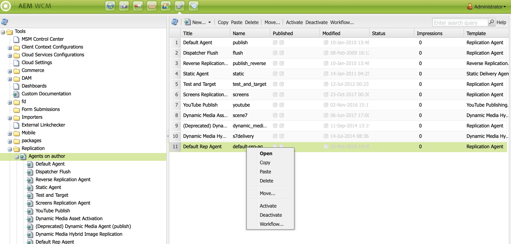

# Konfigurera författare och publicera i AEM Screens {#configuring-author-and-publish-in-aem-screens}

På den här sidan beskrivs följande ämnen:

* **Konfigurera författare- och publiceringsinstanser**
* **Konfigurera publiceringstopologi**
* **Hantera publikation: Leverera innehållsuppdateringar från författare till enhet**

## Förutsättningar {#prerequisites}

Innan du börjar med författare och publiceringsservrar bör du ha kunskap om:

* **AEM Topology**
* **Skapa och hantera AEM Screens Project**
* **Enhetsregistreringsprocess**

>[!NOTE]
>
>Den här AEM Screens-funktionen är bara tillgänglig om du har installerat AEM 6.4 Screens Feature Pack 2. Om du vill få tillgång till det här funktionspaketet måste du kontakta Adobe Support och begära åtkomst. När du har behörighet kan du hämta den från paketresursen.

>[!IMPORTANT]
>
>Om du vill använda fler än en publiceringsinstans med dispatchern måste du uppdatera dispatchern.vilken fil som helst i dispatchern. Se [Aktivera anteckningssessioner](dispatcher-configurations-aem-screens.md#enable-sticky-session) för mer information.

## Konfigurera författare- och publiceringsinstanser {#configuring-author-and-publish-instances}

>[!NOTE]
>
>Om du vill veta mer om författaren och publicera en översikt över arkitekturen och hur innehållet skrivs på en AEM författarinstans och sedan publiceras på flera publiceringsinstanser kan du läsa [Skapa och publicera arkitekturöversikt](author-publish-architecture-overview.md).

I följande avsnitt beskrivs hur du konfigurerar replikeringsagenter för författare och publiceringstopologi.

Du kan skapa ett enkelt exempel där du är värd för en författare och två publiceringsinstanser:

* Författare —> localhost:4502
* Publish 1 (pub1) —> localhost:4503
* Publish 2 (pub2) —> localhost:4504

## Konfigurera replikeringsagenter på författare {#setting-replication-agents}

Om du vill skapa replikeringsagenter måste du lära dig hur du skapar en standardredigeringsagent.

Det finns tre replikeringsagenter som behövs för skärmar:

1. **Standardreplikeringsagent ***(anges som*** Standardreplikeringsagent**)
1. **Raster Replication Agent**
1. **Agenten för omvänd replikering**

### Steg 1: Skapar en standardsreplikeringsagent {#step-creating-a-default-replication-agent}

Följ stegen nedan om du vill skapa en standardsvar för replikering:

1. Navigera till din AEM —> hamikon —> **Operationer** —> **Konfiguration**.

   

1. Välj **Replikering** från det vänstra navigeringsträdet.

   

1. Välj **Agenter på författare** från **Replikering** mapp och klicka på **Nytt** om du vill skapa en ny standardoperationsagent.

   

1. Enter the **Title** and **Name** to create the replication agent and click **Create**.

   

1. Högerklicka på replikeringsagenten och klicka på **Öppna** om du vill redigera inställningarna.

   

1. Click **Edit** to open the **Agent Settings** dialog box to enter the details.

   >[!NOTE]
   >
   >Användaren måste kontrollera **Aktiverad** för att aktivera replikeringsagenten. Du måste markera det här alternativet för standardagenter, skärmar och agenter för omvänd replikering.

   

1. Navigera till **Transport** och ange **URI**, **Användare** och **Lösenord**.

   

   >[!NOTE]
   >
   >Du kan också kopiera och byta namn på en befintlig standardreplikeringsagent.

#### Skapar standardreplikeringsagenter  {#creating-standard-replication-agents}

1. Skapa en standardobjektreplikeringsagent för pub1 (standardagenten som är färdig bör redan vara konfigurerad) (till exempel *https://&lt;hostname>:4503/bin/receive?sling:authRequestLogin=1*)
1. Skapa en standardslikeringsagent för pub2. Du kan kopiera rep agent för pub1 och uppdatera transporten som ska användas för pub2 genom att ändra porten i transportkonfigurationen. (for example, *https://&lt;hostname>:4504/bin/receive?sling:authRequestLogin=1*)

#### Skapar agenter för skärmreplikering {#creating-screens-replication-agents}

1. Skapa AEM Screens-replikeringsagent för pub1. Det finns en som heter Screens Replication Agent som pekar på port 4503. Detta måste aktiveras.
1. Skapa AEM Screens replikeringsagent för pub2. Copy the Screens replication agent for pub1 and change the port to point to 4504 for pub2.

   >[!NOTE]
   >To learn how to configure Screens Replication Agents, see [Configuring Screens Replication Agent](https://experienceleague.adobe.com/docs/experience-manager-screens/user-guide/administering/configure-screens-replication.html?lang=en).

#### Creating Screens Reverse Replication Agents {#creating-screens-reverse-replication-agents}

1. Create standard reverse replication agent for pub1.
1. Create standard reverse replication agent for pub2. Du kan kopiera omvänd rep-agent för pub1 och uppdatera transporten som ska användas för pub2 genom att ändra porten i transportkonfigurationen.

## Konfigurera publiceringstopologi {#setting-up-publish-topology}

### Step 1: Configure Apache Sling Oak-Based Discovery {#step-configure-apache-sling-oak-based-discovery}

Konfigurera Apache Sling Oak-Based Discovery för alla publiceringsinstanser i topologin

För varje publiceringsinstans:

1. Navigera till `https://<host>:<port>/system/console/configMgr`
1. Select **Apache Sling Oak-Based Discovery Service** Configuration.
1. Update Topology connector URLs: add URLs of all partaking publish instances that is:
   * `https://localhost:4503/libs/sling/topology/connector`
   * `https://localhost:4504/libs/sling/topology/connector`
1. **Vitlista för topologikoppling**: anpassa sig till IP-adresser eller undernät som omfattar partakta publiceringsinstanser
1. Enable **Auto-Stop Local-Loops**

Konfigurationen ska vara identisk för varje publiceringsinstans och den automatiska stopploopen förhindrar en oändlig slinga.

#### Steg 2: Verifiera publiceringstopologi {#step-verify-publish-topology}

Navigera till för alla publiceringsinstanser `https://:/system/console/topology`. Du bör se alla publiceringsinstanser som representeras i topologin under **Utgående topologianslutningar**.

#### Steg 3: Konfigurera ActiveMQ Artemis-kluster {#step-setup-activemq-artemis-cluster}

I det här steget kan du skapa krypterat lösenord för ActiveMQ Artemis-klustret.
Klusteranvändaren och lösenordet för alla publiceringsinstanser i topologin måste vara identiska. Lösenordet för ActiveMQ Artemis-konfigurationen måste krypteras. Eftersom varje instans har en egen krypteringsnyckel måste du använda krypteringsstöd för att skapa en krypterad lösenordssträng. Krypterat lösenord används sedan i OSGi-konfigurationen för ActiveMQ.

På varje publiceringsinstans:

1. I OSGi Console går du till **MAIN** —> **Krypteringsstöd** (`https://&lt;host&gt;:&lt;port&gt;/system/console/crypto`).
1. Skriv in lösenordet för oformaterad text (samma för alla förekomster) i **Oformaterad text**
1. Klicka **Protect**.
1. Kopiera värdet **Skyddad text** till anteckningsblock eller textredigerare. Det här värdet används i OSGi-konfigurationen för ActiveMQ.

Eftersom varje publiceringsinstans som standard har unika krypteringsnycklar måste du utföra det här steget på varje pub-instans och spara den unika nyckeln för nästa konfiguration.

>[!NOTE]
>
>Lösenordet ska börja och sluta med klammerparenteser. Till exempel:
>`{1ec346330f1c26b5c48255084c3b7272a5e85260322edd59119828d1fa0a610e}`

#### Steg 4: Aktivera ActiveMQ Artemis-kluster {#step-activate-activemq-artemis-cluster}

På varje publiceringsinstans:

1. Navigera till OSGi Config-hanteraren `https://&lt;host&gt;:&lt;port&gt;/system/console/configMgr`
1. Välj **Apache ActiveMQ Artemis JMS Provider** Konfiguration
1. Uppdatera följande:

   * ***Klusterlösenord***: använd krypterat värde från föregående steg per instans
   * ***Ämnen***: `{name: 'commands', address: 'com.adobe.cq.screens.commands', maxConsumers: 50}`

#### Verifiera ActiveMQ-objektkluster {#verify-activemq-artemis-cluster}

Följ stegen nedan för varje publiceringsinstans:

1. Navigera till OSGi Console -> Meny > ActiveMQ Artemis `https://localhost:4505/system/console/mq`.
1. Verifiera och kontrollera om du vill visa portar för andra instanser under Klusterinformation > Topologi > noder=2, members=2.
1. Send a Test Message (top of the screen under Broker Information)
1. Ange följande ändringar i fält:

   1. **Mål**: /com.adobe.cq.screens/devTestTopic
   1. **Text**: Hello World
   1. Visa fel.logg för varje instans för att se att meddelandet skickades och togs emot i hela klustret

>[!NOTE]
>
>Navigering till OSGi-konsolen kan ta några sekunder efter att konfigurationen sparats i föregående steg. Du kan också kontrollera error.log för mer information.

Följande bild visas till exempel när ActiveMQ Artemis Server har konfigurerats.

Om du inte ser följande konfiguration från */system/console/mq* navigera sedan till */system/console/mq* och klicka **Starta om** för att starta om mäklaren.

#### Ta bort krav på referensrubrik {#remove-referrer-header-requirement}

Följ stegen för varje publiceringsinstans:

1. Navigera till **OSGi Console** > **Konfigurationshanteraren**
1. Select **Apache Sling Referrer Filter**
1. Uppdatera konfiguration och **Markera Tillåt tomt**

### Konfigurera författare och publiceringsinstans {#configuring-author-and-publish-instance}

När du har konfigurerat publiceringstopologin måste du konfigurera författaren och publiceringsinstanserna för att visa de praktiska resultaten av implementeringen:

>[!NOTE]
>
>**Förutsättningar**
>
>För att komma igång med det här exemplet skapar du ett nytt AEM Screens-projekt följt av att du skapar en plats, visning och kanal i ditt projekt. Lägg till innehåll i kanalen och tilldela kanalen till en skärm.

#### Step 1: Starting an AEM Screens Player (device) {#step-starting-an-aem-screens-player-device}

1. Launch a separate browser window.
1. Go to Screens player using the *web browser*, that is,`https://localhost:4502/content/mobileapps/cq-screens-player/firmware.html` or launch the AEM Screens app. När du öppnar enheten visas enhetens status som ej registrerad.

>[!NOTE]
>
>Du kan öppna en AEM Screens-spelare med den AEM Screens-app du hämtade eller med webbläsaren.

#### Steg 2: Registrera en enhet på författaren {#step-registering-a-device-on-author}

1. Go to `https://localhost:4502/screens.html/content/screens/we-retail` or select your project and navigate to Devices > Device Manager.
1. Välj **Registrera enhet**.
1. Klicka **Enhetsregistrering** för att visa enheten.
1. Välj den enhet som du vill registrera och klicka på **Registrera enhet**.
1. Verifiera registreringskoden och klicka på **Validera**.
1. Ange en rubrik för enheten och klicka på **Registrera**.

#### Step 3: Assigning the Device to Display {#step-assigning-the-device-to-display}

1. Click **Assign Display** from the dialog box from the preceding step.
1. Select the display path for your channel from the **Locations** folder.
1. Klicka **Tilldela**.
1. Klicka **Slutför** för att slutföra processen och nu tilldelas enheten.

Kontrollera spelaren så ser du innehållet som du har lagt till i kanalen.

#### Steg 4: Publicera enhetskonfiguration för publiceringsinstanser {#step-publishing-device-configuration-to-publish-instances}

**Verifiera enheten**

Innan du utför stegen nedan kontrollerar du att enhets-ID är verifierat. Om du vill verifiera söker du efter enhets-ID i CRXDE Lite, med sökvägen som */home/users/screens/we-retail/devices*.

Så här replikerar du enhetsanvändaren:

1. Gå till sidan för användaradministration (t.ex.: `https://localhost:4502/useradmin`
1. Sök efter **screens-devices-överordnad** grupp
1. Högerklicka på gruppen och klicka på **Aktivera**

>[!CAUTION]
>
>Aktivera inte författare-publish-screens-service eftersom det är en systemanvändare som används av författarjobbet.

Du kan även aktivera enheten från enhetshanteringskonsolen. Följ stegen nedan:

1. Navigera till ditt skärpeprojekt —> **Enheter**.
1. Klicka **Enhetshanteraren** i åtgärdsfältet.
1. Select the device and click **Activate** from the action bar, as in shown in the figure below.

>[!NOTE]
>
>När du har aktiverat enheten kan du även redigera eller uppdatera server-URL:en genom att klicka på **Redigera server-URL** från åtgärdsfältet, som visas i figuren nedan, och dina ändringar kommer att spridas till AEM Screens-spelaren.

### Publiceringskontrolllista {#publishing-check-list}

Följande punkter sammanfattar publiceringskontrolllistan:

* *Skärmar enhetsanvändare* - Detta lagras som en AEM och aktiveras från **verktyg** > **Säkerhet** > **Användare**. Användaren får prefixet&quot;screens&quot; med en lång serialiserad sträng.

* *Projekt* - AEM Screens-projektet.
* *Plats* - Plats som enheten är ansluten till.
* *Kanaler* - en eller flera kanaler som visas på platsen
* *Schema* - om du använder ett schema, se till att det publiceras
* *Plats, scheman och kanalmapp* - om motsvarande resurser finns i en mapp.

Följ stegen nedan för att verifiera författarens/publiceringens beteende:

1. Uppdatera kanalinnehåll i författarinstans
1. Utför **Hantera publikation** publicera nya ändringar i alla publiceringsinstanser
1. Tryck **Aktivera** för att aktivera enheten från **Enhetshanteraren**
1. **Redigera URL** från författarinstansens URL till en av publiceringsinstansernas URL
1. Verifiera att det uppdaterade kanalinnehållet visas i AEM Screens Player
1. Upprepa dessa steg med en annan publiceringsinstans

#### Steg 5: Peka på enheten för att publicera instansen på Admin-panelen {#step-pointing-the-device-to-publish-instance-in-the-admin-panel}

1. Visa administratörsgränssnittet från Skärmspelaren, tryck länge på det övre vänstra hörnet för att öppna Admin-menyn, på din touchaktiverade AEM Screens-spelare eller genom att använda en mus.
1. Klicka på **Konfiguration** från sidopanelen.
1. Ändra författarinstans till publiceringsinstans i **Server**.

Se ändringarna i din AEM Screens-spelare.

Du kan även uppdatera/redigera server-URL:en från enhetshanteringskonsolen genom att följa följande steg:

1. Navigera till ditt AEM Screens-projekt och välj **Enheter** mapp.
1. Click **Device Manager** from the action bar.
1. Markera enheten och klicka på **Redigera server-URL** från åtgärdsfältet, som visas i figuren nedan, och dina ändringar kommer att spridas till AEM Screens-spelaren.

The **Hantera publikation** Med kan du leverera innehållsuppdateringar från författare till publicering till enhet. Du kan publicera/avpublicera innehåll för hela AEM Screens-projektet eller bara för en av dina kanaler, platser, enheter, program eller scheman. Mer information om den här funktionen finns i [On Demand Content Update](on-demand-content.md).
