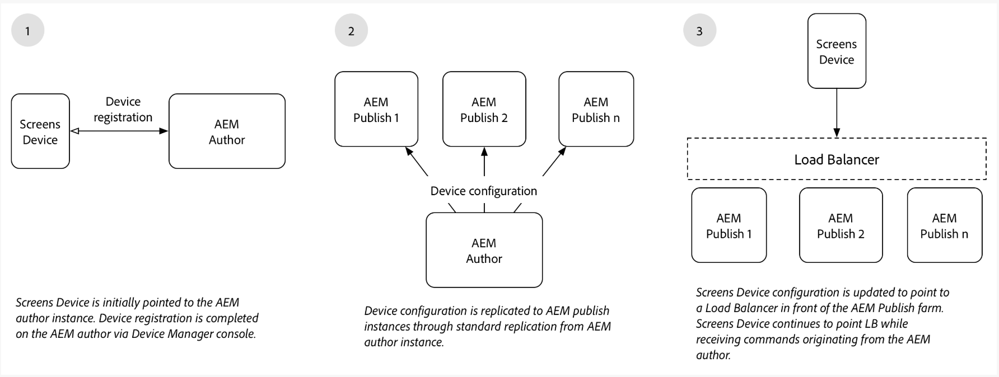

# Skapa och publicera arkitekturöversikt {#author-and-publish-architectural-overview}

På den här sidan beskrivs följande ämnen:

* **Introduktion till publiceringsservrar**
* **Arkitektöversikt**
* **Registreringsprocess**

## Förutsättningar {#prerequisites}

Innan du börjar med författarservrar och publiceringsservrar bör du ha kunskap om:

* **AEM Topology**
* **Skapa och hantera AEM Screens Project**
* **Enhetsregistreringsprocess**

>[!NOTE]
>
>Den här AEM Screens-funktionen är bara tillgänglig om du har AEM 6.4 Screens Feature Pack 2. Om du vill få tillgång till det här funktionspaketet måste du kontakta Adobe Support och begära åtkomst. När du har behörighet hämtar du den från Package Share.

## Introduktion {#introduction}

AEM Screens arkitektur liknar en traditionell AEM Sites-arkitektur. Innehållet skapas på en AEM författarinstans och sedan vidarebefordras till flera publiceringsinstanser. Enheter på AEM Screens kan nu ansluta till en AEM publiceringsgrupp via belastningsutjämnaren. Det går att lägga till flera AEM publiceringsinstanser för att fortsätta att skala publiceringsgruppen.

*Till exempel* skapar ett AEM Screens-innehåll ett kommando i redigeringssystemet för en viss enhet. Enheten är konfigurerad att interagera med en publiceringsgrupp eller en AEM Screens-innehållsförfattare som hämtar information om enheter som är konfigurerade att interagera med publiceringsgrupper.

I följande diagram visas både författarmiljön och publiceringsmiljön.

## Arkitektur {#architectural-design}

Det finns fem arkitektoniska komponenter som underlättar denna lösning:

* ***Replikerar innehåll*** från författare till publicering för visning på enheter

* ***Invertera*** replikera binärt innehåll från publiceringsmiljön (tas emot från enheter) till redigeringsmiljön.
* ***Skickar*** kommandon från författaren för att publicera via särskilda REST API:er.
* ***Meddelanden*** mellan publiceringsinstanser för att synkronisera uppdateringar och kommandon för enhetsinformation.
* ***Avsökning*** av författaren till publiceringsinstanser för att få enhetsinformation via särskilda REST API:er.

### Replikering (framåt) av innehåll och konfigurationer  {#replication-forward-of-content-and-configurations}

Standardreplikeringsagenter används för att replikera AEM Screens-kanalinnehåll, platskonfigurationer och enhetskonfigurationer. Detta gör det möjligt för författare att uppdatera innehållet i en kanal och eventuellt gå igenom något slags godkännandearbetsflöde innan kanaluppdateringar publiceras. En replikeringsagent måste skapas för varje publiceringsinstans i publiceringsgruppen.

I följande diagram visas replikeringsprocessen:

>[!NOTE]
>
>En replikeringsagent måste skapas för varje publiceringsinstans i publiceringsgruppen.

### Skärmreplikeringsagenter och kommandon  {#screens-replication-agents-and-commands}

Specifika replikeringsagenter för anpassade skärmar skapas för att skicka kommandon från författarinstansen till AEM Screens-enheten. AEM Publish-instanser fungerar som en mellanhand för att vidarebefordra dessa kommandon till enheten.

Detta gör att författare kan fortsätta att hantera enheten, till exempel skicka enhetsuppdateringar och ta skärmbilder från redigeringsmiljön. AEM Screens replikeringsagenter har en anpassad transportkonfiguration, som vanliga replikeringsagenter.

### Meddelanden mellan publiceringsinstanser  {#messaging-between-publish-instances}

Ofta är det bara meningen att ett kommando ska skickas till en enhet en gång. I en belastningsutjämnad publiceringsarkitektur är det dock okänt vilken publiceringsinstans enheten ansluter till.

Därför skickar författarinstansen meddelandet till alla publiceringsinstanser. Sedan bör bara ett meddelande vidarebefordras till enheten. För att meddelandet ska fungera på rätt sätt måste kommunikationen ske mellan publiceringsinstanser. Detta uppnås med *Apache ActiveMQ Artemis*. Varje publiceringsinstans placeras i en löst kopplad topologi med hjälp av Oak-baserad Sling-identifieringstjänst och ActiveMQ har konfigurerats så att varje publiceringsinstans kan kommunicera och skapa en enda meddelandekö. AEM Screens-enheten avsöker den AEM publiceringsgruppen med hjälp av belastningsutjämnaren och hämtar kommandot från köens övre del.

### Omvänd replikering {#reverse-replication}

Efter ett kommando förväntas ofta någon sorts svar från skärmenheten vidarebefordras till författarinstansen. För att uppnå detta AEM ***Omvänd replikering*** används.

* Skapa en omvänd replikeringsagent för varje publiceringsinstans, precis som standardsreplikeringsagenterna och AEM Screens replikeringsagenter.
* En arbetsflödeskonfiguration lyssnar efter noder som ändrats på den AEM publiceringsinstansen och utlöser i sin tur ett arbetsflöde för att placera enhetens svar i AEM publiceringsinstansens utkorg.
* En omvänd replikering i det här sammanhanget används bara för binära data (till exempel loggfiler och skärmbilder) som tillhandahålls av enheterna. Icke-binära data hämtas genom avsökning.
* Omvänd replikeringsomröstning från AEM författarinstans hämtar svaret och sparar det i författarinstansen.

### Avsökning av publiceringsinstanser  {#polling-of-publish-instances}

Författarinstansen måste kunna avfråga enheterna för att få pulsslag och veta hälsostatusen för en ansluten enhet.

Enheter som pingar belastningsutjämnaren och dirigeras till en publiceringsinstans. Enhetens status visas sedan av den AEM publiceringsinstansen via ett publicerings-API som anges som @ **api/screens-dcc/devices/static** för alla aktiva enheter och **api/screens-dcc/devices/&lt;device_id>/status.json** för en enda enhet.

Författarinstansen avsöker alla publiceringsinstanser och sammanfogar enhetsstatussvaren till en enda status. Det schemalagda jobbet som avfrågar efter författare är `com.adobe.cq.screens.impl.jobs.DistributedDevicesStatiUpdateJob` och kan konfigureras baserat på ett cron-uttryck.

## Registrering {#registration}

Registreringen fortsätter att ha sitt ursprung i AEM författarinstans. AEM Screens Device hänvisas till författarinstansen och registreringen är klar.

När en enhet har registrerats i AEM redigeringsmiljö replikeras enhetskonfigurationen och tilldelningarna av kanaler/scheman till AEM publiceringsinstanser. AEM Screens-enhetskonfigurationen uppdateras sedan så att den pekar på belastningsutjämnaren framför AEM publiceringsgrupp. Detta är avsett som en engångsinstallation. När skärmenheten har anslutits till publiceringsmiljön kan den fortsätta att ta emot kommandon från författarmiljön. Du behöver aldrig ansluta AEM Screens-enheten direkt till AEM.

### Nästa steg {#the-next-steps}

När du förstår arkitekturdesignen för författare och publicerar konfigurationen i AEM Screens, se [Konfigurera författare och publicera för AEM Screens](author-and-publish.md) för mer information.
