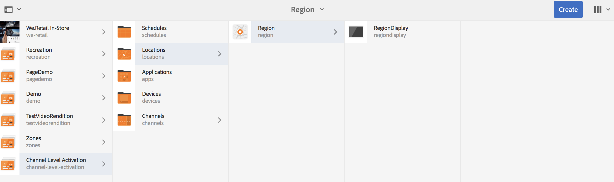

# Aktivering på kanalnivå {#channel-level-activation-single-event-playback}

Den här sidan beskriver kanalnivåaktivering för resurserna som används i kanaler.

Följande ämnen behandlas i detta avsnitt:

* Ökning
* Aktiveringsfönster
* Använda kanalnivåaktivering som en enda händelseuppspelning
* Hantera återkommande för resurser i en kanal
   * DayParting
   * WeekParting
   * MånadDelning
   * Kombination av partner
* Använda kanalnivåaktivering som en enda händelseuppspelning

## Ökning {#overview}

***Aktivering på kanalnivå*** gör att kanalerna kan växla efter ett visst angivet schema. Den enskilda händelsekanalen ersätter huvudkanalen efter ett angivet schema och spelas upp en viss tid tills huvudkanalen spelar upp innehållet igen.

I följande exempel får du en lösning genom att fokusera på följande nyckeltermer:

* a ***huvudsekvenskanal*** för den globala sekvensen
* a ***single event channel*** som endast körs en gång i en angiven tid
* a ***ange schema och prioritet*** för den enda uppspelningshändelsen som inträffar inuti huvudsekvenskanalen

## Aktiveringsfönster {#using-channel-level-activation}

I följande avsnitt beskrivs hur du skapar en enda händelseuppspelning i en kanal för ett AEM Screens-projekt.

### Förutsättningar {#prerequisites}

Innan du börjar implementera den här funktionen bör du kontrollera att du har följande krav klara att börja implementera aktivering på kanalnivå:

* Skapa ett AEM Screens-projekt, i detta exempel **Aktivering på kanalnivå**

* Skapa en kanal som **MainAdChannel** under **Kanaler** mapp

* Skapa en annan kanal som **TargetedSinglePlay** under **Kanaler** mapp

* Lägg till relevanta resurser i båda kanalerna

Följande bild visar **Aktivering på kanalnivå** projekt med **MainAdChannel** och **TargetedSinglePlay** kanaler i **Kanaler** mapp.

>[!NOTE]
>
>Mer information om hur du skapar ett projekt och hur du skapar en sekvenskanal finns i resurserna nedan:
>
>* [Skapa och hantera projekt](creating-a-screens-project.md)
>
>* [Hantera en kanal](managing-channels.md)
>

### Implementering {#implementation}

Implementering av kanalnivåaktivering i ett AEM Screens-projekt innefattar tre viktiga uppgifter:

1. **Konfigurera Project-taxonomin inklusive kanaler, platser och bildskärmar**
1. **Tilldela kanaler att visa**
1. **Konfigurera ett schema och en prioritet**

Följ stegen nedan för att implementera funktionen:

1. **Skapa en plats**

   Navigera till **Platser** i ditt AEM Screens-projekt och skapa en plats som **Län**.

   

   >[!NOTE]
   >
   >Mer information om hur du skapar en plats finns i **[Skapa och hantera platser](managing-locations.md)**.

1. **Skapa visning under Plats**

   1. Navigera till **Aktivering på kanalnivå** > **Platser** > **Län**.
   1. Välj **Län** och klicka **+ Skapa** i åtgärdsfältet.
   1. Välj **Visa** från guiden och skapa en skärm med namnet **RegionDisplay.**

   

1. **Tilldela kanaler att visa**

   För **Huvudkanal:**

   1. Navigera till **Aktivering på kanalnivå** > **Platser** > **Län** > **RegionDisplay** och klicka **Tilldela kanal** i åtgärdsfältet.
   1. **Kanaltilldelning** öppnas.
   1. Välj **Referenskanal**.. efter bana.
   1. Välj **Kanalsökväg** as **Aktivering på kanalnivå** —> ***Kanaler*** —> ***MainAdChannel***.
   1. The **Kanalroll** fylls i som **huvudkanal**.
   1. Välj **Prioritet** as **1**.
   1. Välj **Händelser som stöds** as **Inledande inläsning** och **Inaktiv skärm**.
   1. Klicka **Spara**.

   

   >[!NOTE]
   >
   >Du kan också tilldela kanal från kontrollpanelen genom att navigera till **Aktivering på kanalnivå** —> **Platser** —> **Län** —> **RegionDisplay** och klicka **Kontrollpanel** i åtgärdsfältet. Klicka **+ Tilldela kanal** från **TILLDELADE KANALER OCH SCHEMAN** -panelen.

   Tilldela kanal på samma sätt **TargetedSinglePlay** för bildskärm**:

   1. Navigera till **Aktivering på kanalnivå** —> **Platser** —> **Län** —> **RegionDisplay** och klicka **Tilldela kanal** i åtgärdsfältet.
   1. **Kanaltilldelning** öppnas.
   1. Välj **Referenskanal**.. efter bana.
   1. Välj **Kanalsökväg** as **Aktivering på kanalnivå*** —> ***Kanaler*** —> ***TargetedSinglePlay***.
   1. The **Kanalroll** fylls i som **målsingleplay**.
   1. Ange **Prioritet** as **2**.
   1. Välj **Händelser som stöds** as **Inledande inläsning**, **Inaktiv skärm** och **Timer**, *enligt bilden nedan.
   1. Välj datum i **aktiv från** den 27 november 2018 kl. 11.59 och **aktiv tills** den 28 november 2018 kl. 12:05
   1. Klicka **Spara**.

   >[!CAUTION]
   >
   Du måste ange prioritet för **TargetedSinglePlay** kanal högre än **MainAdSegment** kanal.

   

   >[!NOTE]
   >
   Om du vill välja samma dag måste du markera nästa dag och manuellt redigera datumet till samma dag, men för en senare tid. Detta hindrar användaren från att välja ett tidigare datum. Se exemplet nedan:

   

## Visa resultaten {#viewing-the-results}

När du har konfigurerat kanalerna och visningen är klar startar du AEM Screens-spelaren för att visa innehållet.

Spelaren visar innehållet i **MainAdChannel** och exakt klockan 11:59 (enligt schemat), **TargetedSinglePlay** Kanalen visar sitt innehåll fram till kl. 12.05 och sedan **MainAdChannel** kommer att fortsätta spela upp innehållet igen.

>[!NOTE]
>
Läs mer om AEM Screen Player här:
[AEM Screens Player - nedladdningar](https://download.macromedia.com/screens/)
[Arbeta med AEM Screens Player](working-with-screens-player.md)

## Hantera återkommande för resurser i en kanal {#handling-recurrence-in-assets}

Du kan schemalägga att resurser i en kanal återkommer med vissa intervall på varje dag, vecka eller månad, beroende på dina behov.

Anta att du bara vill visa innehållet i en kanal på fredag från 1:00 till 10:00. Du kan använda **Aktivering** för att ange önskat återkommande intervall för resursen.

### Dag-parsning {#day-parting}

1. Markera kanalen och klicka på **Kontrollpanel** från åtgärdsfältet för att öppna kanalkontrollpanelen.

1. Efter att du angett startdatum/tid och sluttid/tid från **Kanaltilldelning** kan du använda ett uttryck eller en naturlig textversion för att ange upprepningsschema.

   >[!NOTE]
   >
   Du kan hoppa över eller ta med **Aktiv från** och **Aktiv tills** fält och lägg till uttrycket i fältet Scheman enligt dina önskemål.

1. Ange uttrycket i **Schema** och resursen visas för det angivna intervallet på dag och tid.

#### Exempeluttryck för dagdelning {#example-one}

I följande tabell sammanfattas några exempeluttryck som du kan lägga till i schemat när du tilldelar kanal till en visning.

| **Uttryck** | **Tolkning** |
|---|---|
| före 08:00 | resursen i kanalen spelas upp innan klockan åtta varje dag |
| efter klockan 2:00 | resursen i kanalen spelas upp efter klockan 17:00 varje dag |
| efter 12:15 och före 12:45 | resursen i kanalen spelas upp efter klockan 12:15 varje dag i 30 minuter |
| före 12:15 även efter 12:45 | resursen i kanalen spelas upp före kl. 12.15 varje dag och även efter kl. 12.45 |
| Mån,Nyans,Ved eller mån | resursen spelas upp i kanalen från måndag till onsdag |
| den första dagen i januari efter kl. 2:00 också den andra dagen i januari, även den tredje dagen i januari före kl. 3:00 | resursen i kanalen börjar spelas upp efter kl. 2:00 den 1 januari och fortsätter att spela för hela dagen den 2 januari ända till kl. 3:00 den 3 januari |
| den 1-2 januari efter kl. 2:00 också den 2-3 januari före kl. 3:00 | resursen i kanalen startar spelaren efter kl. 2:00 den 1 januari, fortsätter att spelas upp till kl. 17:00 den 2 januari och börjar igen kl. 2:00 och fortsätter att spelas upp till kl. 3:00 den 3 januari |

>[!NOTE]
>
Du kan också använda _militär tid_ notation (d.v.s. 14:00) i stället för *fm/em* notation (d.v.s. 2:00).

### WeekParting {#week-parting}

1. Markera kanalen och klicka på **Kontrollpanel** från åtgärdsfältet för att öppna kanalkontrollpanelen.

1. Efter att du angett startdatum/tid och sluttid/tid från **Kanaltilldelning** kan du använda ett uttryck eller en naturlig textversion för att ange upprepningsschema.

   >[!NOTE]
   >
   Du kan hoppa över eller ta med **Aktiv från** och **Aktiv tills** fält och lägg till uttrycket i fältet Scheman enligt dina önskemål.

1. Ange uttrycket i **Schema** och resursen visas för det angivna intervallet på dag och tid.

#### Exempeluttryck för WeekParting {#example-two}

I följande tabell sammanfattas några exempeluttryck som du kan lägga till i schemat när du tilldelar kanal till en visning.

| **Uttryck** | **Tolkning** |
|---|---|
| Mån,Nyans,Ved eller mån | resursen spelas upp i kanalen från måndag till onsdag |
| före 08:00 | resursen i kanalen spelas upp innan klockan åtta varje dag |
| efter klockan 2:00 | resursen i kanalen spelas upp efter klockan 17:00 varje dag |
| efter 12:15 och före 12:45 | resursen i kanalen spelas upp efter klockan 12:15 varje dag i 30 minuter |
| före 12:15 även efter 12:45 | kanalen spelas upp före kl. 12.15 varje dag och även efter kl. 12.45 |

>[!NOTE]
>
Du kan också använda _militär tid_ notation (d.v.s. 14:00) i stället för *fm/em* notation (d.v.s. 2:00).

### MånadDelning {#month-parting}

1. Markera kanalen och klicka på **Kontrollpanel** från åtgärdsfältet för att öppna kanalkontrollpanelen.

1. Efter att du angett startdatum/tid och sluttid/tid från **Kanaltilldelning** kan du använda ett uttryck eller en naturlig textversion för att ange upprepningsschema.

   >[!NOTE]
   >
   Du kan hoppa över eller ta med **Aktiv från** och **Aktiv tills** fält och lägg till uttrycket i fältet Scheman enligt dina önskemål.

1. Ange uttrycket i **Schema** och resursen visas för det angivna intervallet på dag och tid.

#### Exempeluttryck för MonthParting {#example-three}

I följande tabell sammanfattas några exempeluttryck som du kan lägga till i schemat när du tilldelar kanal till en visning.

| **Uttryck** | **Tolkning** |
|---|---|
| februari,maj,augusti,november | resursen spelas upp i kanalen i februari,maj,augusti,november |

>[!NOTE]
>
När du definierar veckodagar och månader kan du både använda kort- och fullnamnsnoteringar, till exempel måndag/måndag och januari.

>[!NOTE]
>
Du kan också använda _militär tid_ notation (d.v.s. 14:00) i stället för *fm/em* notation (d.v.s. 2:00).

### Kombination av partner {#combined-parting}

1. Markera kanalen och klicka på **Kontrollpanel** från åtgärdsfältet för att öppna kanalkontrollpanelen.

1. Efter att du angett startdatum/tid och sluttid/tid från **Kanaltilldelning** kan du använda ett uttryck eller en naturlig textversion för att ange upprepningsschema.

   >[!NOTE]
   >
   Du kan hoppa över eller ta med **Aktiv från** och **Aktiv tills** fält och lägg till uttrycket i fältet Scheman enligt dina önskemål.

1. Ange uttrycket i **Schema** och resursen visas för det angivna intervallet på dag och tid.

#### Exempeluttryck för en kombination av partner {#example-four}

I följande tabell sammanfattas några exempeluttryck som du kan lägga till i schemat när du tilldelar kanal till en visning.

| **Uttryck** | **Tolkning** |
|---|---|
| efter 6:00 och före 18:00 i Mon, Wed of Jan-Mar | tillgången spelas upp i kanalen mellan kl. 6.00 och kl. 18.00 måndag och onsdag från januari till slutet av mars |
| den första dagen i januari efter kl. 2:00 också den andra dagen i januari, även den tredje dagen i januari före kl. 3:00 | resursen i kanalen börjar spelas upp efter kl. 2:00 den 1 januari och fortsätter att spela för hela dagen den 2 januari ända till kl. 3:00 den 3 januari |
| den 1-2 januari efter kl. 2:00 också den 2-3 januari före kl. 3:00 | resursen i kanalen startar spelaren efter kl. 2:00 den 1 januari, fortsätter att spelas upp till kl. 17:00 den 2 januari och börjar igen kl. 2:00 och fortsätter att spelas upp till kl. 3:00 den 3 januari |

>[!NOTE]
>
När du definierar veckodagar och månader kan du både använda kort- och fullnamnsnoteringar, till exempel måndag/måndag och januari.  Du kan även använda _militär tid_ notation (d.v.s. 14:00) i stället för *fm/em* notation (d.v.s. 2:00).
