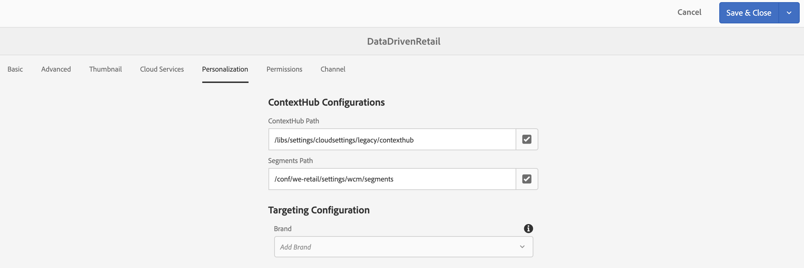

# ContextHub konfigureras i AEM-skärmar {#configuring-contexthub-in-aem-screens}

I det här avsnittet betonas hur du skapar och hanterar datadrivna resursändringar med hjälp av ett datalager.

## Nyckeltermer {#key-terms}

Innan vi får mer information om hur du skapar och hanterar lagerdrivna kanaler i ditt AEM Screens-projekt måste du lära dig några viktiga termer som är viktiga och relevanta för de olika scenarierna.

**Varumärke** hänvisar till din projektbeskrivning på hög nivå.

**Område** refererar till ditt projektnamn för AEM-skärmar, t.ex. Digital Ad Signage

**Aktivitet** definierar regelkategorin, t.ex. Lagerstyrd, Väderstyrd, Avdelningstillgänglighetsstyrd osv.

**Målgrupp** definierar regeln.

**Segment** Avser den version av resursen som ska spelas upp för den angivna regeln, t.ex. om temperaturen är under 50 grader, så visar skärmen en bild av ett varmt kaffe, i annat fall en kall dryck.

I följande diagram visas hur ContextHub-konfigurationer sammanfaller med Activity, Audience och Channels.


## Förhandsvillkor {#preconditions}

Innan du börjar konfigurera Context Hub Configurations för ett AEM Screens-projekt måste du konfigurera Google Sheets (i demonstrationssyfte).

>[!IMPORTANT]
>
>Google Sheets används i följande exempel som ett exempeldatabassystem från vilket värdena hämtas och är endast avsett för utbildningsändamål. Adobe stöder inte Google Sheets för produktionsmiljöer.
>
>Mer information finns i [Hämta API-nyckel](https://developers.google.com/maps/documentation/javascript/get-api-key) i Google-dokumentationen.

## Steg 1: Konfigurera ett datalager {#step-setting-up-a-data-store}

Du kan konfigurera datalagret som en lokal I/O-händelse eller som en lokal databashändelse.

Följande datanivådata utlöser ett exempel på en lokal databashändelse som ställer in ett datalager, t.ex. ett Excel-blad, som gör att du kan använda ContextHub-konfigurationer och segmentsökvägar till AEM Screens-kanalen.

När du har ställt in Google Sheet korrekt, till exempel enligt nedan:


Följande validering är vad du kommer att se när du kontrollerar anslutningen genom att ange de två värdena, *Google Sheet ID* och *API-nyckel* i formatet nedan:

`https://sheets.googleapis.com/v4/spreadsheets/<your sheet id>/values/Sheet1?key=<your API key>`


>[!NOTE]
> I det specifika exemplet nedan visas Google-tabellerna som ett datalager som utlöser en resursändring om värdet är högre än 100 eller lägre än 50.

## Steg 2: Konfigurera butikskonfigurationer {#step-setting-store-configurations}

1. **Navigera till ContextHub**

   Navigera till din AEM-instans och klicka på verktygsikonen i det vänstra sidofältet. Klicka på **Webbplatser** —> **ContextHub**, som bilden nedan visar.

   

1. **Skapa en ny konfiguration för ContextHub Store**

   1. Navigera till konfigurationsbehållaren med namnet **screens**.

   1. Klicka på **Skapa** > **Skapa konfigurationsbehållare** och ange titeln som **ContextHubDemo**.

      

   1. **Navigera** till **ContextHubDemo** > **Create** **ContentHub Configuration** och klicka på **Save**.

      >[!NOTE]
      > När du har klickat på **Spara** visas **konfigurationsskärmen** för ContextHub.

   1. Klicka på **Skapa** > Konfiguration av **ContentHub Store på skärmen Konfiguration** **av ContextHub.**

      

   1. Ange **Titel** som **Google Sheets**, **Butiksnamn** som **Googlesheets** och **Butikstyp** **** ****som¥contexthub.generic-jsonp¥ och klicka på¥Next.
      

   1. Ange din specifika json-konfiguration. Du kan t.ex. använda följande json som demoversion och klicka på **Spara** så visas butikskonfigurationen med namnet **Google Sheets** i ContextHub-konfigurationen.

      >[!IMPORTANT]
      >Se till att ersätta koden med *&lt;Sheet ID>* och *&lt;API Key>*, som du hämtade när du konfigurerade Google Sheets.

      ```
       {
        "service": {
        "host": "sheets.googleapis.com",
        "port": 80,
        "path": "/v4/spreadsheets/<your google sheets id>/values/Sheet1",
        "jsonp": false,
        "secure": true,
        "params": {
        "key": "<your Google API key>"
       }
      },
      "pollInterval": 10000
      }
      ```

      >[!NOTE]
      I ovanstående exempelkod definierar **pollInterval** den frekvens med vilken värdena uppdateras (i ms).
Ersätt koden med ditt *&lt;Sheet ID>* och *&lt;API Key>*, som du hämtade när du konfigurerade Google Sheets.

      >[!CAUTION]
      Om du skapar dina Google Sheets-lagringskonfigurationer utanför den globala mappen (t.ex. i din egen projektmapp) kommer målanpassning inte att fungera som den ska.

1. **Konfigurera butikssegmentering**

   1. Navigera till **ContentHub Store-konfigurationen.** och skapa en annan butikskonfiguration i skärmkonfigurationsbehållaren och ange **titeln** som **segmenteringskontexthub**, **butiksnamn** som **segmentering** och **butikstyp** som ****¥aem.segmentation¥.

      

   1. Klicka på **Nästa** och sedan **Spara**.

      >[!NOTE]
Du måste hoppa över processen att definiera jsonen och lämna den tom.


## Steg 3: Konfigurera segment i målgruppen {#setting-up-audience}

1. **Skapa segment i målgrupper**

   1. Navigera från din AEM-instans till **Personalisering** > **Publiker** > **skärmar**.

   1. Klicka på **Skapa** > **Skapa kontextnavsegment.** Dialogrutan **Nytt ContextHub-segment** öppnas.

   1. Ange **titeln** som **högre än 50** och klicka på **Skapa**. Du kan också skapa ett annat segment med namnet **Lowerthan50**.

      

   1. Markera segmentet **högre än 50** och klicka på **Egenskaper** i åtgärdsfältet.
      

   1. Välj fliken **Personalisering** i **Segmentegenskaper**. Ställ in **ContextHub Path** till `/conf/screens/settings/cloudsettings/ContextHubDemo/contexthub` och **Segments Path** till `/conf/screens/settings/wcm/segments` och klicka på **Save**, som bilden nedan visar.

      

   1. Du kan även ange **ContextHub Path** och **Segments Path** för **Lowerthan50** -segmentet.

## Steg 4: Konfigurera varumärke och område {#setting-brand-area}

Följ stegen nedan för att skapa ett varumärke i era aktiviteter och i ert område under varumärket:

1. **Skapa ett varumärke i aktiviteter**

   1. Navigera från din AEM-instans till **Personalisering** > **Verksamheter**.

   1. Klicka på **Skapa** > **Skapa varumärke**.

   1. Välj **Varumärke** i guiden **Skapa sida** och klicka på **Nästa**.

   1. Ange **Titel** som **Skärmmärke** och klicka på **Skapa**. Ditt varumärke har nu skapats enligt nedan.

      


      >[!CAUTION]
      Känt fel:
Om du vill lägga till ett område tar du bort mallen från URL:en, t.ex.
      `http://localhost:4502/libs/cq/personalization/touch-ui/content/v2/activities.html/content/campaigns/screensbrand/master`.

1. **Skapa ett område i ditt varumärke**

   Följ stegen nedan för att skapa ett område i varumärket:

   1. Klicka på **Skapa** och sedan **Skapa område**.

      

   1. Välj **Område** i guiden **Skapa sida** och klicka på **Nästa**.

   1. Ange **Title** som **ScreensValue** och klicka på **Create**.
Ett område kommer att skapas i ert varumärke.

## Steg 5: Skapa segment i en aktivitet {#step-setting-up-audience-segmentation}

När du har konfigurerat ett datalager och definierat din aktivitet (varumärke och område) följer du stegen nedan för att skapa segment i din aktivitet.

1. **Skapa segment i aktiviteter**

   1. Navigera från din AEM-instans till **Personalization** > **Activity** > **ScreensBrand** >**ScreensValue**.

   1. Klicka på **Skapa** > **Skapa aktivitet.** Guiden **Konfigurera aktivitet** öppnas.

   1. Ange **Title** som **ValueCheck50** och **Name** som **valueCheck50**. Välj **målmotorn** som **ContextHub (AEM)** i listrutan och klicka på **Nästa**.

      

   1. Klicka på **Lägg till upplevelse** i **guiden** Konfigurera aktivitet.

   1. I **Publiker** väljer du **Higherthan50** och klickar på **Lägg till upplevelse** och anger **Title** som **higherthan50** **** ****¥Name¥higherthan50. Click **Ok**.

   1. I **Publiker** väljer du **Lowerthan50** och klickar på **Add Experience** och anger **Title** som **lägre än50** **** ****¥Name¥less50¥. Click **Ok**.

      

   1. Klicka på **Nästa** och sedan **Spara**. **ValueCheck50** -aktiviteten har nu skapats och konfigurerats.

      

## Steg 5: Redigera segment i publiker{#editing-audience-segmentation}

1. **Redigera segment**

   1. Navigera från din AEM-instans till **Personalisering** > **Publiker** > **skärmar**.

   1. Markera segmentet **högre än 50** och klicka på **Redigera** i åtgärdsfältet.

   1. Dra och släpp **jämförelsen: Egenskap - Värdekomponent** till redigeraren.

   1. Klicka på skiftnyckelsikonen för att öppna dialogrutan **Jämför en egenskap med ett värde** .

   1. Välj **Googlesheets/value/1/0** i listrutan i **Egenskapsnamn**.

      >[!NOTE]
Google **heets/value/1/0** refererar till rad 2 och kolumn som fylls i i Google Sheets i figuren nedan:

      

   1. Välj **Operator** som **större än** i listrutan.

   1. Ange **värdet** som **70**.
   >[!NOTE]
   AEM validerar dina data från Google Sheet genom att visa ditt segment som grönt.

   

   Redigera på samma sätt egenskapsvärdena till **Lägre än 50**.

   1. Dra och släpp **jämförelsen: Egenskap - Värdekomponent** till redigeraren.

   1. Klicka på skiftnyckelsikonen för att öppna dialogrutan **Jämför en egenskap med ett värde** .

   1. Välj **Googlesheets/value/1/0** i listrutan i **Egenskapsnamn**.

   1. Välj **Operatör** som **mindre än** i listrutan.

   1. Ange **värdet** som **50**.


## Aktivera mål i kanaler {#step-enabling-targeting-in-channels}

Följ stegen nedan för att aktivera målinriktning i dina kanaler.

1. Navigera till en av AEM-skärmarna. Följande steg visar hur du aktiverar målinriktning genom att använda **DataDrivenRetail** som skapats i en AEM Screens Channel.

1. Välj kanalen **DataDrivenRetail** och klicka på **Egenskaper** i åtgärdsfältet.

   

1. Välj fliken **Personalisering** för att konfigurera ContextHub-konfigurationer.

   1. Välj **ContextHub Path** som **libs** > **settings** > **cloudsettings** > **default** **** ****>¥ContextHub Configurations¥ och klicka på¥Select¥.

   1. Välj **Segmentsökväg** som **conf** > **We.Retail** > **settings** > **wcm** **** ****>¥segments¥ och klicka¥Select.

   1. Klicka på **Spara och stäng**.
   >[!NOTE]
   Använd ContextHub och Segments-sökvägen, där du först sparade dina kontextnavkonfigurationer och segment.

   

1. Navigera till och välj **DataDrivenRetail** från **DataDrivenAssets** > **Kanaler** och klicka på **Redigera** i åtgärdsfältet.

   >[!NOTE]
   Om du har konfigurerat allt korrekt visas alternativet **Riktning** i listrutan från redigeraren, vilket visas i bilden nedan.

   

   >[!NOTE]
   När du har konfigurerat ContextHub-konfigurationerna för din kanal måste du följa de föregående stegen från 1 till 4 för de andra tre sekvenskanalerna också om du vill följa alla användningsexempel nedan.

## Läs mer: Exempel på användningsfall {#learn-more-example-use-cases}

När du har konfigurerat ContextHub för ditt AEM Screens-projekt kan du följa de olika användningsexemplen för att förstå hur datautlösande resurser spelar en viktig roll i olika branscher:

1. **[Målinställd aktivering för butikslager](retail-inventory-activation.md)**
1. **[Temperaturaktivering i resecentret](local-temperature-activation.md)**
1. **[Aktivering av hotellreservation](hospitality-reservation-activation.md)**
