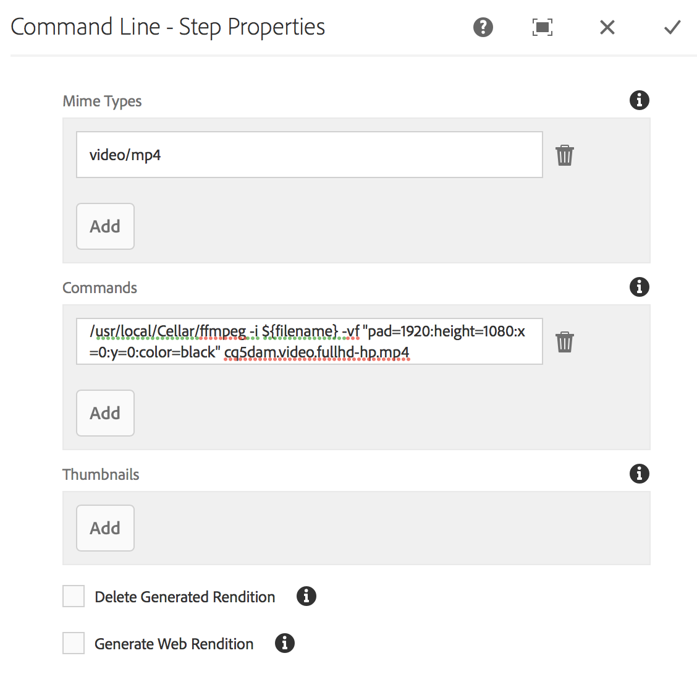

# Skapa ett arbetsflöde för videoutfyllnad {#creating-a-video-padding-workflow}

Detta avsnitt behandlar följande ämnen:

* **Översikt**
* **Förutsättningar**
* **Skapa ett arbetsflöde för videoutfyllnad**
   * **Skapa ett arbetsflöde**
   * **Använda arbetsflödet i AEM Screens Project**

* **Validera arbetsflödets utdata**

## Översikt {#overview}

I följande exempel används montering av en video (exempel: 1 280 x 720) i en kanal där skärmen är 1 920 x 1 080 och där videon ska placeras på 0x0 (övre vänstra). Videon får inte sträckas ut eller ändras på något sätt och ska inte användas **omslag** i videokomponenten.

Videon visas som ett objekt från pixel 1 till pixel 1280 över och från pixel 1 till pixel 720 ned och resten av kanalen blir standardfärg.

## Förutsättningar {#prerequisites}

Innan du skapar ett arbetsflöde för video måste du uppfylla följande krav:

1. Överför en video i mappen **Assets** i din AEM
1. Skapa ett AEM Screens-projekt (t.ex. **TestVideoRendition**) och en kanal med namnet (**VideoRendering**) enligt bilden nedan:

## Skapa ett arbetsflöde för videoutfyllnad {#creating-a-video-padding-workflow-1}

Om du vill skapa ett arbetsflöde för videoutfyllnad måste du skapa ett arbetsflöde för videon och sedan använda samma arbetsflöde i din AEM Screens-projektkanal.

Följ stegen nedan för att skapa och använda arbetsflödet:

1. Skapa ett arbetsflöde
1. Använda arbetsflödet i ett AEM Screens-projekt

### Skapa ett arbetsflöde {#creating-a-workflow}

Följ stegen nedan för att skapa ett arbetsflöde för videon:

1. Navigera till AEM och klicka på verktyg från sidospåret. Välj **Arbetsflöde** —> **Modeller** för att skapa en ny modell.

   

1. Klicka på **Modeller** —> **Skapa** —> **Skapa modell**. Ange **titeln** (som **VideoRendition**) och **Namn** i **Lägg till arbetsflödesmodell**. Klicka på **Klar** för att lägga till arbetsflödesmodellen.

   

1. När du har skapat arbetsflödesmodellen väljer du modellen (**VideoRendition**) och klickar på **Redigera** i åtgärdsfältet.

   

1. Dra och släpp komponenten **Kommandorad** i ditt arbetsflöde.

   

1. Markera komponenten **Kommandorad** och öppna dialogrutan Egenskaper.

   

1. Välj fliken **Argument** för att ange fälten i dialogrutan **Kommandorad - Stegegenskaper**.

   Ange formatet i **Mime Types** (som ***video/mp4***) och kommandot som (**/usr/local/Cellar/ffmpeg -i ${filename} -vf &quot;pad=1920:height=1080:x=0:y=0:color=black&quot; cq5dam.video.fullhd-hp.mp4***) för att starta arbetsflödet i fältet **Commands**.

   Se informationen om **Mime Types** och **Kommandon** i anteckningen nedan.

   

1. Välj arbetsflödet (**VideoRenditions**) och klicka på **Starta arbetsflöde** i åtgärdsfältet för att öppna dialogrutan **Kör arbetsflöde**.

   

1. Välj sökvägen till resursen i **nyttolasten** (som ***/content/dam/holpeyda-crossroad01_512kb 2.mp4***) och ange **titeln** som ***RunVideo*** och klicka på **Kör a9/>.**

   

### Använda arbetsflödet i ett AEM Screens-projekt {#using-the-workflow-in-an-aem-screens-project}

Följ stegen nedan för att använda arbetsflödet i ditt AEM Screens-projekt:

1. Navigera till ett AEM Screens-projekt (**TestVideoRendition** —> **Kanaler** —>**VideoRendition**).

   

1. Klicka på **Redigera** i åtgärdsfältet. Dra och släpp videon som du ursprungligen överförde till **Resurser**.

   

1. När du har överfört videon klickar du på **Förhandsgranska** för att visa utdata.

   

## Validerar utdata för arbetsflödet {#validating-the-output-for-the-workflow}

Du kan validera dina utdata genom att:

* Kontrollera förhandsgranskning av videon i kanalen
* Navigera till ***/content/dam/testvideo.mp4/jcr:content/renditions/cq5dam.video.fullhd-hp.mp4*** i CRXDE Lite, vilket visas i figuren nedan:

