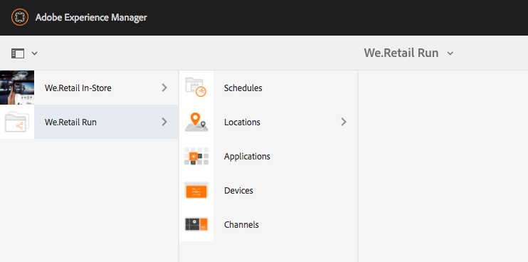

# Utveckla en anpassad komponent för AEM-skärmar {#developing-a-custom-component-for-aem-screens}

I följande självstudiekurs går du igenom stegen för att skapa en anpassad komponent för AEM-skärmar. AEM Screens återanvänder många befintliga designmönster och tekniker från andra AEM-produkter. I självstudiekursen beskrivs skillnader och speciella överväganden när du utvecklar för AEM-skärmar.

## Översikt {#overview}

Den här självstudiekursen är avsedd för utvecklare som inte har använt AEM Screens tidigare. I den här självstudiekursen har en enkel Hello World-komponent byggts för en Sequence-kanal i AEM Screens. I en dialogruta kan författare uppdatera den text som visas.


## Förutsättningar {#prerequisites}

För att slutföra den här självstudiekursen behöver du följande:

1. [AEM 6.5](https://helpx.adobe.com/experience-manager/6-4/release-notes.html) eller [AEM 6.3](https://helpx.adobe.com/experience-manager/6-3/release-notes.html) + Senaste skärmar, funktionspaket

1. [AEM Screens Player](https://helpx.adobe.com/experience-manager/6-4/sites/deploying/using/configuring-screens-introduction.html)
1. Lokal utvecklingsmiljö

Självstudiestegen och skärmbilderna utförs med **CRXDE-Lite**. IDE kan också användas för att slutföra självstudiekursen. Mer information om hur du använder en IDE för att utveckla [med AEM finns här.](https://helpx.adobe.com/experience-manager/kt/sites/using/getting-started-wknd-tutorial-develop/part1.html#eclipse-ide)


## Projektinställningar {#project-setup}

Källkoden för ett skärmsprojekt hanteras vanligtvis som ett Maven-projekt med flera moduler. För att underlätta självstudiekursen har ett projekt förskapats med [AEM Project Archetype 13](https://github.com/Adobe-Marketing-Cloud/aem-project-archetype). Mer information om hur du [skapar ett projekt med Maven AEM Project Archetype finns här](https://helpx.adobe.com/experience-manager/kt/sites/using/getting-started-wknd-tutorial-develop/part1.html#maven-multimodule).

1. Hämta och installera följande paket med [CRX-pakethanteraren](http://localhost:4502/crx/packmgr/index.jsp):

   [Hämta fil](assets/base-screens-weretail-runuiapps-001-snapshot.zip)

   [Hämta fil](assets/base-screens-weretail-runuicontent-001-snapshot.zip)
   **Om du arbetar med Eclipse eller någon annan IDE-fil kan du även** hämta källpaketet nedan. Distribuera projektet till en lokal AEM-instans med kommandot Maven:

   **`mvn -PautoInstallPackage clean install`**

   Start HelloWorld SRC Screens We.Retail Run Project

   [Hämta fil](assets/src-screens-weretail-run.zip)

1. I [CRX Package Manager](http://localhost:4502/crx/packmgr/index.jsp) kontrollerar du att följande två paket är installerade:

   1. **screens-weretail-run.ui.content-0.0.1-SNAPSHOT.zip**
   1. **screens-weretail-run.ui.apps-0.0.1-SNAPSHOT.zip**
   

   Skärmar, Web.Retail Kör Ui.Apps och Ui.Innehållspaket som installeras via CRX Package Manager

1. Paketet **screens-weretail-run.ui.apps** installerar kod under `/apps/weretail-run`.

   Det här paketet innehåller koden som ansvarar för att återge anpassade komponenter för projektet. Det här paketet innehåller komponentkod och eventuell JavaScript eller CSS som behövs. Det här paketet bäddar även in **screens-weretail-run.core-0.0.1-SNAPSHOT.jar** som innehåller all Java-kod som behövs för projektet.

   >[!NOTE]
   >
   >I den här självstudiekursen skrivs ingen Java-kod. Om mer komplex affärslogik behövs kan back-end Java skapas och driftsättas med Core Java bundle.

   

   Representation av ui.apps-koden i CRXDE Lite

   Heloworld **-** komponenten är för närvarande bara en platshållare. Under kursen kommer funktioner att läggas till som gör det möjligt för en författare att uppdatera det meddelande som visas av komponenten.

1. Paketet **screens-weretail-run.ui.content** installerar kod under:

   * `/conf/we-retail-run`
   * `/content/dam/we-retail-run`
   * `/content/screens/we-retail-run`
   Det här paketet innehåller det startinnehåll och den konfigurationsstruktur som krävs för projektet. **`/conf/we-retail-run`** innehåller alla konfigurationer för Web.Retail Run-projektet. **`/content/dam/we-retail-run`** innehåller start av digitala resurser för projektet. **`/content/screens/we-retail-run`** innehåller innehållsstrukturen för skärmar. Innehållet under alla dessa sökvägar uppdateras huvudsakligen i AEM. För att främja enhetlighet mellan miljöer (lokal, utvecklare, scen, produktion) sparas ofta en grundinnehållsstruktur i källkontrollen.

1. **Gå till AEM-skärmar > Vi.Retail Run-projekt:**

   Från AEM Start-menyn > Klicka på Skärmar-ikonen. Verifiera att det går att se Kör projekt för webb.butik.

   

## Skapa Hello World-komponenten {#hello-world-cmp}

Komponenten Hello World är en enkel komponent som gör att en användare kan ange ett meddelande som ska visas på skärmen. Komponenten är baserad på [AEM Screens Component Template: https://github.com/Adobe-Marketing-Cloud/aem-screens-component-template](https://github.com/Adobe-Marketing-Cloud/aem-screens-component-template).

AEM Screens har intressanta begränsningar som inte nödvändigtvis gäller för traditionella WCM-webbplatskomponenter.

* De flesta skärmkomponenter måste köras i helskärmsläge på de digitala signeringsenheterna
* De flesta skärmkomponenter måste kunna bäddas in i sekvenskanalerna för att bildspel ska kunna genereras
* Redigering bör tillåta redigering av enskilda komponenter i en sekvenskanal, så att återgivning av dem i helskärmsläge inte är möjligt

1. I **CRXDE-Lite** `http://localhost:4502/crx/de/index.jsp` (eller IDE) navigerar du till `/apps/weretail-run/components/content/helloworld.`

   Lägg till följande egenskaper i `helloworld` komponenten:

   ```
       jcr:title="Hello World"
       sling:resourceSuperType="foundation/components/parbase"
       componentGroup="We.Retail Run - Content"
   ```

   

   Egenskaper för /apps/weretail-run/components/content/helpWorld

   Komponenten **mainWorld** utökar komponenten **foundation/components/parbase** så att den kan användas korrekt inuti en sekvenskanal.

1. Skapa en fil med `/apps/weretail-run/components/content/helloworld` namnet under `helloworld.html.`

   Fyll filen med följande:

   ```xml
   <!--/*
   
    /apps/weretail-run/components/content/helloworld/helloworld.html
   
   */-->
   
   <!--/* production: preview authoring mode + unspecified mode (i.e. on publish) */-->
   <sly data-sly-test.production="${wcmmode.preview || wcmmode.disabled}" data-sly-include="production.html" />
   
   <!--/* edit: any other authoring mode, i.e. edit, design, scaffolding, etc. */-->
   <sly data-sly-test="${!production}" data-sly-include="edit.html" />
   ```

   Skärmkomponenter kräver två olika återgivningar beroende på vilket [redigeringsläge](https://helpx.adobe.com/experience-manager/6-4/sites/authoring/using/author-environment-tools.html#PageModes) som används:

   1. **Produktion**: Förhandsgranska eller publicera (wcmmode=disabled)
   1. **Redigera**: används för alla andra redigeringslägen, t.ex. redigering, design, ställningar, utvecklare...
   `helloworld.html`fungerar som en växel, kontrollerar vilket redigeringsläge som är aktivt och omdirigerar till ett annat HTML-skript. En vanlig konvention som används för skärmkomponenter är att ha ett `edit.html` skript för redigeringsläget och ett skript för `production.html` produktionsläget.

1. Skapa en fil med `/apps/weretail-run/components/content/helloworld` namnet under `production.html.`

   Fyll filen med följande:

   ```xml
   <!--/*
    /apps/weretail-run/components/content/helloworld/production.html
   
   */-->
   
   <div data-duration="${properties.duration}" class="cmp-hello-world">
    <h1 class="cmp-hello-world__message">${properties.message}</h1>
   </div>
   ```

   Ovanför är produktionsmarkeringen för Hello World-komponenten. Ett `data-duration` attribut inkluderas eftersom komponenten används i en sekvenskanal. Attributet används av sekvenskanalen för att ta reda på hur länge ett sekvensobjekt ska visas. `data-duration`

   Komponenten återger en `div` och en `h1` tagg med text. `${properties.message}` är en del av HTML-skriptet som kommer att visa innehållet i en JCR-egenskap med namnet `message`. En dialogruta skapas senare där användaren kan ange ett värde för `message` egenskapstexten.

   Observera också att BEM-notation (Block Element Modifier) används med komponenten. BEM är en CSS-kodkonvention som gör det enklare att skapa återanvändbara komponenter. BEM är den syntax som används av [AEM:s kärnkomponenter](https://github.com/Adobe-Marketing-Cloud/aem-core-wcm-components/wiki/CSS-coding-conventions). Mer information finns här: [https://getbem.com/](https://getbem.com/)

1. Skapa en fil med `/apps/weretail-run/components/content/helloworld` namnet under `edit.html.`

   Fyll filen med följande:

   ```xml
   <!--/*
   
    /apps/weretail-run/components/content/helloworld/edit.html
   
   */-->
   
   <!--/* if message populated */-->
   <div
    data-sly-test.message="${properties.message}"
    class="aem-Screens-editWrapper cmp-hello-world">
    <p class="cmp-hello-world__message">${message}</p>
   </div>
   
   <!--/* empty place holder */-->
   <div data-sly-test="${!message}"
        class="aem-Screens-editWrapper cq-placeholder cmp-hello-world"
        data-emptytext="${'Hello World' @ i18n, locale=request.locale}">
   </div>
   ```

   Ovanför finns redigeringskoden för Hello World-komponenten. Det första blocket visar en redigeringsversion av komponenten om dialogmeddelandet har fyllts i.

   Det andra blocket återges om inget dialogrutemeddelande har angetts. I så fall visas `cq-placeholder` och `data-emptytext` återger etiketten ***Hello World*** som platshållare. Strängen för etiketten kan internationaliseras med i18n för att ge stöd för redigering i flera språkområden.

1. **Copy Sscreens Image Dialog to be used for the Hello World component.**

   Det är enklast att börja från en befintlig dialogruta och sedan göra ändringar.

   1. Kopiera dialogrutan från: `/libs/screens/core/components/content/image/cq:dialog`
   1. Klistra in dialogrutan under `/apps/weretail-run/components/content/helloworld`
   

1. **Uppdatera dialogrutan Hello World så att den innehåller en flik för meddelandet.**

   Uppdatera dialogrutan så att den matchar följande. JCR-nodstrukturen i den slutliga dialogrutan presenteras nedan i XML:

   ```xml
   <?xml version="1.0" encoding="UTF-8"?>
   <jcr:root xmlns:sling="https://sling.apache.org/jcr/sling/1.0" xmlns:cq="https://www.day.com/jcr/cq/1.0" xmlns:jcr="https://www.jcp.org/jcr/1.0" xmlns:nt="https://www.jcp.org/jcr/nt/1.0"
       jcr:primaryType="nt:unstructured"
       jcr:title="Hello World"
       sling:resourceType="cq/gui/components/authoring/dialog">
       <content
           jcr:primaryType="nt:unstructured"
           sling:resourceType="granite/ui/components/coral/foundation/tabs"
           size="L">
           <items jcr:primaryType="nt:unstructured">
               <message
                   jcr:primaryType="nt:unstructured"
                   jcr:title="Message"
                   sling:resourceType="granite/ui/components/coral/foundation/fixedcolumns">
                   <items jcr:primaryType="nt:unstructured">
                       <column
                           jcr:primaryType="nt:unstructured"
                           sling:resourceType="granite/ui/components/coral/foundation/container">
                           <items jcr:primaryType="nt:unstructured">
                               <message
                                   jcr:primaryType="nt:unstructured"
                                   sling:resourceType="granite/ui/components/coral/foundation/form/textfield"
                                   fieldDescription="Message for component to display"
                                   fieldLabel="Message"
                                   name="./message"/>
                           </items>
                       </column>
                   </items>
               </message>
               <sequence
                   jcr:primaryType="nt:unstructured"
                   jcr:title="Sequence"
                   sling:resourceType="granite/ui/components/coral/foundation/fixedcolumns">
                   <items jcr:primaryType="nt:unstructured">
                       <column
                           jcr:primaryType="nt:unstructured"
                           sling:resourceType="granite/ui/components/coral/foundation/container">
                           <items jcr:primaryType="nt:unstructured">
                               <duration
                                   jcr:primaryType="nt:unstructured"
                                   sling:resourceType="granite/ui/components/coral/foundation/form/numberfield"
                                   defaultValue=""
                                   fieldDescription="Amount of time the image will be shown in the sequence, in milliseconds"
                                   fieldLabel="Duration (ms)"
                                   min="0"
                                   name="./duration"/>
                           </items>
                       </column>
                   </items>
               </sequence>
           </items>
       </content>
   </jcr:root>
   ```

   Textfältet för meddelandet sparas i en egenskap med namnet `message` och det numeriska fältet för Varaktighet sparas i en egenskap med namnet `duration`. Dessa två egenskaper refereras båda i `/apps/weretail-run/components/content/helloworld/production.html` HTML som `${properties.message}` och `${properties.duration}`.

   

   Hello World - slutförd dialogruta

## Skapa bibliotek på klientsidan {#clientlibs}

Med klientbibliotek kan du ordna och hantera CSS- och JavaScript-filer som behövs för en AEM-implementering.

AEM-skärmar-komponenter återges annorlunda i redigeringsläge jämfört med förhandsgransknings-/produktionsläge. Två klientbibliotek skapas, ett för redigeringsläget och ett för Förhandsgranska/Produktion.

1. Skapa en mapp för klientbibliotek för Hello World-komponenten.

   Skapa `/apps/weretail-run/components/content/helloworld`en ny mapp med namnet `clientlibs`.

   

1. Under `clientlibs` mappen skapar du en ny nod med namnet `shared` av typen `cq:ClientLibraryFolder.`

   

1. Lägg till följande egenskaper i det delade klientbiblioteket:

   * `allowProxy` | Boolesk | `true`

   * `categories`| Sträng[] | `cq.screens.components`
   

   Egenskaper för /apps/weretail-run/components/content/helpWorld/clientlibs/shared

   Egenskapen categories är en sträng som identifierar klientbiblioteket. Kategorin cq.screens.component används i både redigeringsläget och läget Förhandsgranska/produktion. Därför läses alla CSS/JS som definierats i SharedClientlib in i alla lägen.

   Det är en god vana att aldrig visa några sökvägar direkt för /apps i en produktionsmiljö. Egenskapen allowProxy ser till att klientbibliotekets CSS och JS refereras via ett prefix of/etc.clientlibs.

1. Skapa en fil med namnet `css.txt` under den delade mappen.

   Fyll filen med följande:

   ```
   #base=css
   
   styles.less
   ```

1. Skapa en mapp med namnet `css` under `shared` mappen. Lägg till en fil med namnet `style.less` under `css` mappen. Klientbibliotekens struktur bör nu se ut så här:

   

   I stället för att skriva CSS direkt använder den här självstudien LESS. [LESS](https://lesscss.org/) är en populär CSS-förkompilator som stöder CSS-variabler, mixiner och funktioner. AEM-klientbibliotek stöder LESS-kompilering. Sass eller andra förkompilerare kan användas men måste kompileras utanför AEM.

1. Fyll `/apps/weretail-run/components/content/helloworld/clientlibs/shared/css/styles.less` med följande:

   ```css
   /**
       Shared Styles
      /apps/weretail-run/components/content/helloworld/clientlibs/shared/css/styles.less
   
   **/
   
   .cmp-hello-world {
       background-color: #fff;
   
    &__message {
     color: #000;
     font-family: Helvetica;
     text-align:center;
    }
   }
   ```

1. Kopiera och klistra in klientbiblioteksmappen för att skapa ett nytt klientbibliotek med namnet `shared` `production`.

   

   Kopiera det delade klientbiblioteket för att skapa ett nytt produktionsklientbibliotek

1. Uppdatera egenskapen `categories` för produktionsklientbiblioteket som ska `cq.screens.components.production.`

   Detta garanterar att formaten bara läses in i förhandsgransknings-/produktionsläge.

   

   Egenskaper för /apps/weretail-run/components/content/help/world/clientlibs/production

1. Fyll `/apps/weretail-run/components/content/helloworld/clientlibs/production/css/styles.less` med följande:

   ```css
   /**
       Production Styles
      /apps/weretail-run/components/content/helloworld/clientlibs/production/css/styles.less
   
   **/
   .cmp-hello-world {
   
       height: 100%;
       width: 100%;
       position: fixed;
   
    &__message {
   
     position: relative;
     font-size: 5rem;
     top:25%;
    }
   }
   ```

   Ovanstående format visar meddelandet centrerat mitt på skärmen, men endast i produktionsläge.

En tredje klientbibliotekskategori: kan `cq.screens.components.edit` användas för att lägga till redigeringsspecifika format i komponenten.

| Kategorin Clientlib | Användning |
|---|---|
| `cq.screens.components` | Format och skript som delas mellan redigerings- och produktionslägen |
| `cq.screens.components.edit` | Format och skript som endast används i redigeringsläge |
| `cq.screens.components.production` | Format och skript som endast används i produktionsläge |

## Skapa en designsida {#design-page}

AEM Screens använder [statiska sidmallar](https://helpx.adobe.com/experience-manager/6-5/sites/developing/using/page-templates-static.html) och [designkonfigurationer](https://helpx.adobe.com/experience-manager/6-4/sites/authoring/using/default-components-designmode.html) för globala ändringar. Designkonfigurationer används ofta för att konfigurera tillåtna komponenter för parsys i en kanal. Ett tips är att lagra dessa konfigurationer på ett appspecifikt sätt.

Nedanför en webbsida (We.Retail Run Design) skapas som lagrar alla konfigurationer som är specifika för Web.Retail Run-projektet.

1. I **CRXDE-Lite** `http://localhost:4502/crx/de/index.jsp#/apps/settings/wcm/designs` navigerar du till `/apps/settings/wcm/designs`
1. Skapa en ny nod under designmappen med namnet `we-retail-run` på en typ av `cq:Page`.
1. Under `we-retail-run` sidan lägger du till en annan nod med namnet `jcr:content` av typen `nt:unstructured`. Lägg till följande egenskaper i `jcr:content` noden:

   | Namn | Typ | Värde |
   |---|---|---|
   | jcr:title | Sträng | Vi.Retail Run |
   | sling:resourceType | Sträng | wcm/core/components/designer |
   | cq:doctype | Sträng | html_5 |

   

   Designsida på /apps/settings/wcm/designs/we-retail-run

## Skapa en sekvenskanal {#create-sequence-channel}

Komponenten Hello World är avsedd att användas på en sekvenskanal. Om du vill testa komponenten skapas en ny sekvenskanal.

1. Från AEM Start-menyn navigerar du till **Skärmar** > **We.Retail** Run > och väljer **Channels**.

1. Klicka på knappen **Skapa**

   1. Välj **Skapa entitet**
   

1. I guiden Skapa:

1. Mallsteg - välj **sekvenskanal**

   1. Egenskapssteg
   * Fliken Grundläggande > Titel = **Inaktiv kanal**
   * Fliken Kanal > Kontrollera **Gör kanalen online**
   

1. Öppna sidegenskaperna för inaktivitetskanalen. Uppdatera fältet Design så att det pekar på `/apps/settings/wcm/designs/we-retail-run,`den designsida som skapades i föregående avsnitt.

   

   Designkonfiguration som pekar på /apps/settings/wcm/designs/we-retail-run

1. Redigera den nyligen skapade inaktivitetskanalen för att öppna den.

1. Växla sidläge till **designläge**

   1. Klicka på **skiftnyckelsikonen** i parsys för att konfigurera de tillåtna komponenterna

   1. Välj gruppen **Skärmar** och **gruppen Kör - innehåll** .
   

1. Växla sidläge till **Redigera**. Komponenten Hello World kan nu läggas till på sidan och kombineras med andra sekvenskanalkomponenter.

   

1. I **CRXDE-Lite** `http://localhost:4502/crx/de/index.jsp#/apps/settings/wcm/designs/we-retail-run/jcr%3Acontent/sequencechannel/par` navigerar du till `/apps/settings/wcm/designs/we-retail-run/jcr:content/sequencechannel/par`. Observera att `components` egenskapen nu innehåller `group:Screens`, `group:We.Retail Run - Content`.

   

   Designkonfiguration under /apps/settings/wcm/designs/we-retail-run

## Mall för anpassade hanterare {#custom-handlers}

Om din anpassade komponent använder externa resurser som resurser (bilder, videoklipp, teckensnitt, ikoner osv.), specifika resursåtergivningar eller klientbibliotek (css, js osv.), läggs dessa inte automatiskt till i offlinekonfigurationen eftersom vi bara paketerar HTML-koden som standard.

För att du ska kunna anpassa och optimera exakt de resurser som hämtas till spelaren erbjuder vi en tilläggsmekanism för anpassade komponenter som visar deras beroenden för offline-cachningslogiken i skärmar.

I avsnittet nedan visas mallen för anpassade offline-resurshanterare och minimikraven i `pom.xml` för det specifika projektet.

```java
package …;

import javax.annotation.Nonnull;

import org.apache.felix.scr.annotations.Component;
import org.apache.felix.scr.annotations.Reference;
import org.apache.felix.scr.annotations.Service;
import org.apache.sling.api.resource.Resource;
import org.apache.sling.api.resource.ResourceUtil;
import org.apache.sling.api.resource.ValueMap;

import com.adobe.cq.screens.visitor.OfflineResourceHandler;

@Service(value = OfflineResourceHandler.class)
@Component(immediate = true)
public class MyCustomHandler extends AbstractResourceHandler {

 @Reference
 private …; // OSGi services injection

 /**
  * The resource types that are handled by the handler.
  * @return the handled resource types
  */
 @Nonnull
 @Override
 public String[] getSupportedResourceTypes() {
     return new String[] { … };
 }

 /**
  * Accept the provided resource, visit and traverse it as needed.
  * @param resource The resource to accept
  */
 @Override
 public void accept(@Nonnull Resource resource) {
     ValueMap properties = ResourceUtil.getValueMap(resource);
     
     /* You can directly add explicit paths for offline caching using the `visit`
        method of the visitor. */
     
     // retrieve a custom property from the component
     String myCustomRenditionUrl = properties.get("myCustomRenditionUrl", String.class);
     // adding that exact asset/rendition/path to the offline manifest
     this.visitor.visit(myCustomRenditionUrl);
     
     
     /* You can delegate handling for dependent resources so they are also added to
        the offline cache using the `accept` method of the visitor. */
     
     // retrieve a referenced dependent resource
     String referencedResourcePath = properties.get("myOtherResource", String.class);
     ResourceResolver resolver = resource.getResourceResolver();
     Resource referencedResource = resolver.getResource(referencedResourcePath);
     // let the handler for that resource handle it
     if (referencedResource != null) {
         this.visitor.accept(referencedResource);
     }
   }
}
```

Följande kod innehåller minimikraven i `pom.xml` för det specifika projektet:

```css
   <dependencies>
        …
        <!-- Felix annotations -->
        <dependency>
            <groupId>org.apache.felix</groupId>
            <artifactId>org.apache.felix.scr.annotations</artifactId>
            <version>1.9.0</version>
            <scope>provided</scope>
        </dependency>

        <!-- Screens core bundle with OfflineResourceHandler/AbstractResourceHandler -->
        <dependency>
            <groupId>com.adobe.cq.screens</groupId>
            <artifactId>com.adobe.cq.screens</artifactId>
            <version>1.5.90</version>
            <scope>provided</scope>
        </dependency>
        …
      </dependencies>
```

## Sammanställ allt {#putting-it-all-together}

I videon nedan visas den färdiga komponenten och hur den kan läggas till i en sekvenskanal. Kanalen läggs sedan till i en platsvisning och tilldelas till en skärmspelare.

>[!VIDEO](https://video.tv.adobe.com/v/22385?quaity=9)

## Kod klar {#finished-code}

Nedan visas den färdiga koden från självstudiekursen. screens-weretail-run.ui.ap **ps-0.0.1-SNAPSHOT.zip** och **screens-weretail-run.ui.content-0.0.1-SNAPSHOT.zip** är de kompilerade AEM-paketen. **SRC-screens-weretail-run-0.0.1.zip **är den icke-kompilerade källkoden som kan distribueras med Maven.

[Hämta fil](assets/screens-weretail-runuiapps-001-snapshot.zip)

[Hämta fil](assets/screens-weretail-runuicontent-001-snapshot.zip)

[Hämta fil](assets/screens-weretail-run.zip)
