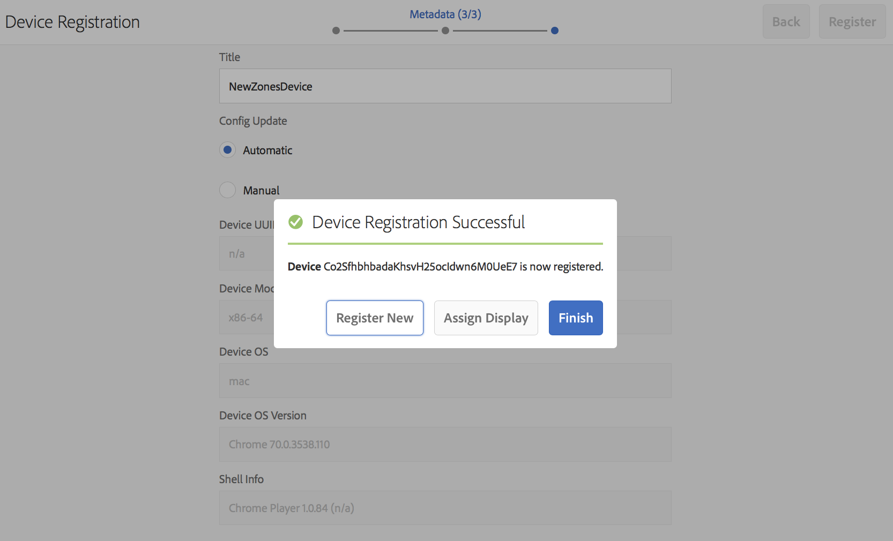
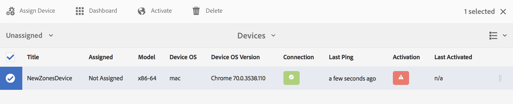

# Enhetsregistrering {#device-registration}

På följande sida beskrivs enhetsregistreringsprocessen i ett AEM Screens-projekt.

## Registrera en enhet {#registering-a-device}

Enhetsregistreringsprocessen görs på två olika datorer:

* Den faktiska enhet som ska registreras, till exempel din skyltskärm
* Den AEM som används för att registrera din enhet

>[!NOTE]
>
>När du har laddat ned den senaste versionen av Windows Player (*.exe*), från [AEM 6.4 Player Downloads](https://download.macromedia.com/screens/) följer du stegen på spelaren för att slutföra ad hoc-installationen:
>
>1. Tryck länge på det övre vänstra hörnet för att öppna administratörspanelen.
>1. Navigera till **Konfiguration** från den vänstra åtgärdsmenyn och ange platsadressen för AEM i **Server** och klicka **Spara**.
>1. Välj **Registrering** från den vänstra åtgärdsmenyn och stegen nedan för att slutföra enhetsregistreringsprocessen.
>


1. Starta AEM Screens Player på enheten. Registreringsgränssnittet visas.

   

1. I AEM navigerar du till **Enheter** projektmapp.

   >[!NOTE]
   >
   >Mer information om hur du skapar ett projekt för skärmar AEM kontrollpanelen finns i [Skapa och hantera skärmsprojekt](creating-a-screens-project.md).

1. Tryck/klicka på **Enhetshanteraren** i åtgärdsfältet.

   

1. Tryck/klicka på **Enhetsregistrering** överst till höger.

   

1. Välj önskad enhet (samma som steg 1) och tryck/klicka på **Registrera enhet**.

   

1. AEM väntar på att enheten ska skicka sin registreringskod.

   

1. Kontrollera **Registreringskod**.

   

1. Om **Registreringskod** är samma på båda datorerna, tryck/klicka **Validera** i AEM, vilket visas i steg 6.
1. Ange önskat namn för enheten och klicka på **Registrera**.

   

1. Tryck/klicka **Slutför** för att slutföra registreringsprocessen.

   

   >[!NOTE]
   >
   >The **Registrera nytt** gör att du kan registrera en ny enhet.
   >
   >The **Tilldela visning** gör att du kan lägga till enheten direkt på en skärm.

   Klicka **Slutför** tilldelar du enheten till en skärm.

   

   >[!NOTE]
   >
   >Mer information om hur du skapar och hanterar en visning för ditt skärmsprojekt finns i [Skapa och hantera skärmar](managing-displays.md).

### Tilldela enhet till en skärm {#assigning-device-to-a-display}

Om du inte har tilldelat enheten till en skärm följer du stegen nedan för att tilldela enheten till en skärm i ditt AEM Screens-projekt:

1. Markera enheten och klicka på **Tilldela enhet** i åtgärdsfältet.

   

1. Markera sökvägen för visningen i **Sökväg för Display/Device Config**.

   

1. Klicka **Tilldela** när du markerar banan.

   

1. Klicka **Slutför** när enheten har tilldelats korrekt, vilket visas i bilden nedan.

   

   Du kan även visa kontrollpanelen när du klickar **Slutför**.

   

## Söka efter en enhet från Enhetshanteraren {#search-device}

När du har registrerat enheter till spelaren kan du visa alla enheter från användargränssnittet i Enhetshanteraren.

1. Navigera till användargränssnittet i Enhetshanteraren från ditt AEM Screens-projekt, till exempel **DemoScreens** > **Enheter**.

1. Välj **Enheter** mapp och klicka på **Enhetshanteraren** i åtgärdsfältet.

   

1. Listan över registrerade enheter visas.

1. Om du har en lång lista över registrerade enheter kan du nu söka med sökikonen i åtgärdsfältet

   

   Eller

   Klicka `/` (snedstreck) för att aktivera sökfunktionen.

   


### Begränsningar för sökfunktioner {#limitations}

* Användaren kan söka efter alla ord som finns i *Enhets-ID* eller *Enhetsnamn*.

  >[!NOTE]
  >Vi rekommenderar att du skapar enhetsnamnen med flera ord, t.ex. *Boston Store Lobby* i stället för en enstaka *BostonStoreLobby*.

* Om du skapar enhetsnamn som *Boston Store Lobby* söker den efter alla ord *boston*, *store*, eller *lobby*. Om enhetsnamnet är *BostonStoreLobby* söker sedan efter *boston* visar inga resultat.

* Vildkort, `*` stöds för sökning. Om du vill hitta alla enheter med namn som börjar med *boston* kan du använda *boston**.

* Om enhetsnamnet är *BostonStoreLobby* och söka efter *boston* returnerar inte resultatet, och använder *boston** i sökvillkoren returnerar resultatet.

## Begränsningar för enhetsregistrering {#limitations-on-device-registration}

Användarlösenordsbegränsningar för hela systemet kan orsaka fel i enhetsregistreringen. Enhetsregistreringen använder ett slumpmässigt genererat lösenord för att skapa enhetsanvändaren.

Om lösenordet är begränsat av *AuthorizableActionProvider* konfiguration, det kan hända att det inte går att skapa enhetsanvändaren.

>[!NOTE]
>
>Det aktuella genererade slumpmässiga lösenordet består av 36 ASCII-tecken, mellan 33 och 122 (innehåller nästan alla specialtecken).

```java
25.09.2016 16:54:03.140 *ERROR* [59.100.121.82 [1474844043109] POST /content/screens/svc/registration HTTP/1.1] com.adobe.cq.screens.device.registration.impl.RegistrationServlet Error during device registration
javax.jcr.nodetype.ConstraintViolationException: Password violates password constraint (^(?=.*\d).{7,9}$).
        at org.apache.jackrabbit.oak.spi.security.user.action.PasswordValidationAction.validatePassword(PasswordValidationAction.java:105)
        at org.apache.jackrabbit.oak.spi.security.user.action.PasswordValidationAction.onPasswordChange(PasswordValidationAction.java:76)
        at org.apache.jackrabbit.oak.security.user.UserManagerImpl.onPasswordChange(UserManagerImpl.java:308)
```

### Andra resurser {#additional-resources}

Mer information om AEM Screens Player finns i [AEM Screens Player](working-with-screens-player.md).
