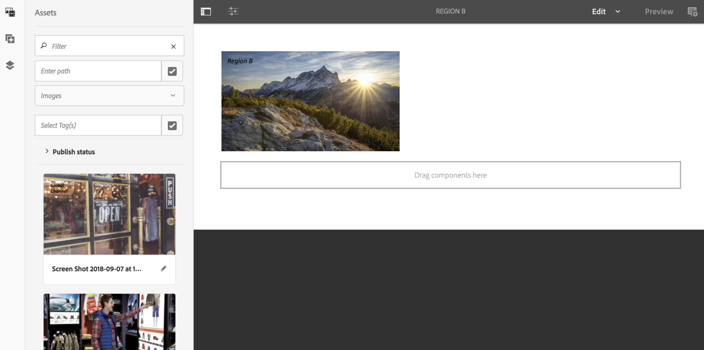
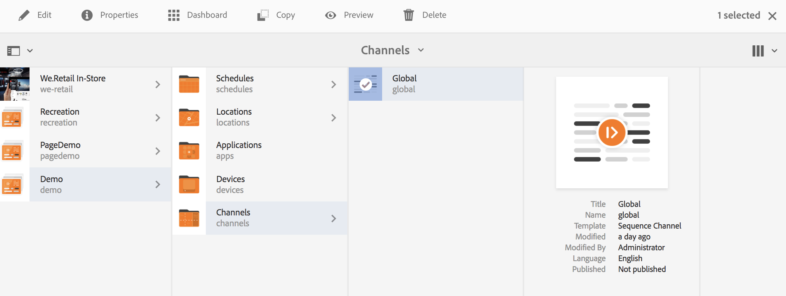
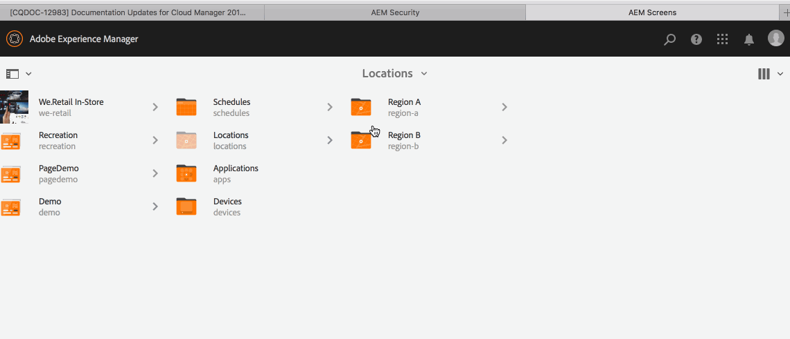

# Använda dynamisk inbäddad sekvens {#using-dynamic-embedded-sequence}

Användning av dynamiska inbäddade sekvenser omfattar följande ämnen:

* **Översikt**
* **Använda dynamisk inbäddad upplevelse i AEM Screens**
* **Visa resultat**
* **Begränsa användare och ändra åtkomstkontrollistor**

## Ökning {#overview}

***Dynamiska inbäddade sekvenser*** skapas för stora projekt som följer efter en hierarki av överordnade och underordnade projekt, där den underordnade refereras inuti en platsmapp och inte till en kanalmapp. Det gör att användaren kan bädda in en sekvens i en kanal med ***Kanalrollen***. Det gör att användaren kan definiera platsspecifika platshållare för olika kontor med hjälp av en inbäddad sekvens inuti en huvudkanal.

När du tilldelar en kanal till en visning kan du välja att ange sökvägen för visningen. Du kan också ange rollen för den kanal som matchar en faktisk kanal efter sammanhang.

Om du vill använda dynamisk inbäddad sekvens tilldelar du en kanal med ***Kanalrollen***. Kanalrollen definierar visningssammanhanget. Rollen avser olika åtgärder och är oberoende av den faktiska kanal som uppfyller rollen. I det här avsnittet beskrivs ett användningsfall som definierar kanaler efter roll och hur du kan tillämpa innehållet på en global kanal. Du kan också se rollen som en identifierare för tilldelningen eller ett alias för kanalen i sammanhanget för den.

### Fördelar med att använda dynamiska inbäddade sekvenser {#benefits-of-using-dynamic-embedded-sequences}

Genom att placera en sekvenskanal på en plats i stället för i kanalmappen kan lokala eller regionala författare redigera innehåll som är relevant för dem. Den kan också hindras från att redigera kanaler högre upp i hierarkin.

Med en *kanal efter roll* kan du skapa en lokal version av en kanal. Om du gör det kan du dynamiskt matcha platsspecifikt innehåll och även skapa en global kanal som använder innehållet för de platsspecifika kanalerna.

>[!NOTE]
>
>**Inbäddade sekvenser jämfört med dynamiska inbäddade sekvenser**
>
>En dynamisk inbäddad sekvens liknar en inbäddad sekvens men gör det möjligt för användaren att följa en hierarki där ändringar och uppdateringar som görs i en kanal sprids till en annan i relation till den. Den följer en hierarki med överordnade och underordnade objekt och innehåller även resurser som bilder eller videor.
>
>Med ***Dynamiska inbäddade sekvenser*** kan du visa platsspecifikt innehåll medan ***Inbäddade sekvenser*** bara visar allmänna bildspel av innehållet. När du konfigurerar dynamiska inbäddade sekvenser konfigurerar du kanalen med kanalroll och namn. Se stegen nedan för en praktisk implementering.
>
>Mer information om hur du implementerar inbäddade sekvenser finns i [Inbäddade sekvenser](embedded-sequences.md) i AEM Screens.

I följande exempel får du en lösning genom att fokusera på följande nyckeltermer:

* en ***huvudsekvenskanal*** för den globala sekvensen.
* ***dynamisk inbäddad sekvens***-komponenter för varje lokalt anpassningsbar del av sekvensen.
* ***enskilda sekvenskanaler*** på respektive plats med en *roll* på skärmen som matchar den **dynamiska inbäddade sekvenskomponentens *roll***.

>[!NOTE]
>
>Mer information om kanaltilldelning finns i **[Kanaltilldelning](channel-assignment.md)** under redigeringsavsnittet i AEM Screens-dokumentationen.

## Använda dynamisk inbäddad sekvens {#using-dynamic-embedded-sequence-2}

I följande avsnitt beskrivs hur du skapar en dynamisk inbäddad sekvens i en AEM Screens-kanal.

### Förutsättningar {#prerequisites}

Innan du börjar implementera den här funktionen måste du se till att du har följande krav på dig att börja implementera dynamiska inbäddade sekvenser:

* Skapa ett AEM Screens-projekt (i det här exemplet **Demo**).
* Skapa en **global**-kanal under mappen **Kanaler**.
* Lägg till innehåll i din **Global**-kanal (*Kontrollera **Resources.zip**för relevanta resurser*).

Följande bild visar **Demo**-projektet med **Global**-kanalen i mappen **Kanaler**.

### Resurser {#resources}

Du kan hämta följande resurser (bilder och lägga till dem i resurser) och sedan använda dem som kanalinnehåll för demonstrationssyfte.

[Hämta fil](assets/resources.zip)

>[!NOTE]
>
>Mer information om hur du skapar ett projekt och hur du skapar en sekvenskanal finns i följande resurser:
>
>* **[Skapa och hantera projekt](creating-a-screens-project.md)**
>* **[Hantera en kanal](managing-channels.md)**
>

Implementering av Dynamic Embedded Sequence i ett AEM Screens-projekt innefattar tre viktiga uppgifter:

1. **Konfigurerar Project-taxonomin inklusive kanaler, platser och skärmar**
1. **Skapar ett schema**
1. **Tilldela schema till varje skärm**

Följ stegen nedan för att implementera funktionen:

>[!CAUTION]
>
>När du implementerar dynamiska inbäddade sekvenser ska du vara försiktig med fälten **Namn** och **Titel** när du skapar kanaler under varje plats. Följ instruktionerna på nomenklaturen noga.

1. **Skapa en mapp med två platser.**

   Navigera till mappen **Platser** i ditt AEM Screens-projekt och skapa två platsmappar som **Region A** och **Region B**.

   >[!NOTE]
   >
   >När du skapar platsmappen **Region A** måste du ange **Title** som **Region A** och lämna fältet **Name** tomt, så automatiskt hämtas namnet **region-a**.
   >
   >Liknande är fallet när du skapar platsmappen **Region B** enligt nedan:

   

   >[!NOTE]
   >Mer information om hur du skapar en plats finns i **[Skapa och hantera platser](managing-locations.md)**.

1. **Skapa två platser och en kanal under varje platsmapp.**

   1. Navigera till **Demo** > **Platser** > **Region A**.
   1. Klicka på **Region A** och klicka på **+ Skapa** i åtgärdsfältet.
   1. Klicka på **Plats** i guiden med **Titel** som **Butik**. Skapa på samma sätt en annan plats från guiden med namnet **Store 2** med **Title** som **Store 2**. Du kan lämna fältet **Namn** tomt när du skapar **Butik 1** och **Butik 2**.
   1. Upprepa steg b och klicka nu på **Sekvenskanal** i guiden. Ange **Title** som **Region A** och **Name** som **region** för den här kanalen.

   >[!CAUTION]
   >
   >Kontrollera att du anger **Title** som **Region A** och **Name** som **region** när du skapar kanalen **Region A**.

   

   Skapa på samma sätt två platser under **Region B** med namnet **Store 3** och **Store 4**. Skapa också en **sekvenskanal** med **Titel** som **Region B** och **Namn** som **region**.

   >[!CAUTION]
   >
   >Se till att du kan använda samma namn för de kanaler som skapas i **region A** och **region B** som **region**.

   

1. **Skapa visning och kanal under varje plats.**

   1. Navigera till **Demo** > **Platser** > **Region A** > **Store 1**.
   1. Klicka på **Lagra 1** och klicka på **+ Skapa** i åtgärdsfältet.
   1. Klicka på **Visa** i guiden och skapa **`Store1Display`**.
   1. Upprepa steg b och klicka den här gången på **Sekvenskanal** i guiden. Ange **Title** as **`Store1Channel`** och **Name** som **store**.

   >[!CAUTION]
   >
   >Det är viktigt när du skapar en sekvenskanal att kanalens **titel** är ditt krav, men **namnet** ska vara detsamma i alla lokala kanaler.
   >I det här exemplet delar kanalerna under **Region A** och **Region B** **Name** som **region** och kanalerna under **`Store 1`**, **`Store 2`**, **`Store 3`** och **`Store 4`** delar **Name** som **store**.

   

   Skapa på samma sätt en visning som **`Store2Display`** och en kanal **`Store2Channel`** under **`Store `** (med namnet **store**).

   >[!NOTE]
   >Se till att du kan använda samma namn för de kanaler som skapas i **`Store 1`** och **`Store 2`** som **store**.

   

   Följ stegen ovan så att du kan skapa en kanal och visa den i **`Store 3`** och **`Store 4`** under **Region B**. Kontrollera igen att du använder samma **Namn** som **store** när du skapar kanalen **`Store3Channel`** och **`Store4Channel`**.

   I följande bild visas visningen och kanalen i **`Store 3`**.

   

   I följande bild visas visningen och kanalen i **`Store 4`**.

   

1. **Lägg till innehåll i kanalerna på deras respektive platser.**

   Navigera till **Demo** > **Platser** > **Region A** > **Region A** och klicka på **Redigera** i åtgärdsfältet. Dra och släpp de resurser du vill lägga till i kanalen.

   >[!NOTE]
   >Du kan använda filen ***Resources.zip*** i avsnittet **Resources** ovan om du vill använda bilderna som resurser för ditt kanalinnehåll.

   

   På samma sätt går du till **Demo** > **Platser** > **Region B** > **Region B** och klickar på **Redigera** i åtgärdsfältet för att dra och släppa resurserna i din kanal, som visas nedan:

   

   Följ de föregående stegen och resurserna så att du kan lägga till innehåll i följande kanaler:

   * **`Store1Channel`**
   * **`Store2Channel`**
   * **`Store3Channel`**
   * **`Store4Channel`**

1. **Skapa ett schema**

   Navigera och klicka på mappen **Scheman** i ditt AEM Screens-projekt. Klicka sedan på **Skapa** i åtgärdsfältet.

   Följande bild visar **AdSchedule** som skapats i **Demo** -projektet.

   

1. **Tilldela kanaler till ett schema**

   1. Navigera till **Demo** > **Scheman** > **AdSchedule** och klicka på **Kontrollpanelen** i åtgärdsfältet.
   1. Klicka på **+ Tilldela kanal** på panelen **TILLDELADE KANALER** så att du kan öppna dialogrutan **Kanaltilldelning**.
   1. Klicka på **Referenskanal** efter sökväg.
   1. Klicka på **kanalsökvägen**, precis som **Demo** > ***Kanaler*** > ***Global***.
   1. Ange **kanalrollen**, precis som **GlobalAdSegment**.
   1. Klicka på **Händelser som stöds**, precis som **Inledande inläsning**, **Inaktivitetsskärm** och **Användarinteraktion**.
   1. Klicka på **Spara**.

   **Tilldela kanal efter roll för region:**

   1. Klicka på **+ Tilldela kanal** på panelen **TILLDELADE KANALER**.
   1. Klicka på **Referenskanal** efter namn i dialogrutan Kanaltilldelning.
   1. Ange **kanalnamnet** som **regionen***.
   1. Ange **kanalrollen** som **RegionAdSegment**.
   1. Klicka på **Spara**.

   **Tilldela kanal efter roll för butik:**

   1. Klicka på **+ Tilldela kanal** på panelen **TILLDELADE KANALER**.
   1. Klicka på **Referenskanal** efter namn i dialogrutan Kanaltilldelning.
   1. Ange **kanalnamnet** som **butik**.
   1. Ange **kanalrollen** som **StoreAdSegment**.
   1. Klicka på **Spara**.

   I följande bild visas de tilldelade kanalerna per sökväg och roll.

   

1. **Konfigurerar dynamisk inbäddad sekvens till den globala kanalen.**

   Navigera till den **globala** kanal som du ursprungligen skapade i projektet **Demo** .

   Klicka på **Redigera** i åtgärdsfältet.

   

   Dra och släpp två **Dynamic Embedded Sequence** -komponenter i kanalredigeraren i redigeraren.

   Öppna egenskaperna från en av komponenterna och ange **kanaltilldelningsrollen** som **RegionAdSegment**.

   Klicka på de andra komponenterna och öppna egenskaper för att ange **rollen för kanaltilldelning** som **StoreAdSegment**.

   

1. **Tilldela schema till varje skärm**

   1. Navigera till varje skärm, till exempel **Demo** > **Platser** > **Region A** >**Store 1** >**`Store1Display`**.
   1. Klicka på **Instrumentpanel** i åtgärdsfältet.
   1. Klicka på **..** på panelen **TILLDELADE KANALER &amp; SCHEMAT** på kontrollpanelen och klicka sedan på **+Tilldela schema**.
   1. Klicka på sökvägen till schemat (här, till exempel **Demo** > **Scheman** > **AdSchedule**).
   1. Klicka på **Spara**.

## Visa resultaten {#viewing-the-results}

När du har konfigurerat kanalerna och visningen är klar startar du AEM Screens Player för att visa innehållet.

>[!NOTE]
>
>Mer information om AEM Screens Player finns i följande resurser:
>
>* [Hämta AEM Screens Player](https://download.macromedia.com/screens/)
>* [Arbeta med AEM Screens Player](working-with-screens-player.md)

Följande utdata bekräftar ditt kanalinnehåll i AEM Screens Player, beroende på visningssökvägen.

**Scenario 1**:

Om du tilldelar visningssökvägen som **Demo** > **Platser** > **Region A** > **Store 1** > **`Store1Display`** visas följande innehåll i din AEM Screens Player.

**Scenario 1**:

Om du tilldelar visningssökvägen som **Demo** > **Platser** > **Region B** > **Store 3** > **`Store3Display`** visas följande innehåll i din AEM Screens Player.

## Begränsa användare och ändra åtkomstkontrollistor {#restricting-users-and-modifying-the-acls}

Du kan skapa globala, regionala eller lokala författare för att redigera innehåll som är relevant för dem samtidigt som du inte kan redigera kanaler högre upp i hierarkin.

Redigera åtkomstkontrollistorna så att du kan begränsa användarens åtkomst till innehållet baserat på deras plats.

### Exempel {#example-use-case}

I följande exempel kan du skapa tre användare för demonstrationsprojektet ovan.

Följande behörigheter tilldelas varje grupp:

**Grupper**:

* **Global-Author**: Består av användare som har åtkomst till alla platser och kanaler i projektet **Demo** och har alla läs-, skriv- och redigeringsbehörigheter.

* **Region-Author**: Består av användare som har läs-, skriv- och redigeringsbehörighet för **Region A** och **Region B**.

* **Store-Author**: Består av användare som bara har läs-, skriv- och redigeringsbehörighet för **Store**, **Store**, **Store 3** och **Store 4**.

#### Steg för att skapa användargrupper, användare och konfigurera åtkomstkontrollistor {#steps-for-creating-user-groups-users-and-setting-up-acls}

>[!NOTE]
>
>Mer information om hur du skiljer ut projekt med hjälp av åtkomstkontrollistor så att varje enskild person eller grupp hanterar sitt eget projekt finns i **Konfigurera åtkomstkontrollistor**.

Följ stegen nedan för att skapa grupper, användare och ändra åtkomstkontrollistor enligt behörigheterna:

1. **Skapa grupper**

   1. Navigera till **Adobe Experience Manager**.
   1. Klicka på **Verktyg** > **Dokumentskydd** > **Grupper**.
   1. Klicka på **Skapa grupp** och ange **Global-Author** i **ID**.
   1. Klicka på **Spara och stäng**.

   Du kan även skapa två andra grupper, till exempel **Region-Author** och **Store-Author**.

   

1. **Skapa användare och lägg till användare i grupper**

   1. Navigera till **Adobe Experience Manager**.
   1. Klicka på **Verktyg** > **Säkerhet** > **Användare**.
   1. Klicka på **Skapa användare** och ange sedan **Global-användare** i **ID**.
   1. Ange **Lösenord** och bekräfta lösenordet för den här användaren.
   1. Klicka på fliken **Grupper** och ange gruppnamnet i **Klicka på Grupp**, till exempel ange **Global-Author** om du vill lägga till **Global-User** i den specifika gruppen.
   1. Klicka på **Spara och stäng**.

   Du kan även skapa två andra användare, till exempel **Region-User** och **Store-User**, och lägga till dem i **Region-Author** respektive **Store-Author** .

   >[!NOTE]
   >Det är en god vana att lägga till användare i en grupp och sedan tilldela behörigheter till varje enskild användargrupp.

   

1. **Lägg till alla grupper i deltagare**

   1. Navigera till **Adobe Experience Manager**.
   1. Klicka på **Verktyg** > **Dokumentskydd** > **Grupper**.
   1. Klicka på **Medarbetare** i listan och klicka på fliken **Medlemmar**.
   1. Klicka på **gruppen**, till exempel **Global-Author**, **Region-Author,** och **Store-Author**, till medverkande.
   1. Klicka på **Spara och stäng**.

1. **Åtkomstbehörigheter för varje grupp**

   1. Navigera till *användaradministratören* och använd det här gränssnittet för att ändra behörigheter för olika grupper.
   1. Sök efter **Global-Author** och klicka på fliken **Behörigheter** enligt bilden nedan.
   1. På samma sätt kan du komma åt behörigheterna för **Region-Author** och **Store-Author**.

   

1. **Ändra behörigheter för varje grupp**

   **För global författare:**

   1. Gå till fliken **Behörigheter**
   1. Navigera till ***/content/screens/demo*** och kontrollera alla behörigheter
   1. Navigera till ***/content/screens/demo/locations*** och kontrollera alla behörigheter
   1. Navigera till ***/content/screens/demo/locations/region-a*** och kontrollera alla behörigheter. Kontrollera på liknande sätt behörigheterna för **`region-b`**.

   Se följande bild för att förstå stegen:
   

   Följande visar att **Global-User** har åtkomst till den **globala kanalen**. Åtkomst till både **Region A** och **Region B** med alla fyra butikerna: **Store 1**, **Store 2**, **Store 3** och **Store 4**.

   

   **För region-författare:**

   1. Gå till fliken **Behörigheter**.
   1. Navigera till ***/content/screens/demo*** och kontrollera endast behörigheterna **Läs**.
   1. Navigera till ***/content/screens/demo/locations*** och kontrollera endast behörigheterna **Läs**.
   1. Navigera till ***/content/screens/demo/channel*** och avmarkera behörigheterna för **Global**-kanal.
   1. Navigera till ***/content/screens/demo/locations***/***region-a*** och kontrollera alla behörigheter. Kontrollera på liknande sätt behörigheterna för **`region-b`**.

   Se följande bild så att du kan förstå stegen:

   

   Följande visar att Region-User har åtkomst till både **Region A** och **Region B**. Åtkomst till alla fyra butikerna, nämligen **Store 1**, **Store 2**, **Store 3** och **Store 4**, men har inte åtkomst till **Global** Channel.

   

   **För Store-Author:**

   1. Gå till fliken **Behörigheter**.
   1. Navigera till ***/content/screens/demo*** och kontrollera endast behörigheterna **Läs**.
   1. Navigera till ***/content/screens/demo/locations*** och kontrollera endast behörigheterna **Läs**.
   1. Navigera till ***/content/screens/demo/channel*** och avmarkera behörigheterna för **Global**-kanal.
   1. Navigera till ***/content/screens/demo/locations/region-a*** och kontrollera bara **läsbehörigheterna**. På samma sätt bör du bara kontrollera **läsbehörigheterna** för **`region-b`**.
   1. Navigera till ***/content/screens/demo/locations***/***region-a /store-1*** och kontrollera alla behörigheter. Kontrollera på samma sätt behörigheterna för **store-2, store-3,** och **store-4**.

   Se följande bild så att du kan förstå stegen:

   

   Följande visar att **Store-User** endast har åtkomst till **Store 1**, **Store 2**, **Store 3** och **Store 4**. Den har dock inte behörighet att komma åt kanalerna **Global** eller region (**Region A** och **Region B**).

   

>[!NOTE]
>
>Mer information om hur du konfigurerar behörigheter finns i [Konfigurera åtkomstkontrollistor](setting-up-acls.md).
