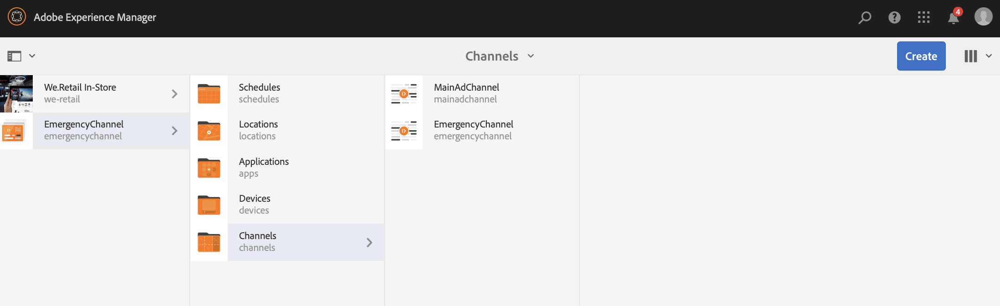
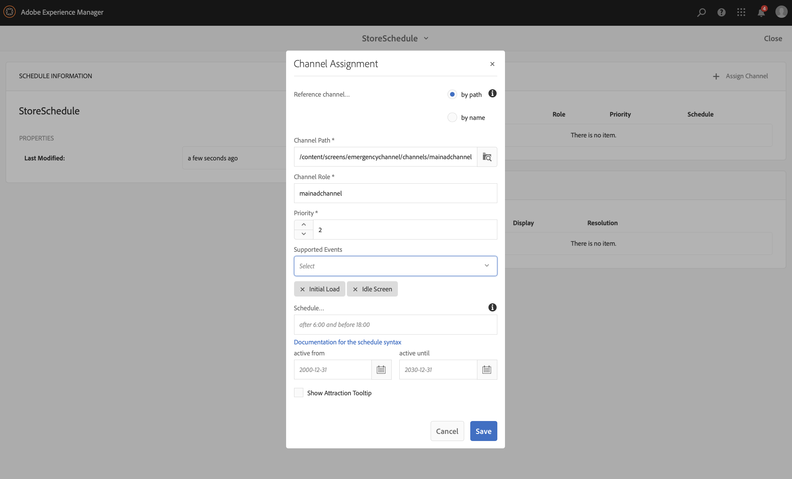

# Nödkanal {#emergency-channel}

## Använd fallbeskrivning {#use-case-description}

I det här avsnittet beskrivs ett exempel på hur du använder ett användningsexempel som fokuserar på att skapa och hantera en nödkanal som innehållsförfattaren kan växla från en sekvenskanal om ett villkor uppfylls.

### Förhandsvillkor {#preconditions}

Innan du börjar med det här användningsexemplet måste du förstå hur du gör:

* **[Skapa och hantera kanaler](managing-channels.md)**
* **[Skapa och hantera platser](managing-locations.md)**
* **[Skapa och hantera scheman](managing-schedules.md)**
* **[Enhetsregistrering](device-registration.md)**

### Primära skådespelare {#primary-actors}

Innehållsförfattare

## Grundläggande flöde: Konfigurera projektet {#basic-flow-setting-up-the-project}

Följ stegen nedan för att konfigurera en nödkanal:

1. Skapa ett AEM Screens-projekt med namnet **EmergencyChannel**, enligt nedan.

   >[!NOTE]
   >Mer information om hur du skapar och hanterar projekt i AEM Screens finns i Skapa ett projekt.

   

1. **Skapa en sekvenskanal**

   1. Välj mappen **Kanaler** och klicka på **Skapa** för att öppna guiden och skapa en kanal.

   1. Välj **Sekvenskanal** i guiden och skapa kanalen **MainAdChannel**.

   

1. **Lägga till innehåll i sekvenskanalen**

   1. Markera kanalen (**MainAdChannel**).
   1. Klicka på **Redigera** i åtgärdsfältet för att öppna redigeraren. Dra och släpp några resurser i kanalen.

   

1. **Skapa en nödkanal**

   1. Välj mappen **Kanaler**.
   1. Klicka på **Skapa** för att öppna guiden och skapa en kanal.
   1. Välj **Sekvenskanal** i guiden och skapa kanalen **EmergencyChannel**.

   >[!NOTE]
   >
   >Normalt läggs din nödkanal till i ditt befintliga produktionsprojekt.

   

1. **Lägga till innehåll i en nödkanal**

   1. Markera kanalen (**Nödkanal)**.
   1. Klicka på **Redigera** i åtgärdsfältet för att öppna redigeraren. Dra och släpp den resurs som du vill ska köras i en nödsituation till kanalen.

   

1. **Skapa en plats**

   1. Navigera till mappen **Platser**.
   1. Klicka på **Skapa** i åtgärdsfältet och skapa en plats med namnet **Store** i guiden.

   

1. **Skapar bildskärmar på din plats**

   Navigera till din plats (**Store**) och klicka på **Skapa** i åtgärdsfältet. Följ guiden för att skapa två **skärmar** med namnet **StoreFront** och **StoreRear**.

   

1. **Skapa ett schema**

   1. Navigera till mappen **Scheman**.
   1. Klicka på **Skapa** i åtgärdsfältet. Följ guiden för att skapa ett schema med namnet **StoreSchedule**.

   

1. Tilldela båda skärmarna till ditt schema och ange prioriteter

   1. Välj schemat **(StoreSchedule)** och klicka på **Kontrollpanel** i åtgärdsfältet.

   1. Klicka på **+ Tilldela kanal** på panelen **TILLDELADE KANALER**.

   1. I dialogrutan **Kanaltilldelning**:

      1. Välj sökvägen till **MainAdChannel**
      1. Ange **Prioritet** som 2
      1. Ange att händelser som stöds ska vara **Inledande inläsning** och **Inaktivitetsskärm**.
      1. Klicka på **Spara**

      På samma sätt måste du utföra samma steg igen för att tilldela **EmergencyChannel** och ange dess **prioritet**.
   >[!NOTE]
   >
   >Prioritet används för att ordna tilldelningarna om flera matchar uppspelningsvillkoren. Den som har det högsta värdet har alltid företräde framför de lägre värdena.

   

1. Klicka på **+ Tilldela kanal** på panelen **TILLDELADE KANALER**.

1. I dialogrutan **Kanaltilldelning**:

   1. Välj sökvägen till **EmergencyChannel**
   1. Ange **Prioritet** som 1

   1. Ange att händelser som stöds ska vara **Inledande inläsning**, **Inaktivitetsskärm** och **Användarinteraktion**

   1. Klicka på **Spara**

   

   Du kan visa de tilldelade kanalerna från kontrollpanelen **StoreSchedule**.

   

1. **Tilldela schema till varje skärm**

   1. Navigera till varje skärm, till exempel **EmergencyChannel** —> **Platser** —> **Store** —>**StoreFront**.

   1. Klicka på **Kontrollpanel** i åtgärden för att öppna kontrollpanelen.
   1. Klicka på **..** från panelen **TILLDELADE KANALER OCH SCHEMALÄGG** och klicka på **+Tilldela schema**.

   1. Välj sökvägen till schemat (här, till exempel **EmergencyChannel** —> **Scheman** —>**StoreSchedule**).

   1. Klicka på **Spara**.

   Du kan visa det tilldelade schemat för visningen från kontrollpanelen **StoreSchedule**.
   

1. **Enhetsregistrering**

   Slutför registreringsprocessen och när du har registrerat dig ser du följande utdata på din AEM Screens-spelare.

   

## Växlar till nödkanal {#switching-to-emergency-channel}

I händelse av en kris utför du följande steg:

1. Gå till **EmergencyChannel** —> **Scheman** —> **StoreSchedule** och välj **Kontrollpanel** i åtgärdsfältet.

   

1. Välj **EmergencyChannel** från kontrollpanelen **StoreSchedule** och klicka på **Redigera tilldelning**.

   

1. Uppdatera **Prioritet** för **Nödkanal** till **3** i dialogrutan **Kanaltilldelning** och klicka på **Spara**.

   

1. Så snart kanalens prioritet har uppdaterats visar alla AEM Screens-spelare innehållet **EmergencyChannel** enligt nedan.

   

### Slutsats {#conclusion}

**Nödkanalen** kommer att fortsätta visa innehållet tills innehållsförfattaren återställer prioritetsvärdet till 1.

När innehållsförfattaren får instruktionerna om att nödläget har rensats bör han/hon uppdatera prioriteten för **MainAdChannel**, vilket gör att den normala uppspelningen återupptas.
