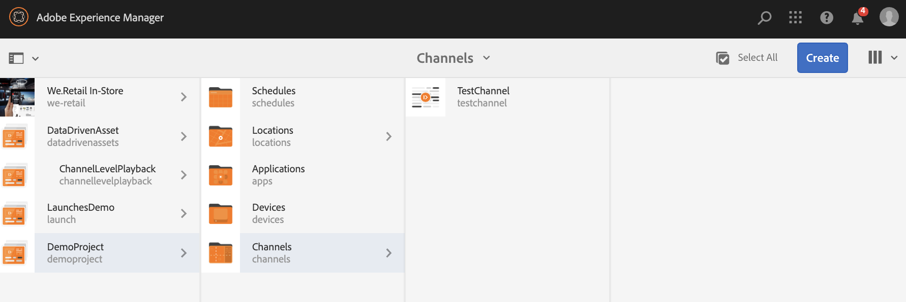
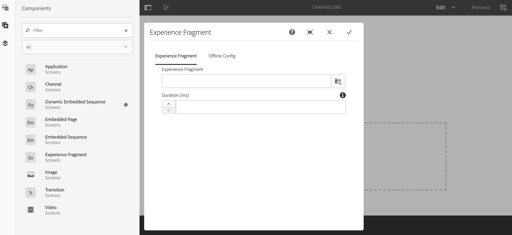
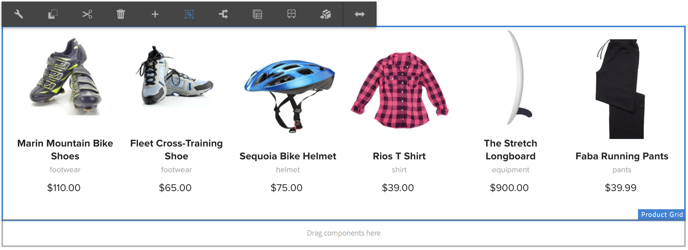

# Använda upplevelsefragment {#using-experience-fragments}

Den här sidan innehåller följande avsnitt:

* **Översikt**
* **Använda Experience Fragments i AEM Screens**
* **Sprider ändringar på sidan**

## Ökning {#overview}

Ett ***Experience Fragment*** är en grupp med en eller flera komponenter, inklusive innehåll och layout, som kan refereras till på sidor. Experience Fragments kan innehålla alla komponenter. Den kan till exempel innehålla en eller flera komponenter som kan innehålla vad som helst i ett styckesystem som refereras till den fullständiga upplevelsen eller som begärs av en tredje slutpunkt.

## Använda Experience Fragments i AEM Screens {#using-experience-fragments-in-aem-screens}

>[!NOTE]
>I följande exempel används **`We.Retail`** som ett demoprojekt där Experience Fragment används från en **Sites** -sida till ett AEM Screens-projekt.

Följande arbetsflöde visar till exempel hur du använder Experience Fragments från `We.Retail` i Sites. Du kan välja en webbsida och använda det innehållet i din AEM Screens-kanal i något av dina projekt.

### Krav {#pre-requisites}

**Skapa ett demonstrationsprojekt med en kanal**

***Skapa ett projekt***

1. Om du vill skapa ett projekt klickar du på **Skapa Screens-projekt**.
1. Ange titeln som **DemoProject**.
1. Klicka på **Spara**.

Ett **DemoProject** har lagts till i din AEM Screens.

***Skapar en kanal***

1. Navigera till **DemoProject** du skapat och klicka på mappen **Kanaler** .

1. Klicka på **Skapa** i åtgärdsfältet så att du kan öppna guiden.
1. Välj mallen **Sekvenskanal** i guiden och klicka på **Nästa**.

1. Ange **Title** som **TestChannel** och klicka på **Create**.

En **TestChannel** har lagts till i ditt **DemoProject**.\

### Skapa ett upplevelsefragment {#creating-an-experience-fragment}

Följ stegen nedan för att tillämpa innehållet från **`We.Retail`** på din **TestChannel** i **DemoProject**.

1. **Navigera till en webbplatssida i We.Retail**

   1. Navigera till Sites och klicka på **`We.Retail`** > **United States** > **English** > **Equipment** och klicka på den här sidan så att du kan använda den som en Experience Fragment för din Screens-kanal.

   1. Klicka på **Redigera** i åtgärdsfältet så att du kan öppna sidan som du vill använda som Experience Fragment för din Screens-kanal.

1. **Återanvända innehållet**

   1. Klicka på det fragment som du vill inkludera i kanalen.
   1. Klicka på den sista ikonen till höger så att du kan öppna dialogrutan **Konvertera till Experience Fragment**.

   

1. **Skapa ett Experience Fragment**

   1. Välj **Åtgärd** som **Skapa ett nytt Experience Fragment**.

   1. Klicka på den **överordnade sökvägen**.
   1. Klicka på **Mallen**. Välj mallen **Experience Fragment - Screens Variation** här (värde i fältet `/libs/settings/screens/experience-fragments/templates/experience-fragment-template-screens`).

   1. Ange **Fragment Title** som **ScreensFragment**.

   1. Klicka på bockmarkeringen för att slutföra skapandet av ett nytt Experience Fragment.

   

   Om du vill välja ett enklare alternativ klickar du på bockmarkeringen till höger om fältet så att du kan öppna valdialogrutan.

1. **Skapar Live-kopia av Experience Fragment**

   1. Navigera till AEM startsida.
   1. Klicka på **Experience Fragments** och markera **ScreensFragment** och klicka på **Variation som live-copy**, vilket visas i figuren nedan:

   

   c. Klicka på **ScreensFragment** i guiden **Skapa Live-kopia** och klicka på **Nästa**.

   d. Ange **Title** och **Name** som **Screens**.

   e. Klicka på **Skapa** så att du kan skapa Live-kopian.

   f. Klicka på **Klar** så att du kan gå tillbaka till sidan **ScreensFragment**.

   

   >[!NOTE]
   >
   >När du har skapat ett AEM Screens-fragment kan du redigera egenskaperna för fragmentet. Klicka på fragmentet och klicka på **Egenskaper** i åtgärdsfältet.

   **Redigera egenskaper för ett Screens-fragment**

   1. Navigera till **ScreensFragment** (du skapade i föregående steg) och klicka på **Egenskaper** i åtgärdsfältet.

   1. Klicka på fliken **Offlinekonfiguration** enligt bilden nedan.

   Du kan lägga till **klientbiblioteken** (Java™ och CSS) och **statiska filer** i ditt Experience Fragment.

   I följande exempel visas hur bibliotek på klientsidan och teckensnitten läggs till som en del av statiska filer i Experience Fragment.  

1. **Använda Experience Fragment som en komponent i Screens Channel**

   1. Navigera till den Screens-kanal där du vill använda fragmentet **Screens**.
   1. Klicka på **TestChannel** och klicka på **Redigera** i åtgärdsfältet.

   1. Klicka på komponentikonen på sidofliken.
   1. Dra och släpp **Experience Fragment** i din kanal.

   

   e. Klicka på komponenten **Experience Fragment** och klicka på den övre vänstra (skiftnyckel) ikonen så att du kan öppna dialogrutan **Experience Fragment** .

   f. Klicka på **Screens** Live Copy of the fragment that you created in *Step 3* in **Path**.

   

   f. Klicka på **Screens** Live Copy of the fragment that you created in *Step 3* i **Experience Fragment**.

   

   h. Ange millisekunder i **Varaktighet**.

   i. Klicka på **Offlinekonfigurationen** i dialogrutan **Experience Fragments** så att du kan definiera klientbiblioteken och de statiska filerna.

   >[!NOTE]
   >
   >Om du vill lägga till bibliotek på klientsidan, eller statiska filer utöver vad du konfigurerade i steg (4), kan du lägga till från fliken **Offlinekonfiguration** i dialogrutan **Experience Fragment** .

   

   j. Klicka på bockmarkeringen så att du kan slutföra processen.

### Validerar resultatet {#validating-the-result}

När du har slutfört de föregående stegen kan du validera din Experience Fragment i **ChannelOne** genom att:

1. Navigerar till **TestChannel**.
1. Välj **Förhandsgranska** i åtgärdsfältet.

Visa innehållet från sidan **Webbplatser** (live-copy av Experience Fragment) i din kanal, vilket visas i bilden nedan:\

## Sprider ändringar på sidan {#propagating-changes-from-the-master-page}

***Live-kopia*** refererar till kopian (av källan), som underhålls av synkroniseringsåtgärder som definieras av rollout-konfigurationerna.

Eftersom det Experience Fragment du skapade är en Live-kopia från **webbplatserna** och du ändrar det fragmentet från den primära sidan, kan du visa ändringarna i din kanal. Eller så kan du visa målet där du har använt Experience Fragment.

>[!NOTE]
>
>Mer information om Live Copy finns i Återanvända innehåll: Multisite Manager och Live Copy.

Följ stegen nedan för att sprida ändringar från den primära kanalen till målkanalen:

1. Klicka på Experience Fragment på sidan **Platser** (primär) och klicka på pennikonen så att du kan redigera objekten i Experience Fragment.

   

1. Klicka på Experience Fragment och klicka på skiftnyckelsikonen så att du kan öppna dialogrutan för att redigera bilderna.

   

1. Dialogrutan **Produktstödraster** öppnas.

   

1. Du kan redigera alla bilder. Här ersätts t.ex. den första bilden i det här avsnittet.

   

1. Klicka på Experience Fragment och klicka på ikonen Rollout så att du kan sprida ändringarna till det fragment som används i din kanal.

   

1. Klicka på Överrullning.

   Observera att ändringarna introduceras.

   

### Validerar ändringarna {#validating-the-changes}

Följ stegen nedan för att bekräfta ändringarna i din kanal:

1. Navigera till **Screens** > **Kanaler** > **Testkanal**.

1. Klicka på **Förhandsgranska** i åtgärdsfältet.

Följande bild visar ändringarna i din **TestChannel**:\

