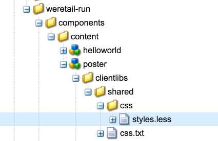

# Utöka en AEM Screens-komponent

I följande självstudiekurs går du igenom de olika stegen och de bästa sätten att utöka AEM Screens-komponenterna direkt. Bildkomponenten utökas för att lägga till en redigerbar textövertäckning.

## Ökning {#overview}

Den här självstudiekursen är avsedd för utvecklare som inte har använt AEM Screens tidigare. I den här självstudiekursen utökas Screens Image-komponenten för att skapa en Poster-komponent. En titel, beskrivning och logotyp läggs ovanpå en bild för att skapa en övertygande upplevelse i en sekvenskanal.

>[!NOTE]
>
>Innan du startar den här självstudiekursen rekommenderar vi att du slutför självstudiekursen: [Utveckla en anpassad komponent för AEM Screens](developing-custom-component-tutorial-develop.md).


En `Custom Poster`-komponent skapas genom att bildkomponenten utökas.

## Förutsättningar {#prerequisites}

Du behöver följande för att kunna slutföra den här självstudiekursen:

1. AEM 6.5 + Senaste Screens Feature Pack
1. [AEM Screens Player](/help/user-guide/aem-screens-introduction.md)
1. Lokal utvecklingsmiljö

Självstudiestegen och skärmbilderna utförs med CRXDE-Lite. [Eclipse](https://experienceleague.adobe.com/en/docs/experience-manager-65/content/implementing/developing/devtools/aem-eclipse) eller [IntelliJ](https://experienceleague.adobe.com/en/docs/experience-manager-65/content/implementing/developing/devtools/ht-intellij) IDE:er kan också användas för att slutföra självstudiekursen. Mer information om hur du använder en IDE för att [utveckla med AEM finns här](https://experienceleague.adobe.com/en/docs/experience-manager-learn/getting-started-wknd-tutorial-develop/project-archetype/project-setup).

## Projektinställningar {#project-setup}

Ett Screens-projekts källkod hanteras vanligtvis som ett Maven-projekt med flera moduler. För att underlätta självstudiekursen har ett projekt förskapats med [AEM Project Archetype 13](https://github.com/adobe/aem-project-archetype). Mer information om att [skapa ett projekt med Maven AEM Project Archetype finns här](https://experienceleague.adobe.com/en/docs/experience-manager-learn/getting-started-wknd-tutorial-develop/project-archetype/project-setup).

1. Hämta och installera följande paket med **CRX package manage** `http://localhost:4502/crx/packmgr/index.jsp)r:`

[Hämta fil](assets/start-poster-screens-weretail-runuiapps-001-snapshot.zip)

   [Hämta fil](assets/start-poster-screens-weretail-runuicontent-001-snapshot.zip)
   **Om du vill** kan du hämta källpaketet nedan om du arbetar med Eclipse eller någon annan IDE. Distribuera projektet till en lokal AEM-instans med kommandot Maven:

   **`mvn -PautoInstallPackage clean install`**

   SRC Starta Screens `We.Retail` Kör projekt

[Hämta fil](assets/start-poster-screens-weretail-run.zip)

1. I **CRX Package Manager** `http://localhost:4502/crx/packmgr/index.jsp` är följande två paket installerade:

   1. **`screens-weretail-run.ui.content-0.0.1-SNAPSHOT.zip`**
   1. **`screens-weretail-run.ui.apps-0.0.1-SNAPSHOT.zip`**

   

   AEM Screens `We.Retail Run Ui.Apps`- och `Ui.Content`-paket som installeras med CRX Package Manager

## Skapa komponenten Poster {#poster-cmp}

Komponenten Poster utökar den färdiga AEM Screens Image-komponenten. En mekanism med Sling, `sling:resourceSuperType`, används för att ärva huvudfunktionerna i Image-komponenten utan att behöva kopiera och klistra in. Mer information om grunderna i [Bearbetning av delningsbegäran finns här.](https://experienceleague.adobe.com/en/docs/experience-manager-65/content/implementing/developing/introduction/the-basics)

Komponenten Poster återges i helskärmsläge i förhandsgransknings-/produktionsläge. I redigeringsläge är det viktigt att återge komponenten på ett annat sätt för att underlätta redigering av sekvenskanalen.

1. I **CRXDE-Lite** `http://localhost:4502/crx/de/index.jsp` (eller valfri IDE) under `/apps/weretail-run/components/content`skapar du en `cq:Component` med namnet `poster`.

   Lägg till följande egenskaper i komponenten `poster`:

   ```xml
   <?xml version="1.0" encoding="UTF-8"?>
   <jcr:root xmlns:sling="https://sling.apache.org/jcr/sling/1.0" xmlns:cq="https://www.day.com/jcr/cq/1.0" xmlns:jcr="https://www.jcp.org/jcr/1.0"
       jcr:primaryType="cq:Component"
       jcr:title="Poster"
       sling:resourceSuperType="screens/core/components/content/image"
       componentGroup="We.Retail Run - Content"/>
   ```

   

   Egenskaper för /apps/weretail-run/components/content/affisch

   Genom att ställa in egenskapen `sling:resourceSuperType` på `screens/core/components/content/image` ärver Poster-komponenten alla funktioner i Image-komponenten. Likvärdiga noder och filer som hittas under `screens/core/components/content/image` kan läggas till under komponenten `poster` för att åsidosätta och utöka funktionen.

1. Kopiera noden `cq:editConfig` under `/libs/screens/core/components/content/image`. Klistra in `cq:editConfig` under komponenten `/apps/weretail-run/components/content/poster`.

   Uppdatera egenskapen `sling:resourceType` till lika med `weretail-run/components/content/poster` på noden `cq:editConfig/cq:dropTargets/image/parameters`.

   

   XML-representation av `cq:editConfig` som visas nedan:

   ```xml
   <?xml version="1.0" encoding="UTF-8"?>
   <jcr:root xmlns:sling="https://sling.apache.org/jcr/sling/1.0" xmlns:cq="https://www.day.com/jcr/cq/1.0" xmlns:jcr="https://www.jcp.org/jcr/1.0" xmlns:nt="https://www.jcp.org/jcr/nt/1.0"
       jcr:primaryType="cq:EditConfig">
       <cq:dropTargets jcr:primaryType="nt:unstructured">
           <image
               jcr:primaryType="cq:DropTargetConfig"
               accept="[image/.*]"
               groups="[media]"
               propertyName="./fileReference">
               <parameters
                   jcr:primaryType="nt:unstructured"
                   sling:resourceType="weretail-run/components/content/poster"
                   imageCrop=""
                   imageMap=""
                   imageRotate=""/>
           </image>
       </cq:dropTargets>
   </jcr:root>
   ```

1. Kopiera dialogrutan `image` för WCM Foundation som ska användas för komponenten `poster`.

   Det är enklast att börja från en befintlig dialogruta och sedan göra ändringar.

   1. Kopiera dialogrutan från: `/libs/wcm/foundation/components/image/cq:dialog`
   1. Klistra in dialogrutan under `/apps/weretail-run/components/content/poster`

   

   Dialogrutan har kopierats från `/libs/wcm/foundation/components/image/cq:dialog` till `/apps/weretail-run/components/content/poster`

   AEM Screens `image`-komponenten är supertypad till WCM Foundation `image` -komponenten. Därför ärver komponenten `poster` funktioner från båda. Dialogrutan för förhandsgranskningskomponenten består av en kombination av dialogrutorna Screens och Foundation. Funktionerna i **`Sling Resource Merger`** används för att dölja irrelevanta dialogrutefält och flikar som ärvs från de överordnade typkomponenterna.

1. Uppdatera `cq:dialog` under `/apps/weretail-run/components/content/poster` med följande ändringar representerade i XML:

   ```xml
   <?xml version="1.0" encoding="UTF-8"?>
   <jcr:root xmlns:sling="https://sling.apache.org/jcr/sling/1.0" xmlns:cq="https://www.day.com/jcr/cq/1.0" xmlns:jcr="https://www.jcp.org/jcr/1.0" xmlns:nt="https://www.jcp.org/jcr/nt/1.0"
       jcr:primaryType="nt:unstructured"
       jcr:title="Poster"
       sling:resourceType="cq/gui/components/authoring/dialog">
       <content
           jcr:primaryType="nt:unstructured"
           sling:resourceType="granite/ui/components/foundation/container">
           <layout
               jcr:primaryType="nt:unstructured"
               sling:resourceType="granite/ui/components/foundation/layouts/tabs"
               type="nav"/>
           <items jcr:primaryType="nt:unstructured">
               <image
                   jcr:primaryType="nt:unstructured"
                   jcr:title="Elements"
                   sling:resourceType="granite/ui/components/foundation/section">
                   <layout
                       jcr:primaryType="nt:unstructured"
                       sling:resourceType="granite/ui/components/foundation/layouts/fixedcolumns"
                       margin="{Boolean}false"/>
                   <items jcr:primaryType="nt:unstructured">
                       <column
                           jcr:primaryType="nt:unstructured"
                           sling:resourceType="granite/ui/components/foundation/container">
                           <items
                               jcr:primaryType="nt:unstructured"
                               sling:hideChildren="[linkURL,size]">
                               <file
                                   jcr:primaryType="nt:unstructured"
                                   sling:resourceType="cq/gui/components/authoring/dialog/fileupload"
                                   autoStart="{Boolean}false"
                                   class="cq-droptarget"
                                   fieldLabel="Image asset"
                                   fileNameParameter="./fileName"
                                   fileReferenceParameter="./fileReference"
                                   mimeTypes="[image]"
                                   multiple="{Boolean}false"
                                   name="./file"
                                   title="Upload Image Asset"
                                   uploadUrl="${suffix.path}"
                                   useHTML5="{Boolean}true"/>
                               <title
                                   jcr:primaryType="nt:unstructured"
                                   sling:resourceType="granite/ui/components/foundation/form/textfield"
                                   fieldLabel="Title"
                                   name="./jcr:title"/>
                               <description
                                   jcr:primaryType="nt:unstructured"
                                   sling:resourceType="granite/ui/components/foundation/form/textarea"
                                   fieldLabel="Description"
                                   name="./jcr:description"/>
                               <position
                                   jcr:primaryType="nt:unstructured"
                                   sling:resourceType="granite/ui/components/coral/foundation/form/click"
                                   fieldLabel="Text Position"
                                   name="./textPosition">
                                   <items jcr:primaryType="nt:unstructured">
                                       <left
                                           jcr:primaryType="nt:unstructured"
                                           text="Left"
                                           value="left"/>
                                       <center
                                           jcr:primaryType="nt:unstructured"
                                           text="Center"
                                           value="center"/>
                                       <right
                                           jcr:primaryType="nt:unstructured"
                                           text="Right"
                                           value="right"/>
                                   </items>
                               </position>
                               <color
                                   jcr:primaryType="nt:unstructured"
                                   sling:resourceType="granite/ui/components/coral/foundation/form/click"
                                   fieldLabel="Text Color"
                                   name="./textColor">
                                   <items jcr:primaryType="nt:unstructured">
                                       <light
                                           jcr:primaryType="nt:unstructured"
                                           text="Light"
                                           value="light"/>
                                       <dark
                                           jcr:primaryType="nt:unstructured"
                                           text="Dark"
                                           value="dark"/>
                                   </items>
                               </color>
                           </items>
                       </column>
                   </items>
               </image>
               <accessibility
                   jcr:primaryType="nt:unstructured"
                   sling:hideResource="{Boolean}true"/>
           </items>
       </content>
   </jcr:root>
   ```

   Egenskapen `sling:hideChildren`= `"[linkURL,size]` används på noden `items` för att säkerställa att fälten **linkURL** och **size** döljs i dialogrutan. Det räcker inte att ta bort de här noderna från förhandsgranskningsdialogrutan. Egenskapen `sling:hideResource="{Boolean}true"` på fliken Tillgänglighet används för att dölja hela fliken.

   Dubbelklicksfält läggs till i dialogrutan, Textplacering och Textfärg, så att författaren kan styra textens position och färgen för titeln och beskrivningen.

   

   Affisch - Slutlig dialogstruktur

   Nu kan en instans av komponenten `poster` läggas till på sidan **Inaktiv kanal** i `We.Retail` Kör projekt: `http://localhost:4502/editor.html/content/screens/we-retail-run/channels/idle-channel.edit.html`.

   

   Dialogrutefält för förhandsgranskning

1. Skapa en fil under `/apps/weretail-run/components/content/poster` med namnet `production.html.`

   Fyll filen med följande:

   ```xml
   <!--/*
   
       /apps/weretail-run/components/content/poster/production.html
   
   */-->
   <div data-sly-use.image="image.js"
        data-duration="${properties.duration}"
        class="cmp-poster"
        style="background-image: url(${request.contextPath @ context='uri'}${image.src @ context='uri'});">
       <div class="cmp-poster__text
                   cmp-poster__text--${properties.textPosition @ context='attribute'}
                   cmp-poster__text--${properties.textColor @ context='attribute'}">
           <h1 class="cmp-poster__title">${properties.jcr:title}</h1>
            <h2 class="cmp-poster__description">${properties.jcr:description}</h2>
       </div>
    
   </div>
   ```

   Produktionsmärkningen för komponenten Poster visas direkt ovanför. HTL-skriptet åsidosätter `screens/core/components/content/image/production.html`. `image.js` är ett serverskript som skapar ett POJO-liknande bildobjekt. Bildobjektet kan sedan anropas för att återge `src` som en bakgrundsbild i textformat.

   `The h1` och h2-taggar läggs till visar titel och beskrivning baserat på komponentegenskaperna: `${properties.jcr:title}` och `${properties.jcr:description}`.

   Omgivande `h1`- och `h2`-taggar är en div-wrapper med tre CSS-klasser med variationer av `cmp-poster__text`. Värdet för egenskaperna `textPosition` och `textColor` används för att ändra CSS-klassen som återges baserat på författarens dialogrutemarkering. I nästa avsnitt skrivs CSS från klientbibliotek för att aktivera dessa ändringar i visningen.

   En logotyp ingår också som ett överlägg i komponenten. I det här exemplet är sökvägen till logotypen ` We.Retail` hårdkodad i DAM. Beroende på användningsfallet kan det vara mer praktiskt att skapa ett dialogfält för att göra logotypsökvägen till ett dynamiskt ifyllt värde.

   Observera också att BEM-notation (Block Element Modifier) används med komponenten. BEM är en CSS-kodkonvention som gör det enklare att skapa återanvändbara komponenter. BEM är den notation som används av [AEM Core Components](https://github.com/adobe/aem-core-wcm-components/wiki/CSS-coding-conventions). <!-- DEAD LINK More info can be found at: [https://getbem.com/](https://getbem.com/) -->

1. Skapa en fil under `/apps/weretail-run/components/content/poster` med namnet `edit.html.`

   Fyll filen med följande:

   ```xml
   <!--/*
   
       /apps/weretail-run/components/content/poster/edit.html
   
   */-->
   
   <div class="aem-Screens-editWrapper ${image.cssClass} cmp-poster" data-sly-use.image="image.js" data-emptytext="${'Poster' @ i18n, locale=request.locale}">
       
       <div class="cmp-poster__text
              cmp-poster__text--${properties.textPosition @ context='attribute'}
          cmp-poster__text--${properties.textColor @ context='attribute'}">
         <p class="cmp-poster__title">${properties.jcr:title}</p>
         <p class="cmp-poster__description">${properties.jcr:description}</p>
       </div>
   </div>
   ```

   Markeringen **redigerad** för komponenten Poster visas direkt ovanför. HTL-skriptet åsidosätter `/libs/screens/core/components/content/image/edit.html`. Markeringen liknar markeringen `production.html` och visar titeln och beskrivningen ovanpå bilden.

   `aem-Screens-editWrapper` läggs till så att komponenten inte återges i helskärmsläge i redigeraren. Attributet `data-emptytext` ser till att en platshållare visas när ingen bild eller inget innehåll har fyllts i.

## Skapa bibliotek på klientsidan {#clientlibs}

Med bibliotek på klientsidan kan du ordna och hantera CSS- och JavaScript-filer som behövs för en AEM-implementering. Mer information om hur du använder [klientbibliotek finns här.](https://experienceleague.adobe.com/en/docs/experience-manager-65/content/implementing/developing/introduction/clientlibs)

AEM Screens-komponenter återges annorlunda i redigeringsläget jämfört med i förhandsgransknings-/produktionsläget. Två uppsättningar klientbibliotek skapas, en för redigeringsläget och en andra för Förhandsvisa/Produktion.

1. Skapa en mapp för klientbibliotek för komponenten Poster.

   Skapa en mapp med namnet `clientlibs` under `/apps/weretail-run/components/content/poster`.

   

1. Skapa en nod med namnet `shared` av typen `cq:ClientLibraryFolder.` under mappen `clientlibs`

   

1. Lägg till följande egenskaper i det delade klientbiblioteket:

   * `allowProxy` | Boolean | `true`
   * `categories` | Sträng [] | `cq.screens.components`

   

   Egenskaper för /apps/weretail-run/components/content/affisch/clientlibs/shared

   Egenskapen `categories` är en sträng som identifierar klientbiblioteket. Kategorin `cq.screens.components` används i både redigeringsläge och förhandsgransknings-/produktionsläge. Alla CSS/JS som definierats i klientlib `shared` läses därför in i alla lägen.

   Det är en god praxis att aldrig visa några sökvägar direkt till `/apps` i en produktionsmiljö. Egenskapen `allowProxy` ser till att klientbibliotekets CSS och JS refereras via prefixet `/etc.clientlibs`. Mer information om egenskapen [allowProxy finns här.](https://experienceleague.adobe.com/en/docs/experience-manager-65/content/implementing/developing/introduction/clientlibs)

1. Skapa filen `css.txt` under den delade mappen.

   Fyll filen med följande:

   ```
   #base=css
   
   styles.less
   ```

1. Skapa en mapp med namnet `css` under mappen `shared`. Lägg till filen `style.less` under mappen `css`. Klientbibliotekens struktur bör nu se ut så här:

   

   I stället för att skriva CSS direkt använder den här självstudien LESS. [LESS](https://lesscss.org/) är en populär CSS-förkompilator som stöder CSS-variabler, mixins och funktioner. AEM klientbibliotek stöder LESS-kompilering. Du kan använda Sass eller andra förkompilerare, men du måste kompilera dem utanför AEM.

1. Fyll i `/apps/weretail-run/components/content/poster/clientlibs/shared/css/styles.less` med följande:

   ```css
   /*
    /apps/weretail-run/components/content/poster/clientlibs/shared/css/styles.less
    Poster component - Shared Style
   */
   
   @import url('https://fonts.googleapis.com/css?family=Fjalla+One|Open+Sans:400i');
   
   @text-light-color: #fff;
   @text-dark-color: #000;
   @title-font-family: 'Fjalla One', sans-serif;
   @description-font-family: 'Open Sans', sans-serif;
   
   .cmp-poster {
   
         &__text {
         position: absolute;
         color: @text-light-color;
         top: 0;
         text-align:center;
         width: 100%;
   
         &--left {
          text-align: left;
                margin-left: 1em;
         }
   
         &--right {
          text-align: right;
                margin-right: 1em;
         }
   
         &--dark {
          color: @text-dark-color;
         }
       }
   
       &__title {
         font-weight: bold;
            font-family: @title-font-family;
            font-size: 1.2em;
       }
   
       &__description {
     font-style: italic;
           font-family: @description-font-family;
    }
   
   }
   ```

   >[!NOTE]
   >
   >Google Web Fonts används för teckensnittsfamiljer. Web Fonts kräver internetanslutning och inte alla AEM Screens-implementeringar har en tillförlitlig anslutning. Planering för offlineläge är en viktig faktor för AEM Screens-distributioner.

1. Kopiera klientbiblioteksmappen `shared`. Klistra in det som ett jämlikhetsobjekt och byt namn på det till `production`.

   

1. Uppdatera egenskapen `categories` för produktionsklientbiblioteket till `cq.screens.components.production.`

   Kategorin `cq.screens.components.production` ser till att formaten bara läses in i förhandsgransknings-/produktionsläge.

   

   Egenskaper för /apps/weretail-run/components/content/affisch/clientlibs/production

1. Fyll i `/apps/weretail-run/components/content/poster/clientlibs/production/css/styles.less` med följande:

   ```css
   /*
    /apps/weretail-run/components/content/poster/clientlibs/production/css/styles.less
    Poster component - Production Style
   */
   
   .cmp-poster {
   
       background-size: cover;
    height: 100%;
    width: 100%;
    position:absolute;
   
        &__text {
   
           top: 2em;
   
           &--left {
               width: 40%;
               top: 5em;
           }
   
           &--right {
               width: 40%;
               right: 1em;
           }
       }
   
       &__title {
     font-size: 5rem;
     font-weight: 900;
     margin: 0.1rem;
    }
   
    &__description {
     font-size: 2rem;
     margin: 0.1rem;
     font-weight: 400;
   
    }
   
       &__logo {
     position: absolute;
     max-width: 200px;
     top: 1em;
     left: 0;
    }
   
   }
   ```

   Ovanstående format visar rubriken och beskrivningen på en absolut plats på skärmen. Titeln visas större än beskrivningen. Komponentens BEM-notation gör det enkelt att noggrant omforma formningarna i klassen cmp-affisch.

En tredje klientbibliotekskategori: `cq.screens.components.edit` kan användas för att lägga till Redigera endast specifika format i komponenten.

| Kategorin Clientlib | Användning |
|---|---|
| `cq.screens.components` | Format och skript som delas mellan redigerings- och produktionslägen |
| `cq.screens.components.edit` | Format och skript som endast används i redigeringsläge |
| `cq.screens.components.production` | Format och skript som endast används i produktionsläge |

## Lägg till filmminiatyrkomponent i en sekvenskanal {#add-sequence-channel}

Poster-komponenten används på en sekvenskanal. Startpaketet för den här självstudiekursen innehöll en inaktivitetskanal. Inaktivitetskanalen är förkonfigurerad för att tillåta komponenter i gruppen **`We.Retail Run - Content`**. Poster-komponentens grupp är inställd på `We.Retail Run - Content` och är tillgänglig för att läggas till i kanalen.

1. Öppna inaktivitetskanalen från projektet `We.Retail` Kör: **`http://localhost:4502/editor.html/content/screens/we-retail-run/channels/idle-channel.edit.html`**
1. Dra och släpp en ny instans av komponenten **Poster** från sidofältet till sidan.

   

1. Redigera dialogrutan för förhandsgranskningskomponenten så att du kan lägga till en bild, titel, beskrivning. Använd alternativen Textplacering och Textfärg för att säkerställa att titeln/beskrivningen kan läsas över bilden.

   

1. Om du vill lägga till några Poster-komponenter upprepar du stegen ovan. Lägg till övergångar mellan komponenterna.

   

## Sammanställ allt {#putting-it-all-together}

I videon nedan visas den färdiga komponenten och hur den kan läggas till i en sekvenskanal. Kanalen läggs sedan till i en platsvisning och tilldelas till en Screens-spelare.

>[!VIDEO](https://video.tv.adobe.com/v/22414?quaity=9)

## Kod klar {#finished-code}

Nedan visas den färdiga koden från självstudiekursen. **screens-weretail-run.ui.apps-0.0.1-SNAPSHOT.zip** och **screens-weretail-run.ui.content-0.0.1-SNAPSHOT.zip** är kompilerade AEM-paket. **SRC-screens-weretail-run-0.0.1.zip** är den okompilerade källkoden som kan distribueras med Maven.

[Hämta fil](assets/final-poster-screens-weretail-runuiapps-001-snapshot.zip)

[Hämta fil](assets/final-poster-screens-weretail-runuicontent-001-snapshot.zip)

SRC Final AEM Screens `We.Retail` Run Project

[Hämta fil](assets/src-screens-weretail-run-001.zip)
