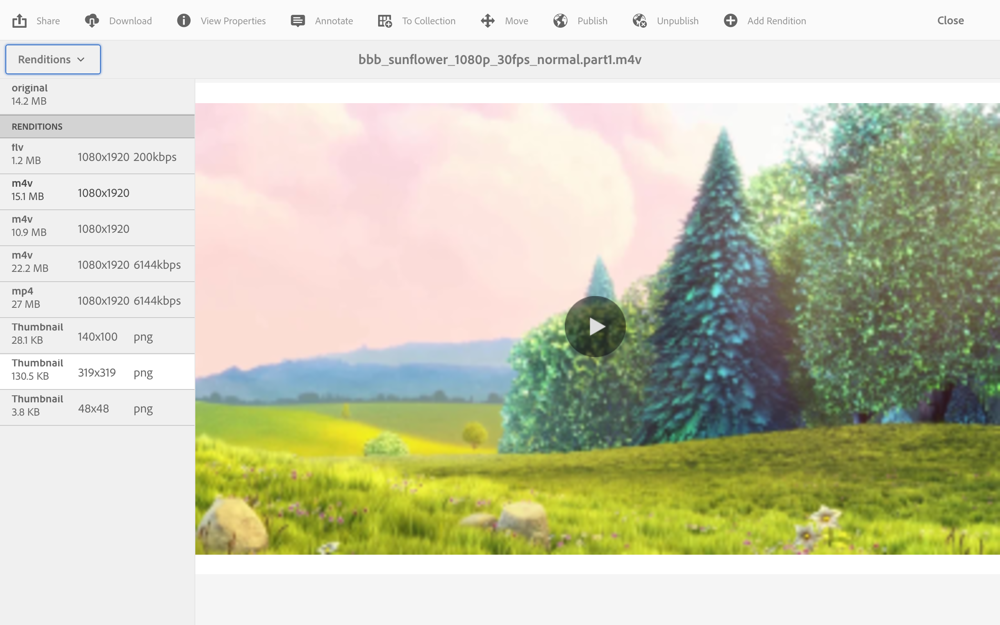
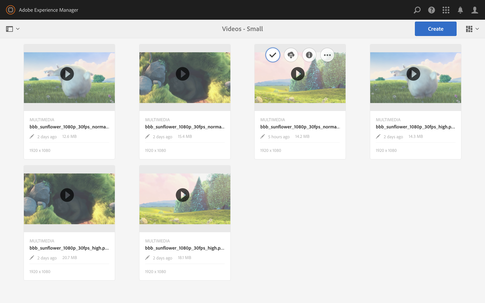

# Videoåtergivningar {#video-renditions}

Du kan generera manuella och automatiska Full HD-renderingar. I följande avsnitt beskrivs arbetsflödet för att lägga till återgivningar i dina resurser.

## Genererar automatiskt renderingar med full HD {#automatically-generating-full-hd-renditions}

>[!NOTE]
>
>Om AEM Screens videoåtergivningar inte spelas upp optimalt på din enhet kontaktar du maskinvaruleverantören för specifikationerna för videon. Detta hjälper till att få bästa prestanda på enheten och därmed skapa en egen anpassad videoprofil där du anger lämpliga parametrar för att FFMPEG ska kunna generera din återgivning. Använd sedan stegen nedan för att lägga till din anpassade videoprofil i listan med profiler.
>
>Se även [Felsöka videoklipp](troubleshoot-videos.md) för att felsöka och felsöka videouppspelning i din kanal.

Följ stegen nedan för att automatiskt generera fullständiga HD-renderingar:

1. Markera länken Adobe Experience Manager (överst till vänster) och klicka på hammesikonen för att välja verktyg för att välja **Arbetsflöde**.

   Klicka på **Modeller** för att ange hantering av arbetsflödesmodeller.

   

1. Välj modellen **DAM Update Asset** och klicka på Redigera i åtgärdsfältet för att öppna fönstret **DAM Update Asset**.

   

1. Dubbelklicka på steget **Fmpeg-omkodning**.

   

1. Välj fliken **Process** om du vill redigera processargumenten. Ange de fullständiga HD-profilerna i listan i **Arguments** som: ***,profile:fullhd-bp,profile:fullhd-hp*** och klicka på **OK**.

   

1. Klicka på **Spara** högst upp till vänster på skärmen **DAM Update Asset**.

   

1. Navigera till **Resurser** och överför en ny video. Klicka på videon och öppna sidospåret Återgivningar så ser du de två HD-videofilmerna.

   

1. Öppna **Återgivningar** från sidospåret.

   

1. Du kommer att märka två nya fullständiga HD-renderingar.

   

## Generera fullständiga HD-återgivningar manuellt {#manually-generating-full-hd-renditions}

Följ stegen nedan om du vill generera fullständiga HD-renderingar manuellt:

1. Markera länken Adobe Experience Manager (överst till vänster) och klicka på hammesikonen för att välja verktyg för att välja **Arbetsflöde**.

   Klicka på **Modeller** för att ange hantering av arbetsflödesmodeller.

   

1. Markera modellen **Skärmuppdatering** och klicka på **Starta arbetsflöde** för att öppna dialogrutan **Kör arbetsflöde**.

   

1. Välj önskad video i **Nyttolast** och klicka på **Kör**.

   

1. Navigera till **Resurser**, gå ned till resursen och klicka på den.

   

1. Öppna sidospåret **Återgivningar** så ser du de nya återgivningarna i full HD.

   

