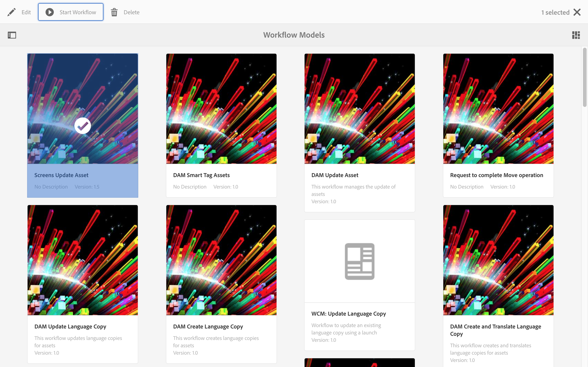

# Videoåtergivningar {#video-renditions}

Du kan generera manuella och automatiska Full HD-renderingar. I följande avsnitt beskrivs arbetsflödet för att lägga till återgivningar i dina resurser.

## Generera återgivningar med full HD automatiskt  {#automatically-generating-full-hd-renditions}

>[!NOTE]
>
>Om AEM Screens videoåtergivningar inte spelas upp optimalt på din enhet kontaktar du maskinvaruleverantören för specifikationerna för videon. Detta hjälper till att få bästa prestanda på enheten och skapar därför en egen anpassad videoprofil där du anger lämpliga parametrar för att FFMPEG ska kunna generera din återgivning. Använd sedan stegen nedan för att lägga till din anpassade videoprofil i listan med profiler.
>
>Se även [Felsöka videoklipp](troubleshoot-videos.md) för att felsöka och felsöka videouppspelning i din kanal.

Följ stegen nedan för att automatiskt generera fullständiga HD-renderingar:

1. Markera länken Adobe Experience Manager (överst till vänster) och klicka på hammarikonen så att du kan välja **Arbetsflöde**.

   Klicka **Models**.

   

1. I arbetsflödesmodellhanteringen väljer du **DAM-uppdateringsresurs** modell och klicka **Redigera** i åtgärdsfältet.

   

1. I **DAM-uppdateringsresurs** fönster, dubbelklicka på **FFmpeg-omkodning** steg.

   

1. Välj **Process** -fliken.
1. Ange de fullständiga HD-profilerna i listan **Argument** som följande:
   ***`,profile:fullhd-bp,profile:fullhd-hp`***
1. Klicka **OK**.

   

1. Klicka **Spara** längst upp till vänster i **DAM-uppdateringsresurs** skärm.

   

1. Navigera till **Resurser** och ladda upp en ny video. Klicka på videon och öppna sidolisten Återgivningar. Lägg märke till de två HD-videorna.

   

1. Öppna **Återgivningar** från sidospåret.

   

1. Lägg märke till två nya fullständiga HD-renderingar.

   

## Generera fullständiga HD-återgivningar manuellt {#manually-generating-full-hd-renditions}

Följ stegen nedan om du vill generera fullständiga HD-renderingar manuellt:

1. Markera länken Adobe Experience Manager (längst upp till vänster) och klicka på hammarikonen så att du kan välja verktyg och välja **Arbetsflöde**.

   Klicka **Models**.

   

1. I arbetsflödesmodellhantering väljer du **Skärmar - uppdatera resurs** och klicka på **Starta arbetsflöde** för att öppna **Kör arbetsflöde** -dialogrutan.

   

1. Välj önskad video i **Nyttolast** och klicka **Kör**.

   

1. Navigera till **Resurser**, gå ned till resursen och klicka på den.

   

1. Öppna **Återgivningar** sidospår. Lägg märke till de nya renderingarna med full HD.

   
