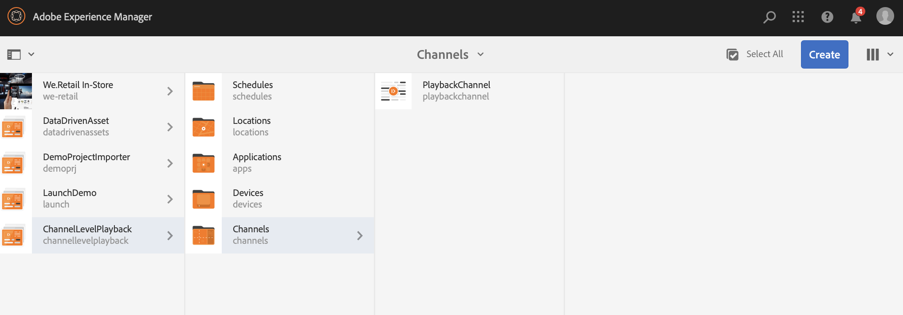

# Varaktighet för bilduppspelning {#image-playback-duration}

## Ökning {#overview}

När du har skapat en sekvenskanal och lagt till bilder i den får alla bilder som standard den uppspelningstid som definieras i konfigurationen på kanalnivå. Alla enskilda bilder kan fortfarande åsidosätta standardvärdet och ha en annan uppspelningstid. Detta uppnås genom att du redigerar uppspelningstiden för den specifika bildkomponenten.

### Förutsättningar {#prerequisites}

Innan du implementerar den här funktionen bör du kontrollera att du har konfigurerat ett projekt som en förutsättning för att börja implementera den här funktionen. Exempel:

1. Skapa ett AEM Screens-projekt (i det här exemplet **ChannelLevelPlayback**)
1. Skapa en sekvenskanal som **PlaybackChannel** under **Kanaler** mapp
1. Lägg till innehåll i **PlaybackChannel**

## Redigera bilduppspelningens varaktighet på kanalnivå {#editing-channel-level-image-playback-duration-assignment}

I avsnittet nedan beskrivs hur du redigerar uppspelningstiden för innehåll i en AEM Screens-kanal.

### Uppdatera uppspelningstiden för bilder i en kanal {#updating-the-playback-duration-for-images-in-a-channel}

Följ stegen nedan för att lära dig hur du uppdaterar tilldelning för bildspelets varaktighet på kanalnivå:

1. Navigera till sekvenskanalen **PlaybackChannel**.

   

1. Klicka **Redigera** i åtgärdsfältet.

   

1. Lägg till två eller flera bilder i kanalredigeraren, enligt bilden nedan.

   

1. Markera alla bilder i kanalen och välj skiftnyckelsikonen i det övre vänstra hörnet (som bilden nedan visar). Dialogrutan Konfigurera på kanalnivå öppnas.

   

1. **Sida** öppnas.

   >[!NOTE]
   >
   >Som standard är bilderna i en kanal inställda på 8 sekunders uppspelningstid.

   

   Redigera **Varaktighet** från 8 000 (millisekunder) till 3 000 (millisekunder), dvs. 3 sekunder. Klicka på bockmarkeringen längst upp till höger på **Sida** så att du kan spara ändringarna.

   

### Visa resultatet {#viewing-the-result}

När du har uppdaterat kanalens uppspelningstid (i det här exemplet alla tre bilderna) kan du se att bilderna spelas upp i 3 sekunder i stället för 8 sekunder (standardvärde).

