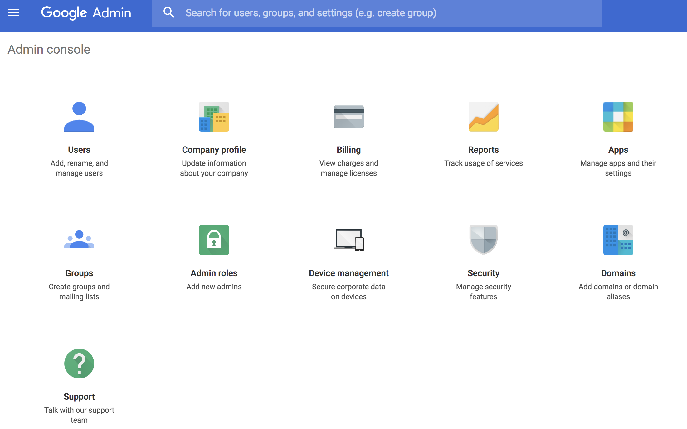

# Implementera Chrome OS Player {#implementing-chrome-os-player}

I det här avsnittet beskrivs hur du implementerar Chrome OS Player med Chrome Management Console.

## Använda Chrome Management Console {#using-chrome-management-console}

Följ stegen nedan för att konfigurera en kromhanteringskonsol:

1. Registrera dig för Chrome Management Console. Du måste skaffa en licens för Chrome Management Console. Kontakta [Google Support](https://support.google.com/chrome/a/answer/1375678?hl=en&amp;ref_topic=2935995) för att hantera Chrome-enhetsinställningar om du vill ha mer information.
1. Registrera din Chrome OS-enhet i domänen och vänta i 15 minuter på att enheten ska synkroniseras med Chrome Management Console. Klicka [här](https://support.google.com/chrome/a/answer/1360534?hl=en) om du vill veta mer om att registrera fönsterenhet.
1. Chrome Player kommer att vara tillgänglig i Chrome Web Store.

>[!NOTE]
>
>En enhetshanteringslösning som Chrome Management Console rekommenderas för driftsättning och hantering av enheter med Chrome OS. Även om det här dokumentet innehåller implementering för Chrome Management Console finns det andra leverantörer som hävdar att de tillhandahåller liknande funktioner. Kontakta leverantören av enhetshanteringsprogrammet.

### Aktivera Kiosk-läge {#enabling-kiosk-mode}

Aktivera Kiosk-läget genom att följa stegen nedan:

1. Logga in på Chrome Developer Console.

   

1. Bläddra till **Enhetshantering** > **Chrome Management** > **Enhetsinställningar**.
1. Bläddra ned till **Kiosk-inställningar** och klicka på **Hantera Kiosk-program**.

   

1. Välj AEM Screens Player från Chrome Web Store.

   >[!NOTE]
   >
   >En nyligen publicerad app kan ta ca 15 minuter att visa i den här listan.

1. Välj **AEM Screens Player** i listrutan **Starta Kiosk-app** automatiskt.

   Det kan ta några minuter beroende på nätverket för att ändringarna ska börja gälla. Omstart rekommenderas.

#### Kontrollerar status för fjärrenhet {#checking-remote-device-status}

1. Logga in på Chrome Developer Console.
1. Bläddra till **Enhetshantering** > **Chrome Devices** och välj den enhet som du vill styra.
1. Klicka på **Systemaktivitet och felsökning**.
1. Kontrollera egenskaperna **Starta om enheten** och **Skärmhämtning** för enheten. Du kan även kontrollera enhetsstatus och hälsoinformation.

>[!NOTE]
>
>Observera att dessa inställningar kan aktiveras flera minuter efter att enheten har registrerats. Varje alternativ kan aktiveras över tid.

### Konfigurera fjärrkonfiguration av Chrome OS-spelare {#configuring-remote-configuration-of-chrome-os-players}

AEM Screens Player är ett program som stöder Kiosk och som även aktiverar Remote Policy Configuration för Chrome OS-spelare.

Följ stegen nedan för att konfigurera olika alternativ för spelaren:

1. Logga in på Chrome Management Console.
1. Klicka på **Enhetshantering** > **Chrome Management** > **App Management**. AEM Screens Player visas i listan.
1. Klicka på programmet **AEM Screens Player**.
1. Klicka på **Kiosk-inställningar** och välj din organisation (*om du använder en testmiljö*).
1. Klicka på **överför konfigurationsfilen** och överför konfigurationsprincipen (*Json-fil*).
1. Klicka på **Spara**. Du måste starta om enheten för att synkronisera principen.

>[!NOTE]
>
>Starta om enheten för att synkronisera principändringar.

#### Exempel på princip-JSON-fil {#example-policy-json-file}

```java
{
  "server": {
    "Value": "https://aemscreensdemo.adobeitc.com"
  },
  "resolution": {
    "Value": "auto"
  },
  "rebootSchedule": {
    "Value": "at 4:00am"
  },
  "enableAdminUI": {
    "Value": true
  },
  "enableOSD": {
    "Value": true
  },
  "enableActivityUI": {
    "Value": true
  }
}
```

### Principattribut och syfte {#policy-attributes-and-purpose}

I följande tabell sammanfattas profilerna med deras funktioner.

| **Principnamn** | **Syfte** |
|---|---|
| *server* | URL:en till Adobe Experience Manager Server |
| *upplösning* | Upplösningen för Chrome OS-enheten |
| *rebootSchedule* | Schemat för att starta om Chrome-spelaren |
| *enableAdminUI* | Aktivera administratörsgränssnittet för tekniker för att konfigurera enheten på plats. Anges till false när den är helt konfigurerad och i produktion. |
| *enableOSD* | Aktivera kanalväljarens användargränssnitt så att användare kan växla kanaler på enheten. Överväg att ställa in på false när den är helt konfigurerad och i produktion. |
| *enableActivityUI* | Aktivera om du vill visa förloppet för aktiviteter som hämtning och synkronisering. Aktivera för felsökning och inaktivera när den är helt konfigurerad och i produktion. |

>[!NOTE]
>
>Principkonfigurationer används strikt och åsidosätts inte manuellt i spelarens administratörsgränssnitt. Om du vill tillåta manuell spelarkonfiguration för en viss princip ska du inte ange principen i ***principkonfigurationen***. Om du till exempel vill tillåta manuell konfiguration för omstartschema ska du inte ange nyckeln ***rebootSchedule*** i principkonfigurationen.
