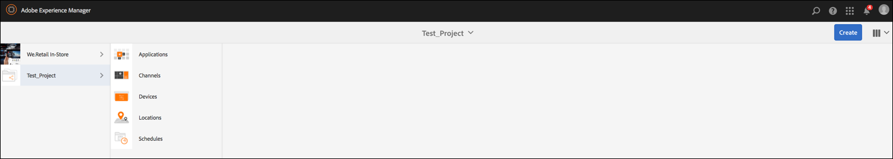
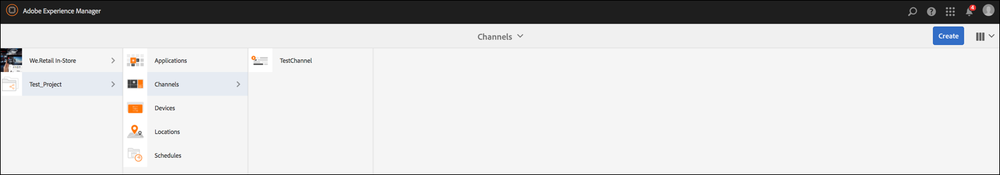
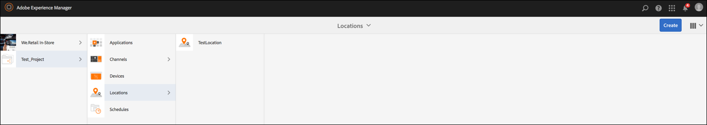
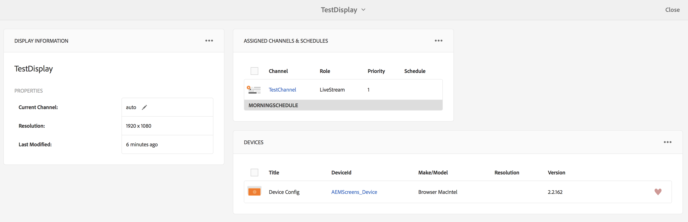

# Kickstart Guide {#kickstart-guide}

I det här avsnittet kommer vi snabbt igång med AEM Screens och visar hur du kan åstadkomma grundläggande åtgärder. Här får du hjälp med att skapa en grundläggande digital signeringsupplevelse med innehåll/resurser och publicera till en skärmspelare.

## Skapa en upplevelse av en digital skylt på 5 minuter {#creating-a-digital-signage-experience-in-minutes}

Med följande steg kan du skapa ett exempelprojekt för skärmar och publicera innehåll för skärmspelaren.

Om du vill hämta **AEM Screens Player** klickar du [här](https://download.macromedia.com/screens/).

Mer information om hur du implementerar Chrome OS Player finns i [Chrome Management Console](implementing-chrome-os-player.md) .

Mer information om hur du installerar och konfigurerar skärmspelare på enheter finns i [Installera och konfigurera skärmar](configuring-screens-introduction.md) .

>[!NOTE]
>**OSGI-inställningar**
>Du måste aktivera den tomma referenten för att enheten ska kunna skicka data till servern. Om t.ex. den tomma refereraregenskapen är inaktiverad, kan enheten inte publicera en skärmdump. Vissa av dessa funktioner är för närvarande bara tillgängliga om Apache Sling Referrer-filtret Tillåt tomt är aktiverat i OSGI-konfigurationen. Kontrollpanelen kan visa en varning om att skyddsinställningarna kan förhindra vissa av dessa funktioner från att fungera.
>
>
>Följ stegen nedan för att aktivera filtret ***Apache Sling Referrer Tillåt tomt***:

## Tillåt tomma referentförfrågningar {#allow-empty-referrer-requests}

1. Gå till **Adobe Experience Manager Web Console Configuration** via AEM:> hammer icon —> **Operations** —> **Web Console**.

   

1. **Adobe Experience Manager Web Console Configuration** öppnas. Sök efter försäljningsreferent.

   Om du vill söka efter egenskapen för Sing-refereraren trycker du på **Command+F** för **Mac** och **Ctrl+F** för **Windows**.

1. Markera alternativet **Tillåt tomt** , så som visas i bilden nedan.

   

1. Klicka på **Spara** för att aktivera Apache Sling Referer-filtret Tillåt tomt.

## Självstudiekurs {#tutorial}

1. **Skapa ett nytt projekt**

   1. Klicka på länken Adobe Experience Manager (överst till vänster) och sedan på **Skärmar**. Du kan också navigera direkt till `https://localhost:4502/screens.html/content/screens](https://localhost:4502/screens.html/content/screens`.

   1. Klicka på **Skapa** för att skapa ett nytt skärmsprojekt (se bilden nedan).
   1. Välj **Skärmar** i guiden **Skapa skärmar projekt** och klicka på **Nästa**.

   1. Ange titeln som *Test_Project* och klicka på **Create**.

   

   När projektet har skapats visas det igen på skärmens projektkonsol. Nu kan du välja ditt projekt. I ett projekt finns det fem typer av mappar: **Program**, **Kanaler**, **Enheter**, **Platser** och **Scheman**, vilket visas i bilden nedan.

   >[!NOTE]
   >
   >Scheman är bara tillgängliga om du har installerat AEM 6.3 Sites Feature Pack 1. Om du vill få tillgång till det här funktionspaketet måste du kontakta Adobe Support och begära åtkomst. När du har behörighet kan du hämta den från paketresursen.

   

   Mer information finns i [Skapa och hantera skärmsprojekt](creating-a-screens-project.md) .

1. **Skapa en ny kanal**

   När projektet är på plats måste du skapa en ny kanal där du hanterar innehållet.

   Följ stegen nedan för att skapa en ny kanal för ditt projekt:

   1. Navigera till *Test_Project* som du skapade och markera mappen **Kanaler** .

   1. Klicka på **Skapa** i åtgärdsfältet (se bilden nedan). En guide öppnas.
   1. Välj **sekvenskanal** och klicka på **Nästa**.

   1. Ange **Namn** och **Titel** som *TestChannel* och klicka på **Skapa**.

   

   TestChannel ** skapas och läggs till i kanalmappen, vilket visas i bilden nedan.

   

   Mer information om hur du skapar och hanterar kanaler finns i [Kanalhantering](managing-channels.md) .

1. **Lägga till innehåll i en kanal**

   När du väl har skapat kanalen måste du lägga till innehåll i kanalen som skärmspelaren ska visa.

   Följ stegen nedan för att lägga till innehåll i kanalen (*TestChannel*) i ditt projekt:

   1. Navigera till *Test_Project* som du skapade och markera mappen **Kanaler** .

   1. Klicka på **Redigera** i åtgärdsfältet (se bilden nedan). Redigeraren för *TestChannel* öppnas.

   1. Klicka på ikonen som växlar sidopanelen till vänster i åtgärdsfältet för att öppna resurserna och komponenterna.
   1. Dra och släpp de komponenter du vill lägga till i kanalen.

   

   I det här exemplet visar redigeraren en bild som lagts till i kanalen.

   

1. **Skapa en ny plats**

   När du väl har skapat din kanal måste du skapa en plats.

   ***Platserna*** är olika för olika digitala signeringsupplevelser och innehåller de konfigurationer som visas beroende på var de olika skärmarna finns.

   Följ stegen nedan för att skapa en ny plats för ditt projekt:

   1. Navigera till *Test_Project* som du skapade och markera mappen **Platser** .

   1. Klicka på **Skapa** bredvid plusikonen i åtgärdsfältet (se bilden nedan). En guide öppnas.
   1. Välj **Plats** i guiden och klicka på **Nästa**.

   1. Ange **namn** och **titel** för platsen (ange titeln som *TestLocation*) och klicka på **Skapa**.

   

   TestLocation ** skapas och läggs till i mappen **Locations** .

   

1. **Skapa en ny visning för *TestLocation***

   När du har skapat en plats måste du skapa en ny skärm för platsen.

   ***Skärmar*** representerar den digitala upplevelse som körs på en eller flera skärmar.

   1. Navigera till den plats där du vill skapa visningen (*Test_* Project —> **Locations** —> *TestLocation)* som visas i bilden ovan och välj *TestLocation*.

   1. Klicka på **Skapa** i åtgärdsfältet.
   1. Välj **Visning** i guiden **Skapa** och klicka på **Nästa**.

   1. Ange **namn** och **titel** för visningsplatsen (ange titeln som *TestDisplay*).

   1. Välj information om layouten på fliken **Visa** .

      1. Välj **Upplösning** som **Full HD**.

      1. Välj **Antal enheter vågrätt** som 1.
      1. Välj **Antal enheter lodrätt** som 1.
   1. Klicka på **Skapa**.

   En ny skärm (*TestDisplay*) läggs till på platsen *TestLocation)*, vilket visas i bilden nedan.

   

1. **Lägga till ett schema**

   *Med scheman* i AEM Screens kan du ordna kanaler i återanvändbara grupper så att du inte behöver upprepa deras uppdrag separat för varje skärm som du vill visa ditt innehåll på.

   >[!NOTE]
   >
   >Den här skärmfunktionen är bara tillgänglig om du har installerat AEM 6.3 Sites Feature Pack 1. Om du vill få tillgång till det här funktionspaketet måste du kontakta Adobe Support och begära åtkomst. När du har behörighet kan du hämta den från paketresursen.

   1. Navigera till mappen **Scheman** från Test_Project —> **Scheman**.

   1. Klicka på **Skapa** i åtgärdsfältet. En guide öppnas.
   1. Välj **Schemalägg** på sidan **Skapa** guide.

   1. Ange **Namn** och **Titel** som *morgonschema* på egenskapssidan.

   1. Klicka på **Skapa** och schemat läggs till i mappen **Scheman** , enligt bilden nedan.

   

   Dessutom väljer du schemat (*morgonschema*) och klickar på **Kontrollpanelen** i åtgärdsfältet för att visa kontrollpanelen för scheman. Du kan visa/ändra schemats egenskaper, tilldela kanaler och visa tilldelade visningar med kontrollpanelen.

   

   Mer information om scheman finns i [Skapa och hantera scheman](managing-schedules.md) .

1. **Tilldela en kanal**

   1. Navigera till visningen från *Test_Project* —> **Locations** —> *TestLocation* —> *TestDisplay*.

   1. Välj *TestDisplay* och tryck/klicka på **Tilldela kanal **i åtgärdsfältet, *eller*,

   1. Klicka på **Kontrollpanelen** och välj **+Tilldela kanal** längst upp till höger på panelen **TILLDELADE KANALER &amp; SCHEMALER** , som visas i bilden nedan. **Dialogrutan Kanaltilldelning** öppnas.

   1. Välj **referenskanal** efter **sökväg**

   1. Ange **kanalrollen** som *LiveStream*.

   1. Markera **kanalsökvägen** (*Test_Project* —> *Kanaler* —> *TestChannel* ) i **kanalen**.

   1. Välj **Prioritet** för den här kanalen som *1*.

   1. Välj **Händelser** som stöds som **Inledande inläsning** och **Inaktiv skärm**.

   1. Ange **Schedule** och välj de datum som är **aktiva från** och **aktiva till**.

   1. Click **Save**.

   Kanalen skapas och läggs till på panelen.

   

   Mer information om dialogrutan **Kanaltilldelning** och de egenskaper som är associerade med den finns i [Tilldela kanaler](channel-assignment.md).

1. **Lägga till schema i en kanal**

   1. Navigera till visningen från *Test_Project* —> **Locations** —> *TestLocation* —> *TestDisplay*.

   1. Klicka på **Kontrollpanelen** och välj **+Tilldela schema** överst till höger från panelen **TILLDELADE KANALER &amp; SCHEMALER** , vilket visas i bilden ovan. **Dialogrutan Schemalägg** tilldelning öppnas.

   1. Välj den sökväg där du skapade schemat (här, *Test_Project* —> **Scheman** —> *Morgonschema*).

   1. Klicka på **Spara** för att lägga till schemat i kanalen.

   

1. **Registrera en enhet**

   Du måste registrera din enhet med AEM kontrollpanel.

   >[!NOTE]
   >
   >Du kan öppna skärmspelaren med den AEM Screens-app du hämtade eller med webbläsaren.

   Så här visar du den väntande enheten:

   1. Starta ett separat webbläsarfönster.
   1. Gå till Skärmspelaren med *webbläsaren* `https://localhost:4502/content/mobileapps/cq-screens-player/firmware.html` eller starta appen AEM Screens. När du öppnar enheten visas enhetens status som ej registrerad.
   1. Navigera från AEM till *Test_Project* —> **Devices**

   1. Klicka på **Enhetshanteraren** i åtgärdsfältet.
   1. Klicka på **Enhetsregistrering** så visas de väntande enheterna enligt bilden nedan.

   

   Välj den enhet som du vill registrera och klicka på **Registrera enhet**.

   

   Du måste validera koden genom att verifiera den från webbläsaren eller AEM Screens-spelaren.

   Klicka på **Validera** för att gå till skärmen **Device Registration** .

   

   Ange **Titel** och klicka på **Registrera** så registreras enheten.

   Klicka på **Slutför** för att slutföra enhetsregistreringssteget.

   

   När du klickar på **Slutför** återgår du till enhetssidan som visar otilldelade och tilldelade enheter.

   

   >[!NOTE]
   >
   >Enheten som du lade till visas som **Inte tilldelad** under **Tilldelad** status.

1. **Tilldela enheten som ska visas**

   När du har registrerat enheten måste du tilldela enheten till en skärm.

   Följ stegen nedan för att tilldela en enhet:

   1. Välj den enhet som du vill tilldela.
   1. Klicka på **Tilldela enhet** i åtgärdsfältet.
   1. Välj visningsbanan för kanalen som `/content/screens/Test_Project/***Locations***/TestLocation/TestDisplay.`

   1. Klicka på **Tilldela**.
   1. Klicka på **Slutför** för att slutföra processen, och nu tilldelas enheten.

   

   Kontrollpanelen för visning öppnas och du ser all information om tilldelade kanaler och scheman tillsammans med information om enhetskonfigurationen.

   

### Visa innehållet i Skärmspelaren {#viewing-the-content-in-screens-player}

När du har lagt till ovanstående konfigurationer bör spelaren automatiskt visa standardkanalen för visningen på enheten, till exempel en bild (i det här fallet en sekvenskanal och innehållet visas i Skärmspelaren för webbläsare).

Mer information om AEM Screens Player finns i [AEM Screens Player](working-with-screens-player.md) .
