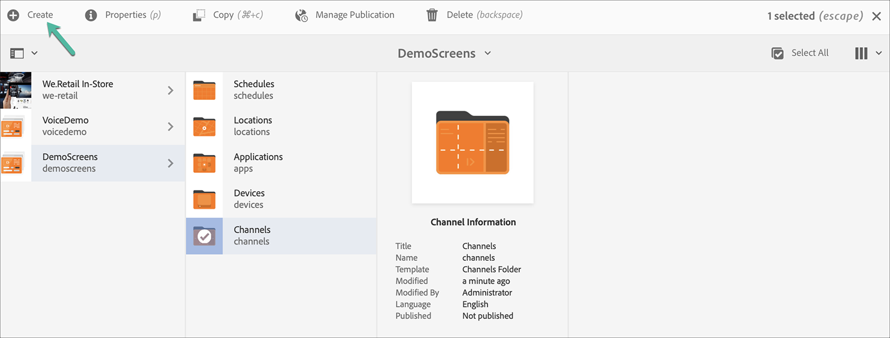

# Kickstart Guide {#kickstart-guide}

I början av AEM Screens demonstreras hur du konfigurerar och kör ett AEM Screens-projekt. Här beskrivs hur du skapar en grundläggande digital signeringsupplevelse och lägger till innehåll som resurser och/eller videor i varje kanal och publicerar innehållet ytterligare i en AEM Screens Player.

>[!NOTE]
>Kontrollera att du har installerat det senaste funktionspaketet för AEM Screens innan du börjar arbeta med projektinformationen. Du kan hämta det senaste funktionspaketet från [Software Distribution Portal](https://experience.adobe.com/#/downloads/content/software-distribution/en/aem.html) med din Adobe ID.

## Förutsättningar {#prerequisites}

Följ stegen nedan för att skapa ett exempelprojekt för AEM Screens och publicera ytterligare innehåll till Screens Player.

>[!NOTE]
>I följande självstudie visas hur du spelar upp innehållet i din kanal i en Chrome OS-spelare.

>[!IMPORTANT]
>**OSGi-konfigurationsinställningar**
>&#x200B;>Du måste aktivera den tomma referenten för att enheten ska kunna skicka data till servern. Om t.ex. den tomma refereraregenskapen är inaktiverad, kan enheten inte publicera en skärmdump. Vissa av dessa funktioner är för närvarande bara tillgängliga om alternativet Tillåt tomt för `Apache Sling`-referensfiltret är aktiverat i OSGi-konfigurationen. Kontrollpanelen kan visa en varning om att skyddsinställningarna kan förhindra vissa av dessa funktioner från att fungera.
>&#x200B;>Följ stegen nedan för att aktivera ***Refererarfiltret för Apache Sling Tillåt tomt***:

## Tillåt tomma referentförfrågningar {#allow-empty-referrer-requests}

1. Navigera till **Adobe Experience Manager Web Console Configuration** med AEM-instans > hammikon > **Åtgärder** > **Webbkonsol**.

   

1. **Adobe Experience Manager Web Console Configuration** öppnas. Sök efter försäljningsreferent.

   Om du vill söka efter egenskapen för snedbrytningsreferenten trycker du på **Kommando+F** för **Mac** och **Ctrl+F** för **Windows**.

1. Markera alternativet **Tillåt tomt** enligt bilden nedan.

   

1. Klicka på **Spara** för att aktivera Apache Sling Referer-filtret Tillåt tomt.

## Skapa en upplevelse av en digital skylt på 5 minuter {#creating-a-digital-signage-experience-in-minutes}

### Skapa ett AEM Screens-projekt {#creating-project}

Det första steget är att skapa ett AEM Screens-projekt.

1. Navigera till din Adobe Experience Manager-instans (AEM) och klicka på **Screens**. Du kan även navigera direkt från `https://localhost:4502/screens.html/content/screens](https://localhost:4502/screens.html/content/screens`.

1. Klicka på **Skapa Screens-projekt** så att du kan skapa ett Screens-projekt.
1. Ange titeln som **DemoScreens** och klicka sedan på **Spara**.

   

   >[!NOTE]
   >När du har skapat projektet återgår du till startsidan för AEM Screens Project. Nu kan du klicka på projektet. I ett projekt finns det fem olika mappar med namnen **Program**, **Kanaler**, **Enheter**, **Platser** och **Scheman**.

### Skapa en kanal {#creating-channel}

När du har skapat ditt AEM Screens-projekt skapar du en kanal där du hanterar innehållet.

Följ stegen nedan för att skapa en kanal för ditt projekt:

1. När du har skapat ett projekt klickar du på projektet **DemoScreens** och sedan på mappen **Kanaler** enligt bilden nedan. Klicka på **+ Skapa** i åtgärdsfältet.

   

1. Välj **Sekvenskanal** i guiden och klicka på **Nästa**.
   

1. Ange **Title** som **TestChannel** och klicka på **Create**.

   

   **TestChannel** har nu lagts till i din kanalmapp, vilket visas i bilden nedan.

   

### Lägga till innehåll i en kanal {#adding-content}

När du har en egen kanal lägger du till innehåll i kanalen som kan visas i AEM Screens Player.

Följ stegen nedan för att lägga till innehåll i kanalen (**TestChannel**) i ditt projekt:

1. Navigera till det **DemoProject** du skapade och klicka på mappen **TestChannel** i mappen **Channels** .

1. Klicka på **Redigera** i åtgärdsfältet (se figuren nedan). Redigeraren för **TestChannel** öppnas.

   

1. Klicka på ikonen som växlar sidopanelen till vänster i åtgärdsfältet för att öppna resurserna och komponenterna.

1. Dra och släpp de komponenter du vill lägga till i kanalen.

   

### Skapa en plats {#creating-location}

Skapa en plats när du har din kanal på plats.

>[!NOTE]
>***Platser*** delar upp dina olika digitala signeringsupplevelser och innehåller de konfigurationer som visas beroende på var de olika skärmarna finns.

Följ stegen nedan för att skapa en plats för ditt projekt:

1. Navigera till **DemoProject** som du har skapat och klicka på mappen **Platser** .
1. Klicka på **+ Skapa** i åtgärdsfältet.
1. Klicka på **Plats** i guiden och klicka på **Nästa**.
1. Ange **namnet** för din plats (ange titeln som **TestLocation**) och klicka på **Create**.

**TestLocation** skapas och läggs till i mappen **Locations**.

### Skapa en visning för plats {#creating-display}

När du har skapat en plats skapar du en visning för platsen.

>[!NOTE]
>***Display*** representerar den digitala upplevelsen som körs på en eller flera skärmar.

1. Navigera till **TestLocation** och klicka på den.
1. Klicka på **Skapa** i åtgärdsfältet.

   

1. Klicka på **Visa** i guiden **Skapa** och klicka på **Nästa**.

   

1. Ange **Title** som **LobbyDisplay** och klicka på **Create**.

   

   En ny skärm med namnet **TestDisplay** har nu lagts till på din plats **TestLocation**, vilket visas i bilden nedan.

   

### Tilldela en kanal {#assigning-channel}

När projektkonfigurationen är klar tilldelar du kanalen till en visning för att visa innehållet.

1. Navigera till önskad visning från **DemoScreens** > **Platser** > **TestLocation** > **LobbyDisplay**.

1. Klicka på **Tilldela kanal** i åtgärdsfältet.

   

   Eller

   Klicka på **Instrumentpanel** i åtgärdsfältet och klicka på **+Tilldela kanal** på panelen **TILLDELADE KANALER OCH SCHEMALÄGG** .

   

1. Dialogrutan **Kanaltilldelning** öppnas.

1. Välj kanalen **efter sökväg** och **händelser som stöds** i alternativet **Inställningar**, till exempel **Inledande inläsning** och **Inaktivitetsskärm**.

   >[!NOTE]
   >
   >**Kanalrollen**, **prioritet** och **avbrottsmetoderna** fylls i som standard. Mer information om kanaltilldelningsegenskaper finns i avsnittet [Kanalegenskaper](/help/user-guide/channel-assignment-latest-fp.md#channel-properties) .

   

   Du kan även klicka på **aktiveringsfönstret** och **Återkommande schema**.

   >[!NOTE]
   >Med *Återkommande schema* kan du ange ett återkommande schema för din kanal. Du kan ställa in flera upprepningsscheman för en kanal.
   >Mer information finns i [Återkommande schema](/help/user-guide/channel-assignment-latest-fp.md#recurrence-schedule).

1. Klicka på **Spara** när du har konfigurerat inställningarna.

### Registrera en enhet och tilldela en enhet till en skärm {#registering-device}

Registrera din enhet med AEM Dashboard.

>[!IMPORTANT]
>Chrome OS Player kan installeras som en Chrome webbläsarplugin i utvecklarläge utan att en Chrome Player-enhet behövs. För installation, följ stegen nedan:
>
>1. Klicka [här](https://download.macromedia.com/screens/) om du vill hämta den senaste Chrome Player.
>1. Zippa upp och spara det på disken.
>1. Öppna webbläsaren Chrome och klicka på **Tillägg** på menyn eller navigera direkt till ***chrome://extensions***.
>1. Aktivera **utvecklarläget** i det övre högra hörnet.
>1. Klicka på **Läs in opackad** i det övre vänstra hörnet och läs in den uppackade Chrome Player.
>1. Kontrollera plugin-programmet **AEM Screens Chrome Player** om det finns i listan över tillägg.
>1. Öppna en ny flik och klicka på ikonen **Apps** i det övre vänstra hörnet eller navigera direkt till ***chrome://apps***.
>1. Klicka på **AEM Screens** så att du kan starta Chrome Player. Som standard startas spelaren i helskärmsläge. Tryck på **Esc** för att avsluta helskärmsläget.

När du har aktiverat Chrome OS-spelaren följer du stegen nedan för att registrera en Chrome-enhet.

1. Navigera till mappen **Devices** i ditt projekt från din AEM-instans.

1. Klicka på **Enhetshanteraren** i åtgärdsfältet.

   

1. Klicka på **Enhetsregistrering** i det övre högra hörnet.

1. Klicka på önskad enhet och klicka på **Registrera enhet**.

   

1. Vänta tills enheten skickar sin registreringskod och kontrollera samtidigt **registreringskoden** från din Chrome-enhet.
   

1. Om **registreringskoden** är densamma på båda datorerna klickar du på **Validera** i AEM.

1. Ange önskat namn som **ChromeDevice forDemo** för enheten och klicka på **Registrera**.

   

1. Klicka på **Tilldela visning** i dialogrutan **Device Registration Successful**.

   

1. Klicka på sökvägen till din visning som **DemoScreens** > **Platser** > **Testplats** > **LobbyDisplay** och klicka på **Tilldela**.

   

1. Följande bekräftelse visas när enheten har tilldelats.

   

1. Klicka på **Slutför** för att slutföra registreringsprocessen. Du kan nu visa din registrerade enhet från kontrollpanelen.

   

### Visa innehåll i Chrome Player {#viewing-content-output}

Alla resurser i din kanal spelas nu upp i din Chrome OS-spelare.

Grattis till att du nu spelar upp innehåll i en AEM Screens-kanal!

