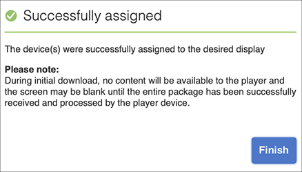

# Kickstart Guide {#kickstart-guide}

I början av AEM Screens demonstreras hur du konfigurerar och kör ett AEM Screens-projekt. Här får du hjälp med att skapa en grundläggande digital signeringsupplevelse och lägga till innehåll som resurser och/eller videor i varje kanal och publicera innehållet ytterligare i en AEM Screens-spelare.

>[!NOTE]
>Kontrollera att du har installerat det senaste funktionspaketet för AEM Screens innan du börjar arbeta med projektinformationen. Du kan hämta det senaste funktionspaketet från [portalen för programvarudistribution](https://experience.adobe.com/#/downloads/content/software-distribution/en/aem.html) med din Adobe ID.

## Förutsättningar {#prerequisites}

Följ stegen nedan för att skapa ett exempelprojekt för AEM Screens och publicera innehåll ytterligare till Screens Player.

>[!NOTE]
>I följande självstudie visas hur du spelar upp innehållet i din kanal i Chrome OS-spelaren.

>[!IMPORTANT]
>**Konfigurationsinställningar för OSGi**
>Du måste aktivera den tomma referenten för att enheten ska kunna skicka data till servern. Om t.ex. den tomma refereraregenskapen är inaktiverad, kan enheten inte publicera en skärmdump. Vissa av dessa funktioner är för närvarande bara tillgängliga om Apache Sling Referrer-filtret Tillåt tomt är aktiverat i OSGi-konfigurationen. Kontrollpanelen kan visa en varning om att skyddsinställningarna kan förhindra vissa av dessa funktioner från att fungera.
>Följ stegen nedan för att aktivera ***Refererarfiltret för Apache Sling Tillåt tomt***:

## Tillåt tomma referentförfrågningar {#allow-empty-referrer-requests}

1. Navigera till **Adobe Experience Manager Web Console Configuration** via AEM:> hammer icon —> **Åtgärder** —> **Webbkonsol**.

   

1. **Adobe Experience Manager Web Console-** konfigurationöppnas. Sök efter försäljningsreferent.

   Om du vill söka efter egenskapen för snedbrytningsreferenten trycker du på **Command+F** för **Mac** och **Ctrl+F** för **Windows**.

1. Markera alternativet **Tillåt tomt** enligt bilden nedan.

   

1. Klicka på **Spara** för att aktivera Apache Sling Referer-filtret Tillåt tomt.

## Skapa en upplevelse av en digital skylt på 5 minuter {#creating-a-digital-signage-experience-in-minutes}

### Skapa ett AEM Screens-projekt {#creating-project}

Det första steget är att skapa ett AEM Screens-projekt.

1. Navigera till din Adobe Experience Manager-instans (AEM) och klicka på **Skärmar**. Du kan också navigera direkt från `https://localhost:4502/screens.html/content/screens](https://localhost:4502/screens.html/content/screens`.

1. Klicka på **Skapa skärmsprojekt** för att skapa ett nytt skärmsprojekt. Ange titeln som **DemoScreens** och klicka på **Spara**.

   

   >[!NOTE]
   >När du har skapat projektet återgår du till startsidan för Skärmprojekt. Nu kan du välja ditt projekt. I ett projekt finns det fem olika mappar med namnen **Program**, **Kanaler**, **Enheter**, **Platser** och **Scheman**.

### Skapa en kanal {#creating-channel}

När du har skapat ditt AEM Screens-projekt måste du skapa en ny kanal där du hanterar innehållet.

Följ stegen nedan för att skapa en ny kanal för ditt projekt:

1. När du har skapat ett projekt väljer du **DemoScreens**-projektet och väljer mappen **Kanaler** enligt bilden nedan. Klicka på **+ Skapa** i åtgärdsfältet.

   

1. Välj **Sekvenskanal** i guiden och klicka på **Nästa**.
   

1. Ange **titeln** som **TestChannel** och klicka på **Skapa**.

   

   **TestChannel** har nu lagts till i kanalmappen, vilket visas i bilden nedan.

   

### Lägga till innehåll i en kanal {#adding-content}

När ni väl har er kanal på plats måste ni lägga till innehåll i kanalen som AEM Screens Player visar.

Följ stegen nedan för att lägga till innehåll i kanalen (**TestChannel**) i ditt projekt:

1. Navigera till **DemoProject** som du skapade och välj **TestChannel** i mappen **Kanaler**.

1. Klicka på **Redigera** i åtgärdsfältet (se figuren nedan). Redigeraren för **TestChannel** öppnas.

   

1. Klicka på ikonen som växlar sidopanelen till vänster i åtgärdsfältet för att öppna resurserna och komponenterna.

1. Dra och släpp de komponenter du vill lägga till i kanalen.

   

### Skapa en plats {#creating-location}

När du väl har skapat kanalen måste du skapa en plats.

>[!NOTE]
>***Platser*** är en delstruktur för dina olika digitala signeringsupplevelser och innehåller de konfigurationer som visas beroende på var de olika skärmarna finns.

Följ stegen nedan för att skapa en ny plats för ditt projekt:

1. Navigera till **DemoProject** som du skapade och välj mappen **Platser**.

1. Klicka på **+ Skapa** i åtgärdsfältet.

1. Välj **Plats** i guiden och klicka på **Nästa**.

1. Ange **namnet** för din plats (ange titeln som **TestLocation**) och klicka på **Skapa**.

**TestLocation** skapas och läggs till i mappen **Platser**.

### Skapa en visning för plats {#creating-display}

När du har skapat en plats måste du skapa en ny skärm för platsen.

>[!NOTE]
>***Display*** representerar den digitala upplevelsen som körs på en eller flera skärmar.

1. Navigera till **TestLocation** och markera den.

1. Klicka på **Skapa** i åtgärdsfältet.

   

1. Välj **Visa** i guiden **Skapa** och klicka på **Nästa**.

   

1. Ange **titeln** som **LobbyDisplay** och klicka på **Skapa**.

   

   En ny skärm med namnet **TestDisplay** har nu lagts till på din plats **TestLocation**, vilket visas i bilden nedan.

   

### Tilldela en kanal {#assigning-channel}

När projektkonfigurationen är klar måste du tilldela kanalen till en skärm för att kunna visa innehållet.

1. Navigera till önskad visning från **DemoScreens** —> **Platser** —> **TestLocation** —> **LobbyDisplay**.

1. Tryck/klicka på **Tilldela kanal** i åtgärdsfältet.

   

   Eller

   Tryck/klicka på **Kontrollpanel** i åtgärdsfältet och klicka på **+Tilldela kanal** på panelen **TILLDELADE KANALER OCH SCHEMAT**.

   

1. Dialogrutan **Kanaltilldelning** öppnas.

1. I alternativet **Inställningar** väljer du kanalen **efter sökväg** och **Händelser som stöds** som **Inledande inläsning** och **Inaktivitetsskärm**.

   >[!NOTE]
   >
   >Kanalrollen **a1/>,** Prioritet **och** Avbrottsmetoder **fylls i som standard.** Mer information om kanaltilldelningsegenskaper finns i [avsnittet Kanalegenskaper](/help/user-guide/channel-assignment-latest-fp.md#channel-properties).

   

   Dessutom kan du välja **Aktiveringsfönstret** och **Återkommande schema**.

   >[!NOTE]
   >Med *upprepningsschemat* kan du ange ett återkommande schema för kanalen. Du ställer in flera upprepningsscheman för en kanal.
   >Mer information finns i [Återkommande schema](/help/user-guide/channel-assignment-latest-fp.md#recurrence-schedule).

1. Klicka på **Spara** när du har konfigurerat inställningarna.

### Registrera en enhet och tilldela en enhet till en skärm {#registering-device}

Du måste registrera din enhet med AEM kontrollpanel.

>[!IMPORTANT]
>Chrome OS-spelaren kan installeras som Chrome Browser-plugin i utvecklarläge utan att den faktiska enheten för Chrome Player krävs. För installation, följ stegen nedan:
>
>1. Klicka [här](https://download.macromedia.com/screens/) för att hämta den senaste Chrome Player.
>1. Zippa upp och spara det på disken.
>1. Öppna webbläsaren Chrome och välj **Tillägg** på menyn eller navigera direkt till ***chrome://extensions***.
>1. Aktivera **utvecklarläget** i det övre högra hörnet.
>1. Klicka på **Läs in opackad** från det övre vänstra hörnet och läs in den uppackade Chrome Player.
>1. Kontrollera **AEM Screens Chrome Player**-plugin om det finns i listan över tillägg.
>1. Öppna en ny flik och klicka på ikonen **Apps** i det övre vänstra hörnet eller navigera direkt till ***chrome://apps***.
>1. Klicka på **AEM Screens** Plugin för att starta Chrome Player. Som standard startas spelaren i helskärmsläge. Tryck på **esc** för att avsluta helskärmsläget.

När du har aktiverat Chrome OS-spelaren följer du stegen nedan för att registrera en Chrome-enhet.

1. Navigera till mappen **Enheter** i ditt projekt från din AEM.

1. Tryck/klicka på **Enhetshanteraren** i åtgärdsfältet.

   

1. Tryck/klicka på **Device Registration** överst till höger.

1. Välj önskad enhet och tryck/klicka på **Registrera enhet**.

   

1. Vänta tills enheten skickar sin registreringskod och kontrollera samtidigt **registreringskoden** från din Chrome-enhet.
   

1. Om **registreringskoden** är densamma på båda datorerna trycker/klickar du på **Validera** i AEM.

1. Ange önskat namn som **ChromeDevice forDemo** för enheten och klicka på **Registrera**.

   

1. Klicka på **Tilldela visning** i dialogrutan **Device Registration Successful**.

   

1. Välj sökvägen till din skärm som **DemoScreens** —> **Platser** —> **TestLocation** —> **LobbyDisplay** och klicka på **Tilldela**.

   

1. När enheten har tilldelats ser du följande bekräftelse.

   

1. Tryck/klicka på **Slutför** för att slutföra registreringsprocessen. Du bör kunna visa din registrerade enhet från kontrollpanelen.

   

### Visa innehållet i Chrome Player {#viewing-content-output}

Alla resurser i din kanal spelas nu upp i din Chrome OS-spelare.

Grattis till att du nu spelar upp innehåll i en AEM Screens-kanal!

