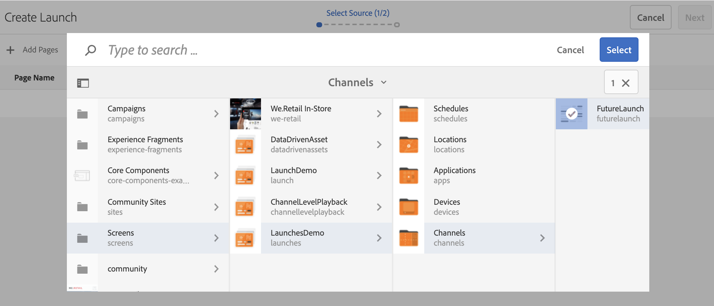
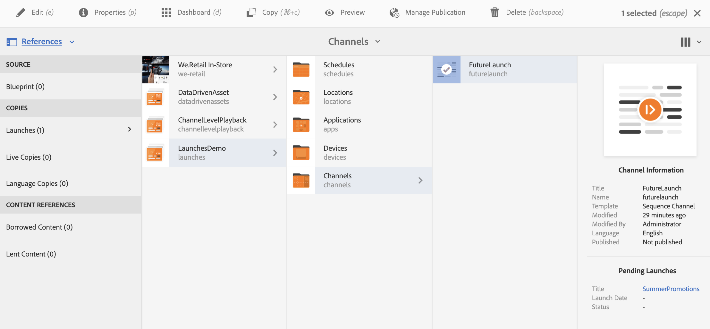

# Content Update using Screens Launch {#launches}

Innehållsförfattare kan skapa framtida versioner av kanalen/kanalerna, så kallade **Screens Launch** , och sedan ställa in live-datum för den här starten kan innehållet visas på enheter eller spelare.

Med hjälp av framtida publicering kan författare förhandsgranska varje kanal i lanseringen och bör kunna initiera en granskningsbegäran. Godkännargruppen får meddelanden och kan godkänna eller avvisa begäran. När live-datumet nås spelas innehållet upp på enheterna.

Om författaren till exempel vill skapa framtida versioner av c1, c2 (kanaler) skapas en start och ett live-datum ställs in (till exempel 10 november 8:00). Ytterligare uppdateringar skickas ut för granskning. När den har godkänts och på live-datumet (10 november 08:00) spelas innehållet upp på enheterna eller spelarna.

## Krav {#requirements}

Innan du börjar implementera en framtida publicering i ett AEM-skärmsprojekt måste du förstå begreppet respitperiod och dess relevans.

I följande avsnitt förklaras giltighetsperioden och hur du konfigurerar den. Du kan även hämta ett exempel på en testkonfiguration för att förstå hur den används.

### Förstå respitperiod {#understanding-grace-period}

I följande konfiguration kan administratören konfigurera ***respitperioden***, som krävs för framtida publicering.

**Respitperiod**, inklusive:

* lanseringen
* publicera resurser för att publicera instanser
* den tid det tar för enheterna att hämta innehållet från publiceringsinstansen och eventuella tidsskillnader mellan servern och spelaren

Exempel: servern är i PST och enheterna är i EST, den maximala tidsskillnaden är 3 timmar i det här fallet och förutsätter att erbjudandet tar 1 minut och att publiceringen tar 10 minuter att publicera och spelaren kan hämta resurserna i vanliga fall på 10-15 minuter. Fristen = tidsskillnad (3 timmar) + tid för att starta programmet (1 min) + tid för att publicera starten (10 min) + tid för nedladdning vid spelaren (10-15 min) + buffert (för att vara säker, till exempel 30 min) = 3 timmar 56 min = 14 160 sekunder. Så när vi planerar någon lansering live kommer kampanjen att börja tidigt med den här offsetet. I ekvationen ovan tar de flesta objekten inte så lång tid. Vi kan använda en bra gissning för den här förskjutningen när vi vet den maximala tidsskillnaden mellan servern och valfri spelare.

### Konfigurerar körklar respitperiod {#configuring-out-of-the-box-grace-period}

Körklar är respitperioden för en lansering inställd på 24 timmar, vilket innebär att när vi ställer in livedatum för en lansering av resurserna under */innehåll/skärmar* börjar kampanjen med den här förskjutningen. Om liveDate till exempel är inställt på 24 nov, 9:00 AM och respitperioden är 24 timmar börjar kampanjjobbet på 23 nov, 09:00.

### Laddar ned konfigurationer {#downloading-configurations}

Hämta följande testkonfigurationer:

[Hämta fil](assets/launches_event_handlerconfig-10.zip)

>[!NOTE]
>
>Ovannämnda konfiguration har 600 sekunder som respitperiod i den här testkonfigurationen.

#### Uppdatera konfigurationerna {#updating-the-configurations}

Om du vill ändra ovanstående konfiguration följer du instruktionerna nedan:

* skapa ***sling:OsgiConfig/ nt:file i /apps/system/config*** med namnet **com.adobe.cq.wcm.launches.impl.LaunchesEventHandler.config** och innehåll

   *launches.evenHandler.updatelastmodification=B&quot;false&quot;launches.evenHandler.launch.Promo.graaceperiod=[&quot;/content/screens(/.*):600&quot;]launches.evenHandler.threadpool.maxsize=I&quot;5&quot;launches.evenHandler.threadpool.priority=&quot;MIN&quot;*

* `launches.eventhandler.launch.promotion.graceperiod=["/content/screens(/.&#42;):600"`Med kan du ange en respitperiod på 600 sekunder i sökvägen */innehållet/skärmarna*.

Det innebär att när du anger ett direktdatum för en start för resurserna under */innehåll/skärmar* börjar kampanjen med den här förskjutningen. Om till exempel live-datumet är inställt på 24 november, 9:00 och respitperioden är 600 sekunder börjar kampanjjobbet på 24 november, 08:50.

## Använda skärmstart {#using-launches}

Följ avsnittet nedan för att implementera starter i ditt AEM Screens-projekt. Detta avsnitt behandlar följande ämnen:

1. **Skapa en skärmstart**
1. **Redigera en skärmstart för att ange live-datum och omfattning**

### Skapa en framtida publicering {#creating-a-launch}

Följ stegen nedan för att implementera framtida publiceringsfunktioner i ditt AEM Screens-projekt:

1. Navigera till kanalen i ditt AEM Screens-projekt, till exempel **LaunchesDemo** —> **Channels** —> **FutureLaunch**, som visas nedan.

   >[!CAUTION]
   >
   >Du måste skapa en start från en befintlig kanal i ditt AEM Screens-projekt.

   

1. Välj kanalen **FutureLaunch** och klicka på **Create**. Välj **Starta** i listrutan.

   

1. Guiden **Skapa start** öppnas. Klicka på **+ Lägg till sidor** för att välja de AEM-skärmar-kanaler som du vill starta starten för.

   

1. Navigera till kanalen och klicka på **Välj**.

   

1. När du har markerat sidan klickar du på **Nästa** för att gå ett steg längre i guiden **Skapa start** .

   

1. Ange **starttitel** som **Sommarkampanjer** och du behöver inte ange **startdatum** enligt bilden nedan. Klicka på **Skapa**.

   >[!NOTE]
   >
   >*Om du aktiverar eller kontrollerar* alternativet **Ärv källsidans livedata** kan kanalerna skapas som live-kopior vid starten. Om några ändringar görs i den ursprungliga kanalen tillämpas dessa ändringar automatiskt på startkanaler.
   >
   >
   >*Om du inaktiverar eller avmarkerar* **Inherit-källsidans livedata** kan kanalerna kopieras utan någon live-relation vid start. Så om ändringar görs i den ursprungliga kanalen tillämpas inte dessa ändringar på startkanaler.

   

   >[!NOTE]
   >
   >Du kan ställa in live-startdatum i det här steget eller ställa in det senare när du redigerar egenskaperna för startprogrammet när det redan har skapats.

1. Du kommer att se att du har startat programmet. Du kan antingen klicka på **Öppna** för att visa sidorna i redigeraren eller klicka på **Klar** för att gå tillbaka till projektet.

   

   Om du klickar på **Klar** kan du gå tillbaka till ditt **LaunchesDemo** -projekt.

   

### Redigera startegenskaperna för att ange live-datum och -omfång {#editing-the-launch-properties-to-set-the-live-date-and-scope}

När du har skapat startprogrammet måste du redigera startegenskaperna för att ange det aktuella datumet för startprogrammet.

Följ stegen nedan för att redigera startegenskaperna:

1. Navigera till kanalen (**FutureLaunch**) och markera kanalen enligt bilden nedan. Öppna **referensrälen** från vänster sida av rälen.

   >[!NOTE]
   >
   >Välj alternativet **Innehållsträd** i den vänstra listen för att öppna den start du skapade.

   

1. Navigera till **Startar** och välj den lansering (**Sommarkampanjer**) som du skapade. Klicka på **Redigera egenskaper**.

   

1. Dialogrutan **Sommarkampanjer** öppnas. Fyll i följande fält:

   * Välj **startdatum**
   * Kontrollera **produktionsklar**
   * Välj **Befordra godkända sidor** från **omfång**
   >[!NOTE]
   >
   >Så här fungerar posterna under **Automatisk befordran**:

   >    * **Startdatum**, hänvisar till live-datumet, det vill säga det datum/den tidpunkt då innehållet spelas upp i skärmspelaren enligt spelarens tidszon.
   >    * **Production Ready**, gör att kanalerna kan marknadsföras och innebär att lanseringen är klar att användas.
   >    * **Omfång** avser de kanaler som kan befordras under en start.

   Följande tre alternativ är tillgängliga för att konfigurera omfattningen:
   1. **Erbjud fullständig start**: Alla kanaler för lanseringen befordras vid angivet live-datum.
   1. **Befordra ändrade sidor**: Endast redigerade startresurser kommer att befordras. Vi rekommenderar att du använder det här alternativet när startgranskningen inte behövs. Det gör att ändringarna i startkanalerna kan befordras.
   1. **Befordra godkända sidor**: Endast godkända sidor befordras vid angivet live-datum.
   

   >[!CAUTION]
   >
   >Starten respekterar spelarens/enhetens tidszon i stället för serverns.

1. Klicka på **Spara och stäng** för att gå tillbaka till **FutureLaunch** -kanalen.

   

