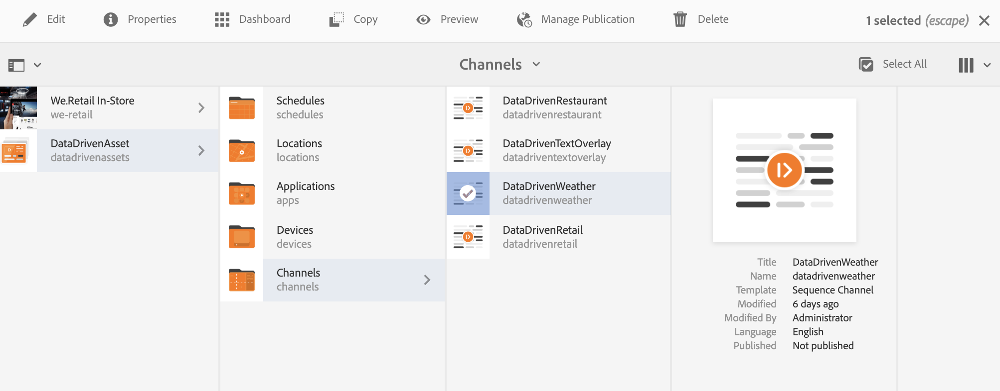

# Temperaturaktivering i resecentret {#travel-center-temperature-activation}

I följande exempel visas användningen av lokal temperaturaktivering i resecentret baserat på de värden som anges i Google Sheets.

## Beskrivning {#description}

Om värdet i Google Sheets är mindre än 50 visas en bild med varma drycker. Om värdet är större än eller lika med 50 visas en bild med kalla drycker. Om det finns något annat värde eller inget värde alls visas en standardbild.

## Förhandsvillkor {#preconditions}

Innan du börjar implementera aktiveringen av lokal temperatur i resecentralen måste du lära dig hur du konfigurerar ***Datalager***, ***Målgruppssegmentering*** och ***Aktivera mål för kanaler*** i ett AEM Screens-projekt.

Se [ContextHub konfigureras i AEM Screens](configuring-context-hub.md) för detaljerad information.

## Grundläggande flöde {#basic-flow}

Följ stegen nedan för att implementera användningsexemplet för aktivering av lokal temperatur i Travel Center:

1. **Fylla i Google-ark**

   1. Navigera till ContextHubDemo Google Sheet.
   1. Lägga till en kolumn med **`Heading1`** med motsvarande värde för temperaturen.

   

1. **Konfigurera segmenten i publiker enligt kraven**

   1. Navigera till segmenten i målgruppen (se ***Steg 2: Konfigurera målgruppssegmentering*** in **[ContextHub konfigureras i AEM Screens](configuring-context-hub.md)** sida för mer information).

   1. Välj **Blad A1 1** och klicka **Redigera**.

   1. Välj jämförelseegenskapen och klicka på konfigurationsikonen.
   1. Välj **googlesheets/value/1/0** från listrutan i **Egenskapsnamn**

   1. Välj **Operator** as **större än eller lika med** i listrutan

   1. Ange **Värde** as **50**

   1. På samma sätt väljer du **Blad A1 2** och klicka **Redigera**.

   1. Välj **Jämförelseegenskap - värde** och klicka på konfigurationsikonen.
   1. Välj **googlesheets/value/1/0** från listrutan i **Egenskapsnamn**

   1. Välj **Operator** as **mindre än** i listrutan

   1. Ange **Värde** as **50**

1. Navigera och markera kanalen () och klicka på **Redigera** i åtgärdsfältet. I följande exempel **DataDrivenVäder**, används en sekventiell kanal för att visa funktionaliteten.

   >[!NOTE]
   >
   >Din kanal bör redan ha en standardbild och publikerna bör vara förkonfigurerade enligt beskrivningen i [ContextHub konfigureras i AEM Screens](configuring-context-hub.md).

   

   >[!CAUTION]
   >
   >Du borde ha konfigurerat **ContextHub** **Konfigurationer** använda kanalen **Egenskaper** > **Personalisering** -fliken.

   

1. Välj **Målinriktning** i redigeraren och väljer **Varumärke** och **Aktivitet** i listrutan och klicka på **Börja målinrikta**.

   

1. **Kontrollera förhandsvisningen**

   1. Klicka **Förhandsgranska.** Du kan även öppna Google Sheet och uppdatera värdet.
   1. Ändra värdet till mindre än 50. Du bör kunna se en bild av en kalldrink. Om värdet i Google Sheets är 50 eller högre bör du se en bild på en het drink.

   
