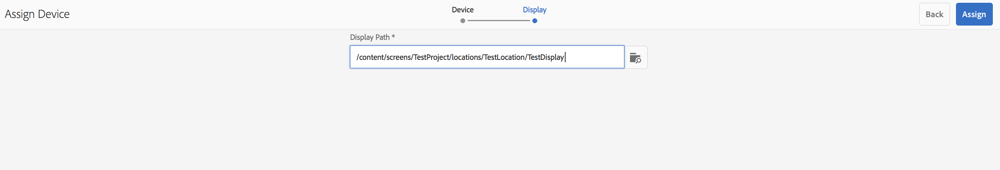

# Hantera enheter {#managing-devices}

Den här sidan beskriver enhetstilldelning.

Med enhetskonsolen kan du komma åt enhetshanteraren och tilldela enheten till en skärm.

>[!CAUTION]
>
>Innan du tilldelar din enhet måste du registrera den. Mer information finns i [Enhetsregistrering](device-registration.md).

## Enhetstilldelning {#device-assignment}

Följ stegen nedan för att tilldela en enhet till en skärm:

1. Navigera till mappen Enheter i ditt projekt, till exempel

   `http://localhost:4502/screens.html/content/screens/TestProject`

   

1. Välj **Enheter** mapp och tryck/klicka **Enhetshanteraren** i åtgärdsfältet. De tilldelade och ej tilldelade enheterna visas.

   

1. Välj en ej tilldelad enhet i listan och tryck/klicka på **Tilldela enhet** i åtgärdsfältet.

   

1. Välj den skärm som du vill tilldela enheten till i listan och tryck/klicka på knappen **Tilldela**.

   

1. Tryck/klicka på **Slutför** för att slutföra tilldelningsprocessen.

   På kontrollpanelen visas den tilldelade enheten i **ENHETER** -panelen.

   

   Klicka på (**...**) i det övre högra hörnet av **ENHETER** för att antingen lägga till enhetskonfiguration eller uppdatera enheterna.

   

>[!NOTE]
>
>Varje gång den första enheten läggs till i ett nytt skärmsprojekt skapas en användargrupp.
>Om till exempel projektnodens namn är *webbutik* och användargruppnamnet är *screens-we-retail-devices*.
>Den här gruppen läggs till som medlem i **Medarbetare** grupp, enligt bilden nedan:

### Nästa steg {#the-next-steps}

När du känner till hur du tilldelar kanal till en skärm kan du läsa följande resurser:

* [Övervaka och felsöka](monitoring-screens.md)
