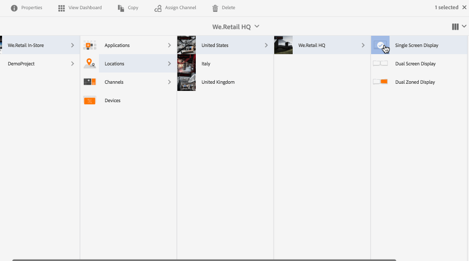

# Skapa och hantera skärmar {#creating-and-managing-displays}

En skärm är en virtuell gruppering av skärmar som vanligtvis placeras bredvid varandra. Bildskärmen är vanligtvis permanent när det gäller en installation. Detta blir det objekt som författare ska arbeta med och alltid referera till som logisk visning i stället för deras fysiska räknardel.

När du har skapat en plats måste du skapa en ny visning för platsen.

På den här sidan visas hur du skapar och hanterar skärmar.

**Krav**:

* [Konfigurera och distribuera skärmar](configuring-screens-introduction.md)
* [Skapa och hantera skärmsprojekt](creating-a-screens-project.md)
* [Skapa och hantera kanaler](managing-channels.md)
* [Skapa och hantera platser](managing-locations.md)

## Skapa en ny visning {#creating-a-new-display}

>[!NOTE]
>
>Du måste skapa en plats innan du skapar en visning. Om du vill se hur du skapar en plats kan du gå till [Skapa och hantera platser](managing-locations.md) för mer information.

Följ stegen nedan för att skapa en ny visning på din plats:

1. Navigera till lämplig plats, till exempel `http://localhost:4502/screens.html/content/screens/TestProject`.
1. Välj din platsmapp och tryck/klicka **Skapa** bredvid plusikonen i åtgärdsfältet. En guide öppnas.
1. Välj **Visa** från **Skapa** guide och klicka **Nästa**.

1. Retur **Namn** och **Titel** för din visningsplats.

1. Under **Visa** väljer du information om layouten. Välj önskat **Upplösning** (exempel som **Full HD**). Dessutom kan du välja antalet enheter vågrätt och lodrätt.

1. Klicka **Skapa**.

Visningen (*StoreDisplay*) skapas och läggs till på platsen (*SanJose*).

När du har visat på plats är nästa steg att skapa en enhetskonfiguration för den aktuella skärmen. Följ avsnittet nedan för att skapa en ny enhetskonfiguration.

>[!NOTE]
>
>**Nästa steg**:
>
>När du har skapat en visning för din plats måste du tilldela en kanal till din skärm för att kunna utnyttja innehållet.
>
>Se [Tilldela kanaler](channel-assignment.md) för att lära dig hur du tilldelar en kanal till visningen.

## Skapa en ny enhetskonfiguration {#creating-a-new-device-config}

En enhetskonfiguration fungerar som platshållare för en faktisk digital signeringsenhet som inte är installerad än.

Följ stegen nedan för att skapa en ny enhetskonfiguration:

1. Navigera till lämplig visning, till exempel `http://localhost:4502/screens.html/content/screens/TestProject/locations/newlocation`.
1. Välj visningsmapp och tryck/klicka **Visa instrumentpanel** i åtgärdsfältet.
1. Tryck/klicka på **+ Lägg till enhetskonfiguration** överst till höger på **Enheter** -panelen.

1. Välj **Enhetskonfiguration** som önskad mall och tryck/klicka **Nästa**.

1. Ange egenskaperna efter behov och tryck/klicka **Skapa**.

Enhetskonfigurationen skapas och läggs till i den aktuella skärmen (i följande exempel är den nya enhetskonfigurationen *DeviceConfig*).

När en enhetskonfiguration är inställd på din skärm på platsen blir nästa steg att tilldela en kanal till din skärm.

>[!NOTE]
>
>När en enhetskonfiguration är inställd på din skärm på platsen blir nästa steg att tilldela en kanal till din skärm.
>
>Så som visas i figuren nedan, om enhetskonfigurationen visas som ej tilldelad i **ENHETER** om ingen kanal har tilldelats den aktuella enhetskonfigurationen.
>
>Du bör ha en förståelse för att skapa och hantera kanaler. Se [Skapa och hantera kanaler](managing-channels.md) för mer information.

## Visa instrumentpanel {#display-dashboard}

På kontrollpanelen visas olika paneler för att hantera visningsenheter och enhetskonfigurationer för din enhet.

>[!NOTE]
>
>Du kan välja kontrollpanelslistor och aktivera massåtgärder för objekt, i stället för att gå igenom varje objekt individuellt.
>
>I följande bild visas hur du kan välja flera kanaler från kontrollpanelen.

### Visa informationspanel {#display-information-panel}

The **VISNINGSINFORMATION** Panelen innehåller visningsegenskaperna.

Klicka på knappen (**...**) i det övre högra hörnet i **VISNINGSINFORMATION** för att visa egenskaperna och förhandsgranska visningen.

#### Visningsegenskaper {#viewing-properties}

Klicka **Egenskaper** om du vill visa eller ändra egenskaperna för visningen.

Dessutom kan du justera händelsens timervärde för den interaktiva kanalen i **Timeout för inaktivitet** egenskap under **Visa** -fliken. Standardvärdet är *300 sekunder*.

Använd **CRXDE Lite** för att få åtkomst till **idleTimeout** property, d.v.s. `http://localhost:4502/crx/de/index.jsp#/content/screens/we-retail/locations/demo/flagship/single/jcr%3Acontent/channels` .

### Panelen Tilldelade kanaler {#assigned-channels-panel}

The **TILLDELADE KANALER** visas de tilldelade kanalerna för den här enheten.

### Panelen Enheter {#devices-panel}

The **ENHETER** Panelen innehåller information om enhetskonfigurationerna.

Klicka på knappen (**...**) i det övre högra hörnet i **ENHETER** för att lägga till enhetskonfigurationer och uppdatera enheter.

Klicka dessutom på enhetskonfigurationen för att visa egenskaper, tilldela en enhet eller ta bort den helt.

#### Nästa steg {#the-next-steps}

När du är klar med att skapa en visning för din plats måste du tilldela en kanal för din visning.

Se [Tilldela kanaler](channel-assignment.md) för mer information.
