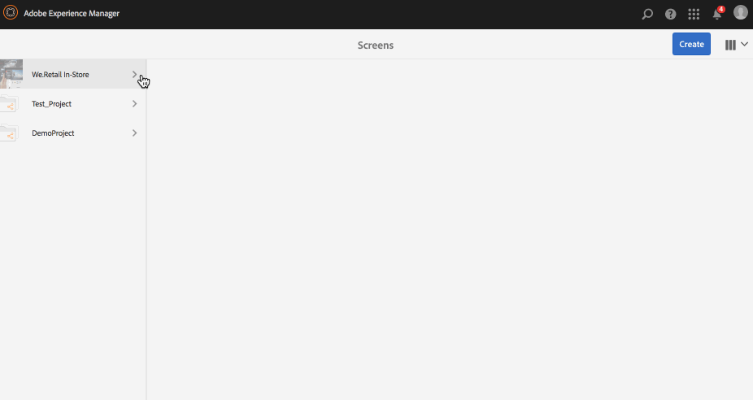

# Skapa och hantera en Live-kopia {#creating-and-managing-a-live-copy}

På den här sidan beskrivs hur du skapar och hanterar Live-kopior av kanaler.

En ***Live-kopia*** är en kopia av specifikt webbplatsinnehåll som har en aktiv relation med den ursprungliga källan. Den här realtidsrelationen gör att den aktiva kopian kan ärva innehåll och sidegenskaper från källan.

På den här sidan beskrivs hur du skapar en live-kopia av en kanal, visar egenskaper, kontrollerar status och sprider ändringar från en kanal till dess live-kopia.

## Skapa en Live Copy {#creating-a-live-copy}

Följ stegen nedan för att skapa en live-kopia av en kanal i projektmappen.

1. Klicka på länken Adobe Experience Manager (överst till vänster) och sedan **Screens**. Du kan också gå direkt till: `http://localhost:4502/screens.html/content/screens`.

1. Navigera till Screens-projekt och klicka på **Kanaler**.
1. Klicka på **Skapa** och klicka på **Live-kopia** så att du kan skapa en live-kopia av kanalen.
1. Klicka på målet och klicka på **Nästa**.
1. Klicka på den plats där live-kopian kan placeras.
1. Ange **Titel** och **Namn** på sidan **Skapa Live-kopia**.

1. Klicka på **Öppna** om du vill visa innehållet i den nya live-kopian eller **Klar** om du vill gå tillbaka till huvudsidan.

Du kan även se stegen nedan för visuell representation av hur du skapar en ny live-kopia av en kanal.

I följande exempel visas hur en live-kopia (***IdleLiveCopy***) för ***Inaktiv kanal*** skapas med målmappen som ***Kanaler***.

## Visa innehåll i Live Copy-kanalen {#viewing-content-of-the-live-copy-channel}

En live-kopia är en kopia av en befintlig kanal.

Om du vill visa innehållet i din live-kopia, se stegen nedan:

1. Navigera till Screens-projekt och klicka på den plats där du ursprungligen skapade en Live-kopia, som visas i avsnittet ovan. (Här valdes platsen som mappen **Kanaler**)

   

1. Klicka på **Redigera** i åtgärdsfältet.

   

   >[!NOTE]
   >
   >När du visar innehåll för en direktkopieringskanal visar du ett extra alternativ på menyn som **Live-kopieringsstatus**. Mer information finns i avsnittet nedan.

### Visa egenskaper för en Live-kopia {#viewing-properties-of-a-live-copy}

Du kan även visa egenskaperna för den aktiva kopiekanalen.

1. Navigera till den aktiva kopiekanalen och klicka på **Egenskaper** i åtgärdsfältet.

   

1. Klicka på fliken **Live-kopia** så att du kan visa information om kanalen.

   

### Live Copy-status {#live-copy-status}

I läget **Live Copy Status**, som visas i figuren nedan, kan du visa relationsstatus för alla resurser i kanalen.

1. Klicka på **Redigera** så att du kan välja **Live-kopieringsstatus**. Du kan också visa associationen mellan kanalinnehållet och den ursprungliga kanal som direktkopian genereras från.

   

1. Klicka på **Live-kopieringsstatus** så att du kan visa förhandsgranskningssidan.

   Alla resurser med grön kant visar att innehållet ärvs från den ursprungliga kanalen.

   

### Bryta arvet {#breaking-the-inheritance}

Du kan också avbryta arvet från den aktiva kopian, så att innehållet blir oberoende av den ursprungliga grenen.

I följande exempel visas att du klickar på bilden i redigeringsläget och klickar på ikonen **Avbryt arv** längst upp till höger.

### Sprida ändringar i Live Copy-kanalen {#propagating-changes-to-the-live-copy-channel}

Om du gör ändringar eller uppdateringar i den ursprungliga kanalen ska du även sprida dessa ändringar till den aktiva kopiekanalen.

Följ stegen nedan för att se till att dina ändringar sprids från den ursprungliga kanalen till den aktiva kopiekanalen:

1. Klicka på den ursprungliga kanalen (***Inaktiv kanal***) och klicka på **Redigera** i åtgärdsfältet.

   

1. Redigera kanalinnehållet. Ta till exempel bort en bild från den här kanalen.

   

1. Klicka på den aktiva kopian av kanalen (***IdleLiveCopy***) och klicka på **Redigera** i åtgärdsfältet. Observera att den bild du tog bort fortfarande är synlig i den aktiva kopian.

   Synkronisera kanalen om du vill sprida ändringarna.

   

1. Om du vill sprida ändringarna till den aktiva kopieringskanalen går du till AEM-kontrollpanelen och klickar på den aktiva kopieringskanalen och klickar på **Egenskaper** i åtgärdsfältet.

   

1. Klicka på fliken **Live-kopia** och klicka på **Synkronisera** i åtgärdsfältet.

   

1. Klicka på **Synkronisera** och sedan på **Spara och stäng** för att gå tillbaka till AEM kontrollpanel.

   

   Observera att bilden nu även tas bort från den aktiva kopieringskanalen.
