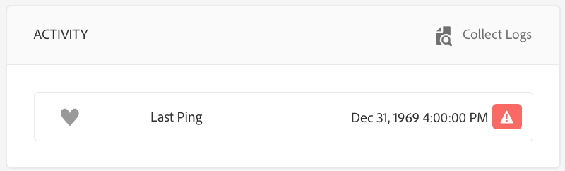

# Felsökning av Device Control Center {#troubleshooting-device-control-center}

Du kan övervaka och felsöka prestanda för din aktivitet och enhet för skärmuppspelning med hjälp av kontrollpanelen för enheter. Den här sidan innehåller information om hur du övervakar och felsöker upplevda prestandaproblem för skärmspelaren och de tilldelade enheterna.

## Övervaka och felsök från Device Control Center {#monitor-and-troubleshoot-from-device-control-center}

Du kan övervaka aktiviteten och därmed felsöka skärmspelaren med Device Dashboard.

### Instrumentpanel för enhet {#device-dashboard}

Följ stegen nedan för att navigera till kontrollpanelen för enheter:

1. Navigera till kontrollpanelen för enheten från ditt projekt, till exempel ***Testa projekt*** > ***Enheter***.

   Välj **Enheter** och **Enhetshanteraren** i åtgärdsfältet.

   

1. I listan visas de tilldelade och ej tilldelade enheterna, vilket visas i bilden nedan.

   

1. Välj enhet (**NewTestDevice**) och klicka på **Kontrollpanel** i åtgärdsfältet.

   

1. På sidan visas enhetsinformation, aktivitet och enhetsinformation som gör att du kan övervaka enhetsaktiviteter och -funktioner.

   

### Övervaka enhetsaktivitet {#monitor-device-activity}

The **Aktivitet** på panelen visas den senaste pingen av skärmspelaren med tidsstämpeln. Den senaste penseln motsvarar den senaste gången som enheten kontaktade servern.

Klicka på **Samla in loggar** från det övre högra hörnet av **Aktivitet** för att visa loggarna för spelaren.

### Uppdatera enhetsinformation {#update-device-details}

Kontrollera **Enhetsinformation** för att visa enhetens IP-adress, lagringsanvändning, firmware-version och spelarens drifttid för enheten.

Klicka på **Rensa cache** och **Uppdatera** för att rensa cacheminnet på din enhet och uppdatera [firmware](screens-glossary.md) från den här panelen.

Klicka även på **...** från det övre högra hörnet av **Enhetsinformation** för att starta om eller uppdatera spelarens status.

### Uppdatera enhetsinformation {#update-device-information}

Kontrollera **ENHETSINFORMATION** för att visa konfigurationsuppdateringen, enhetsmodellen, enhets-OS och gränssnittsinformationen.

Klicka på (**...**) i det övre högra hörnet av panelen Enhetsinformation för att visa egenskaper eller uppdatera enheten.

Klicka **Egenskaper** för att visa **Enhetsegenskaper** -dialogrutan. Du kan redigera enhetens titel eller välja alternativet för konfigurationsuppdateringar som **Manuell** eller **Automatisk**.

>[!NOTE]
>
>Mer information om de händelser som är associerade med enhetens automatiska eller manuella uppdateringar finns i avsnittet ***Automatiska eller manuella uppdateringar från enhetskontrollpanelen*** in [Hantera kanaler](managing-channels.md).

### View Player Screenshot {#view-player-screenshot}

Du kan visa skärmbilden för spelaren från enheten från **SPELARSKÄRMBILD** -panelen.

Klicka (**...**) i det övre högra hörnet av panelen Player-skärmbild och väljer **Uppdatera skärmbild** för att visa ögonblicksbilden av spelaren som körs.

### Hantera inställningar {#manage-preferences}

The **INSTÄLLNINGAR** kan användaren ändra inställningar för **Administratörsgränssnitt**, **Kanalväljare** och **Fjärrfelsökning** för enheten.

>[!NOTE]
>Mer information om detta alternativ finns i [AEM Screens Player](working-with-screens-player.md).

Klicka på **Inställningar** från det övre högra hörnet för att uppdatera enhetsinställningarna. Du kan uppdatera följande inställningar:

* **Server-URL**
* **Upplösning**
* **Starta om schemat**
* **Max. nr av loggfiler som ska behållas**
* **Loggnivå**

>[!NOTE]
>Du kan välja någon av följande loggnivåer:
>* **Inaktivera**
>* **Felsök**
>* **Info**
>* **Varning**
>* **Fel**

## Felsöka OSGi-inställningar {#troubleshoot-osgi-settings}

Du måste aktivera den tomma referenten för att enheten ska kunna skicka data till servern. Om t.ex. den tomma refereraregenskapen är inaktiverad, kan enheten inte publicera en skärmdump.

Vissa av dessa funktioner är för närvarande bara tillgängliga om *Apache Sling Referer-filtret Tillåt tomt* är aktiverat i OSGi-konfigurationen. Kontrollpanelen kan visa en varning om att skyddsinställningarna kan förhindra vissa av dessa funktioner från att fungera.

Följ stegen nedan för att aktivera filtret Tillåt tomt för Apache Sling Referrer

1. Navigera till **Konfiguration av Adobe Experience Manager Web Console**, det vill säga `https://localhost:4502/system/console/configMgr/org.apache.sling.security.impl.ReferrerFilter`.
1. Kontrollera **allow.empty** alternativ.
1. Klicka **Spara**.

### Recommendations {#recommendations}

I följande avsnitt rekommenderas övervakning av nätverkslänkar, servrar och spelare för att förstå hälsan och reagera på problem.

AEM har inbyggd övervakning för:

* *Hjärtslag* var 5:e sekund för att indikera att AEM Screens Player är i drift.
* *Skärmbild* från spelaren som visar vad som visas i spelaren.
* The *AEM Screens Player Firmware* version som är installerad på spelaren.
* *Ledigt lagringsutrymme* på spelaren.

Recommendations för fjärrövervakning med program från tredje part:

* CPU-användning för spelare.
* Kontrollera om AEM Screens Player-processen körs.
* Fjärrstarta om/starta om spelaren.
* Realtidsmeddelanden.

Vi rekommenderar att du driftsätter Player-maskinvaran och operativsystemet på ett sätt som gör att fjärrinloggning kan diagnostisera problem och starta om spelaren.

#### Ytterligare resurser {#additional-resources}

Se [Konfiguration och felsökning av videouppspelning](troubleshoot-videos.md) för att felsöka och felsöka videor som spelas upp i din kanal.
