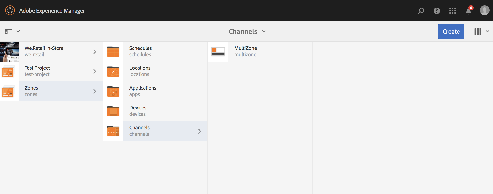

# Layout med flera zoner {#multi-zone-layout}

På följande sida beskrivs användningen av layout med flera zoner och följande avsnitt beskrivs:

* Översikt
* Skapa layout med flera zoner
* Förutsättningar
* Använda enskilda resurser i en eller flera zoner
* Använda sekvensinnehåll i en eller flera zoner

## Översikt {#overview}

***Med layout*** med flera zoner kan du skapa innehåll med flera zoner och använda olika resurser som videor, bilder och text som kan kombineras på en enda skärm. Du kan lägga in bilder, videor och text som gör att allt kan smälta samman och skapa en intuitiv digital upplevelse.

Enligt projektkraven behöver du ibland flera zoner i en kanal och kan redigera dem som en enda heltäckande enhet. Till exempel en produktsekvens med en relaterad feed för sociala medier som körs i tre separata zoner på en enda kanal.

## Skapa layout med flera zoner {#creating-multi-zone-layout}

När du skapar en kanal kan du använda olika mallar för att skapa zoner i kanalen. Du kan lägga till en bild, video eller en inbäddad kanal som gör att flera resurser kan visas i en sekvens.

### Förutsättningar {#prerequisites}

Innan du börjar implementera den här funktionen måste du se till att du har ett projekt redo som en förutsättning för att kunna börja implementera flerzonslayout. Exempel:

* Skapa ett AEM Screens-projekt med namnet **Zones**
* Skapa en visning under **Platser** med namnet **MultiZoneDisplay**

Skapa en kanal med namnet **MultiZone** i **Zones** -projekt. Följ stegen nedan:

**Skapa kanalen**

1. Markera Adobe Experience Manager-länken (överst till vänster) och sedan **Skärmar**. Du kan också gå direkt till: `http://localhost:4502/screens.html/content/screens`.
1. Navigera till mappen **Kanaler** och klicka på **Skapa** i åtgärdsfältet.

1. Välj **Vänster kanal** för delad skärm i L-fältet i guiden **Skapa** .

1. Klicka på **Nästa** och ange **titeln** som **MultiZone**.

1. Klicka på **Skapa** för att slutföra kanalskapandet.

### Använda enskilda resurser i en eller flera zoner {#using-single-assets-in-one-or-more-zones}

Du kan använda enstaka resurser som en bild eller en video i alla tre olika zoner. Följ stegen nedan för implementering:

1. **Lägga till innehåll i kanalen**

   1. Navigera till **Zones** —> **Channels**—>**MultiZone**.
   1. Markera **MultiZone** -kanalen och klicka på **Redigera** i åtgärdsfältet för att öppna redigeraren.
   

1. **Lägga till bilder i kanalen**

   Om du vill spela upp en enstaka bild eller en video i alla tre zonerna drar och släpper du bilden i kanalredigeraren enligt nedan.

   

### Använda sekvensinnehåll i en eller flera zoner {#using-sequenced-content-in-one-or-more-zones}

Om du vill att zonerna ska visa sekvenser av bilder eller innehåll och en statisk bild i tre olika zoner följer du stegen nedan för mer information.

1. **Skapa en kanalmapp**

   1. Navigera till **Zones** —> **MultiZone** —> **Channels** och klicka på **Create** i åtgärdsfältet.
   1. Välj **Kanalmapp** i guiden **Skapa** och klicka på **Nästa**.
   1. Ange titeln som **EmbeddedChannels** och klicka på **Create**.
   

1. **Lägga till ytterligare två kanaler i kanalmappen**

   1. Navigera till **Zones** —> **Channels** —> **EmbeddedChannels** och klicka på **Create** i åtgärdsfältet.
   1. Välj **Sekvenskanal** i guiden **Skapa** för att skapa en kanal med namnet** Zone1**.
   1. Välj **Zon1** och klicka på **Redigera** i åtgärdsfältet för att öppna redigeraren.
   1. Dra och släpp några bilder i den här kanalen.
   Skapa på samma sätt en annan sekvenskanal med namnet **Zone2** i mappen **EmbeddedChannels** .

   

1. **Lägga till inbäddade sekvenser/komponent i huvudkanalen (MultiZone)**

   1. Navigera till **Zones** —> **Channels** —> **MultiZone**.
   1. Klicka på **Redigera** i åtgärdsfältet för att öppna redigeraren.
   1. Dra och släpp den **inbäddade sekvenskomponenten** till två av zonerna enligt bilden nedan.
   

1. **Lägg till innehåll i alla tre zoner**

   1. Navigera till **Zones** —> **Channels** —> **MultiZone**.
   1. Markera den inbäddade sekvensen i någon av zonerna.
   1. Klicka på ikonen **Konfigurera** (skiftnyckel) för en av de inbäddade sekvenserna i redigeraren.
   1. Välj kanalsökvägen som **Zones** —> **Channels** —> **EmbeddedChannels** —> **Zone1**, vilket visas i bilden nedan.
   Lägg på samma sätt till **Zone2** i en annan inbäddad sekvenskomponent i redigeraren. Lägg också till en bild i den tredje zonen längst ned enligt nedan.

   

#### Visa resultatet {#viewing-the-result}

När du har implementerat layouter med flera zoner med de föregående stegen visas följande utdata, vilket visas i bilden nedan.

Följande utdata i Skärmspelaren visar innehållet i tre olika zoner. I den vänstra och högra zonen (båda använder inbäddad sekvens som en komponent) visas bildsekvenser och i zonen nedan visas en statisk bild.

