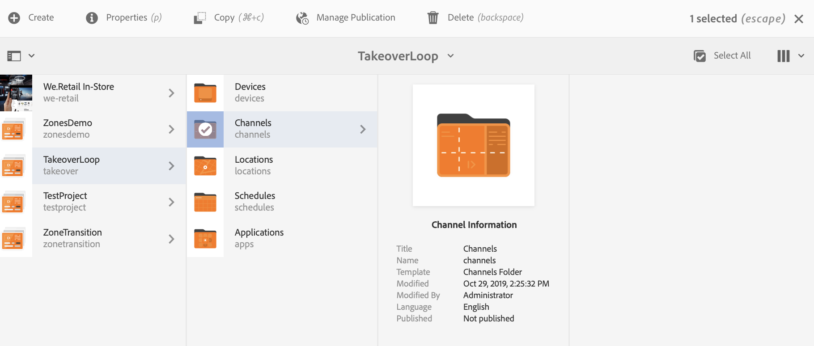
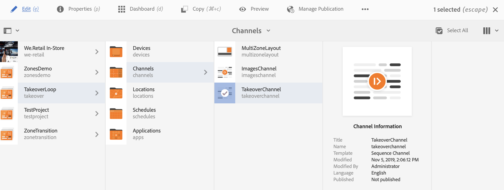

# Övergång mellan flera zoner och en zon {#multizone-to-singlezone-use-case}

## Använd fallbeskrivning {#use-case-description}

I det här avsnittet beskrivs ett exempel på hur du kan använda en flerzonslayoutkanal som växlar med en enzonslayoutkanal. Flerzonskanalen har sekvensbilder/videor och visar hur du kan ställa in ett projekt som växlar från flera zoner till en zon och omvänt.

### Förhandsvillkor {#preconditions}

Innan du börjar med det här användningsexemplet måste du förstå hur du gör:

* **[Skapa och hantera kanaler](managing-channels.md)**
* **[Skapa och hantera platser](managing-locations.md)**
* **[Skapa och hantera scheman](managing-schedules.md)**
* **[Enhetsregistrering](device-registration.md)**

### Primära aktörer {#primary-actors}

Innehållsförfattare

## Konfigurera projektet {#setting-up-the-project}

Följ stegen nedan för att konfigurera ett projekt:

1. Skapa ett AEM Screens-projekt med namnet **TakeoverLoop**, enligt nedan.

   

1. **Skapa en Screens-kanal med flera zoner**

   1. Klicka på mappen **Kanaler** och klicka på **Skapa** i åtgärdsfältet och öppna guiden så att du kan skapa en kanal.
   1. Klicka på **Delad skärmkanal för vänster-L-streck** i guiden och skapa kanalen **MultiZoneLayout**.
   1. Lägg till innehåll i kanalen. Dra och släpp resurserna till varje zon. I följande exempel visas en **MultiZoneLayout** -kanal som består av en video, en bild och en textbanderoll (i en inbäddad sekvens), vilket visas nedan.

   

   >[!NOTE]
   >
   >Mer information om hur du skapar en layout med flera zoner i din kanal finns i [Layout med flera zoner](multi-zone-layout-aem-screens.md).

1. Skapa en annan kanal med namnet **TakeoverChannel** till mappen **Channels** .

   

1. Klicka på **Redigera** i åtgärdsfältet så att du kan lägga till innehåll i den här kanalen. Lägg till en **Channel**-komponent och en bildresurs som du vill växla till för den här kanalen, enligt bilden nedan:

   

1. Öppna inställningarna för Channel-komponenten och peka på **MultiZoneLayout** -kanalen som du skapade i *steg 2*.

   

1. Ange längden från fältet **Sekvens** till **10000 millisekunder**.

   

1. Öppna på samma sätt inställningarna för bilden (resursen som du lade till) och ange dess varaktighet från fältet **Sekvens** till **3000 millisekunder**.

   

## Kontrollera förhandsvisningen {#checking-the-preview}

Du kan visa önskade utdata från spelaren eller bara genom att välja **Förhandsgranska** i redigeraren.

Utdata visar hur en flerzonslayout spelas upp för *10000 millisekunder*. Sedan växlar den till en layout med en zon som har en uppspelningstid på *3000 millisekunder*. Slutligen växlar den tillbaka till flerzonslayouten.

>[!VIDEO](https://video.tv.adobe.com/v/30366)

>[!NOTE]
>
>Du kan anpassa din kanalövergång (från flerzonslayout till enzonslayout eller omvänt) efter behov.
