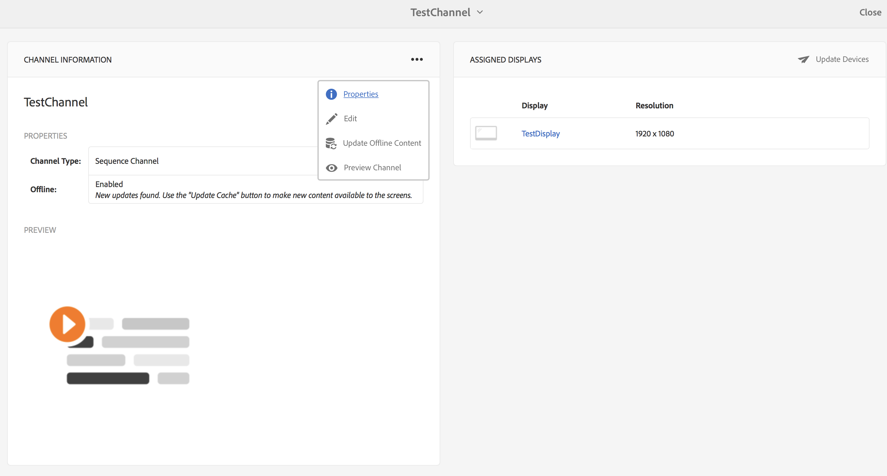

# Offlinekanaler {#offline-channels}

Skärmspelaren tillhandahåller offlinesupport för kanalerna genom att utnyttja tekniken ***ContentSync***.

Spelarna använder en lokal http-server för att hantera det uppackade innehållet.

När en kanal är konfigurerad att köra *online* visar spelaren kanalresurserna genom åtkomst till AEM, men när kanalen är konfigurerad att köra *offline* visar spelaren kanalresurserna från en lokal http-server.

Arbetsflödet för processen är följande:

1. Tolka de önskade sidorna
1. Samla in alla relaterade resurser
1. Paketera allt i en zip-fil
1. Ladda ned zip-filen och extrahera den lokalt
1. Visa lokal kopia av innehållet

## Uppdatera hanterare {#update-handlers}

***ContentSync*** använder uppdateringshanterare för att analysera och samla in alla nödvändiga sidor och resurser för ett visst projekt. AEM Screens använder följande uppdateringshanterare:

### Gemensamma alternativ {#common-options}

* *typ*: den uppdateringshanterartyp som ska användas
* *sökväg*: sökväg till resursen
* *[targetRootDirectory]*: målmapp i zip-filen

<table>
 <tbody>
  <tr>
   <td><strong>Typ</strong></td> 
   <td><strong>Beskrivning</strong></td> 
   <td><strong>Alternativ</strong></td> 
  </tr>
  <tr>
   <td>kanaler</td> 
   <td>samlar in en kanal</td> 
   <td>tillägg: tillägg för resursen som ska samlas in  [pathSuffix='']: suffix som ska läggas till i kanalsökvägen  </td> 
  </tr>
  <tr>
   <td>clientlib</td> 
   <td>samla in det angivna klientbiblioteket</td> 
   <td>[extension='']: kan vara antingen css eller js, för att endast samla in den första, eller bara den senare</td> 
  </tr>
  <tr>
   <td>assetrenditions</td> 
   <td>samla in resursåtergivningar</td> 
   <td>[renditions=[]]: lista över återgivningar som ska samlas in. Standardvärdet är den ursprungliga återgivningen</td> 
  </tr>
  <tr>
   <td>copy</td> 
   <td>kopiera den angivna strukturen från sökvägen</td> 
   <td> </td> 
  </tr>
 </tbody>
</table>

### Testar ContentSync-konfigurationen {#testing-contentsync-configuration}

Följ stegen nedan för att testa ContentSync-konfigurationen:

1. Öppna `https://localhost:4502/libs/cq/contentsync/content/console.html`
1. Välj din konfiguration i listan
1. Klicka på Rensa cache
1. Klicka på Uppdatera cache
1. Klicka på Hämta fullständig
1. Extrahera zip-filen
1. Starta en lokal server i den extraherade mappen
1. Öppna din startsida och kontrollera din appstatus

## Aktivera offlinekonfiguration för en kanal {#enabling-offline-config-for-a-channel}

Följ stegen nedan för att aktivera offlinekonfiguration för en kanal:

1. Inspect kanalinnehållet och kontrollera om det begärs från en AEM (Online).

   

1. Navigera till kanalkontrollpanelen och klicka på **..** i panelen **KANALINFORMATION** om du vill ändra egenskaperna.

   

1. Navigera till kanalegenskaperna och se till att kryssrutan är inaktiverad på fliken **Kanal**. Klicka på **Spara och stäng**.

   

   Klicka på **Uppdatera offlineinnehåll** innan innehållet distribueras korrekt till enheten.

   

   **Offline**-statusen under **EGENSKAPER** uppdateras också.

   

1. Inspect kanalinnehållet och kontrollera om det efterfrågas från den lokala spelarcachen.

   

>[!NOTE]
>
>Mer information om mallen för anpassade offline-resurshanterare och minimikraven i `pom.xml` för det specifika projektet finns i [Template for Custom Handlers](/help/user-guide/developing-custom-component-tutorial-develop.md#custom-handlers) i **Developing a Custom Component for AEM Screens**.