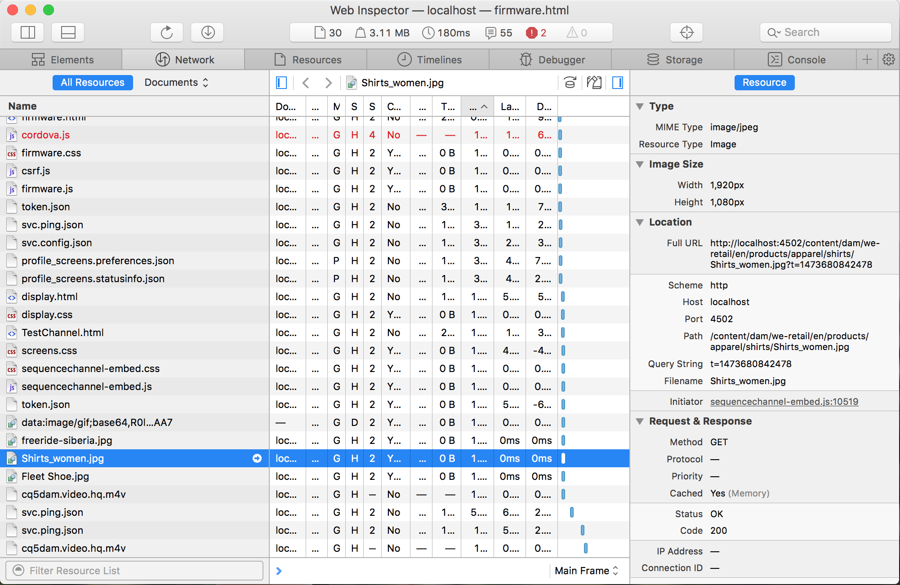
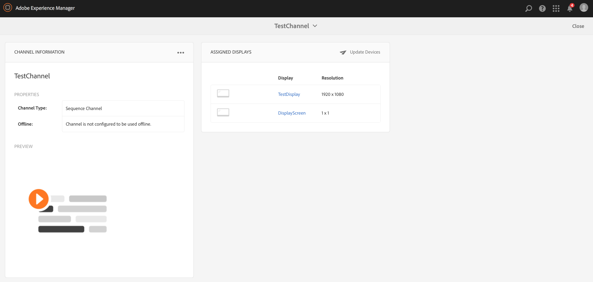

# Offlinekanaler {#offline-channels}

Screens Player ger kanalerna offlinesupport med ***ContentSync*** teknik.

Spelarna använder en lokal http-server för att hantera det uppackade innehållet.

När en kanal är konfigurerad att köras *online*, används för att visa kanalresurserna genom åtkomst till AEM. När kanalen är konfigurerad att köras *offline* spelaren visar kanalresurserna från en lokal http-server.

Arbetsflödet är följande:

1. Tolka de önskade sidorna.
1. Samla in alla relaterade resurser.
1. Paketera allt i en zip-fil.
1. Ladda ned zip-filen och extrahera den lokalt.
1. Visa lokal kopia av innehållet.

## Uppdatera hanterare {#update-handlers}

The ***ContentSync*** använder uppdateringshanterare för att analysera och samla in alla nödvändiga sidor och resurser för ett visst projekt. AEM Screens använder följande uppdateringshanterare:

### Vanliga alternativ {#common-options}

* *type*: den uppdateringshanterartyp som ska användas
* *bana*: sökväg till resursen
* *[targetRootDirectory]*: målmapp i zip-filen

<table>
 <tbody>
  <tr>
   <td><strong>Typ</strong></td> 
   <td><strong>Beskrivning</strong></td> 
   <td><strong>Alternativ</strong></td> 
  </tr>
  <tr>
   <td><code>channels</code></td> 
   <td>samlar in en kanal</td> 
   <td>tillägg: tillägg för resursen som ska samlas in  [pathSuffix='']: suffix att lägga till i kanalsökvägen  </td> 
  </tr>
  <tr>
   <td><code>clientlib</code></td> 
   <td>samla in angivet klientbibliotek</td> 
   <td>[extension='']: kan vara antingen css eller js, för att bara samla in den första, eller bara den senare</td> 
  </tr>
  <tr>
   <td><code>assetrenditions</code></td> 
   <td>samla in resursåtergivningar</td> 
   <td>[renditions=[]]: lista över renderingar som ska samlas in. Standardvärdet är den ursprungliga återgivningen</td> 
  </tr>
  <tr>
   <td><code>copy</code></td> 
   <td>kopiera den angivna strukturen från sökvägen</td> 
   <td> </td> 
  </tr>
 </tbody>
</table>

### Testar konfigurationen av ContentSync {#testing-contentsync-configuration}

Följ stegen nedan för att testa ContentSync-konfigurationen:

1. Öppna `https://localhost:4502/libs/cq/contentsync/content/console.html`
1. Klicka på konfigurationen i listan
1. Klicka på Rensa cache
1. Klicka på Uppdatera cache
1. Klicka på Hämta fullständig
1. Extrahera zip-filen
1. Starta en lokal server i den extraherade mappen
1. Öppna din startsida och kontrollera din appstatus

## Aktivera offlinekonfiguration för en kanal {#enabling-offline-config-for-a-channel}

Följ stegen nedan för att aktivera offlinekonfiguration för en kanal:

1. Inspect kanalinnehållet och kontrollera om det begärs från en AEM (Online).

   

1. Navigera till kanalkontrollpanelen.
1. Klicka **...** i **KANALINFORMATION** Panel.

   

1. Navigera till kanalegenskaperna.
1. Kontrollera att kryssrutan är inaktiverad på fliken (Kanal) och klicka sedan på **Spara och stäng**.

   

   Innan innehållet distribueras till enheten klickar du på **Uppdatera offlineinnehåll**.

   

   The **Offline** status under **EGENSKAPER** uppdateras även i enlighet med detta.

   

1. Inspect kanalinnehållet och kontrollera om det efterfrågas från den lokala spelarcachen.

   

>[!NOTE]
>
>Mer information om mallen för anpassade offlineresurshanterare och minimikraven i `pom.xml` för just det projektet, se [Mall för anpassade hanterare](/help/user-guide/developing-custom-component-tutorial-develop.md#custom-handlers) in **Utveckla en anpassad komponent för AEM Screens**.
