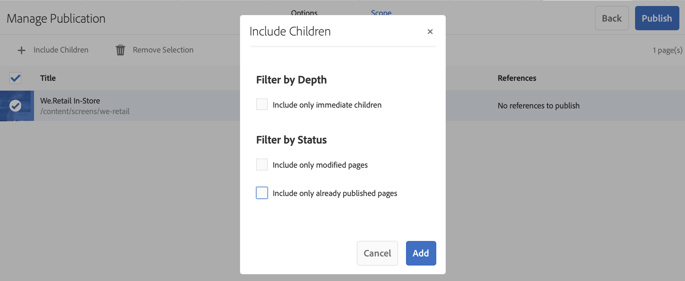
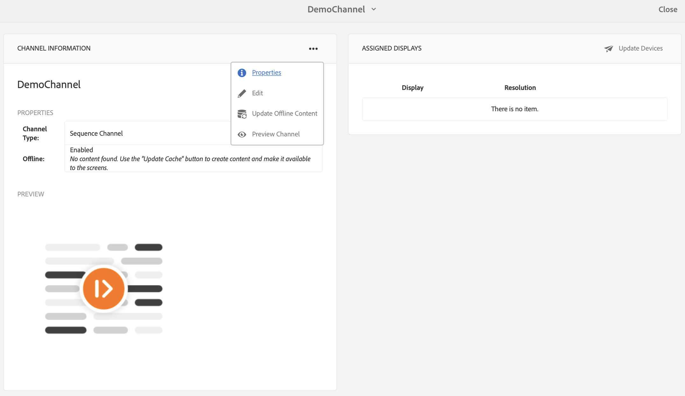

# On Demand Content Update {#on-demand}

I det här avsnittet beskrivs on-demand-innehåll för hantering av publikationer.

## Hantera publikation: Leverera innehållsuppdateringar från författare till enhet {#managing-publication-delivering-content-updates-from-author-to-publish-to-device}

Du kan publicera och avpublicera innehåll från AEM Screens. Med funktionen Hantera publikation kan du leverera innehållsuppdateringar från författare till publicering till enhet. Du kan publicera/avpublicera innehåll för hela ditt AEM Screens-projekt eller bara för en av dina kanaler, platser, enheter, program eller scheman.

### Hantera publikationer för ett AEM Screens-projekt {#managing-publication-for-an-aem-screens-project}

Följ stegen nedan för att leverera innehållsuppdateringar från författaren till en enhet för ett AEM Screens-projekt:

1. Gå till ditt AEM Screens-projekt.
1. Klicka på **Hantera publikation** i åtgärdsfältet för att publicera projektet till publiceringsinstansen.

   

1. The **Manage Publication** wizard opens. Du kan välja **åtgärden** och schemalägga publiceringstiden för tillfället eller senare. Klicka på **Nästa**.

   

1. Markera rutan om du vill välja hela projektet i guiden **Hantera publikation** .

   

1. Klicka på **+ Inkludera underordnade** i åtgärdsfältet och avmarkera alla alternativ för att publicera alla moduler i projektet och klicka på **Lägg** till för att publicera.

   >[!NOTE]
   >
   >Som standard markeras alla rutor och du måste avmarkera kryssrutorna manuellt för att publicera alla moduler i projektet.

   

   **Dialogrutan Inkludera underordnade**

   Steget ovan visar hur du kan publicera hela innehållet. Om du vill använda de andra tre alternativen måste du markera det alternativet.
I följande bild kan du till exempel bara hantera och uppdatera de ändrade sidorna i ditt projekt:
   

   Följ förklaringarna nedan för att förstå de tillgängliga alternativen:

   1. **Inkludera endast omedelbart underordnade**:
Med det här alternativet kan du bara hantera uppdateringar till undernoderna i projektstrukturen.
   1. **Inkludera endast ändrade sidor**:
Med det här alternativet kan du bara hantera uppdateringar av de ändrade sidorna i projektet där ändringarna finns i projektstrukturen.
   1. **Inkludera endast redan publicerade sidor**:
Med det här alternativet kan du bara hantera uppdateringar av sidor som publicerats tidigare.

1. Klicka på **Publicera** i guiden **Hantera publikation.**

   

   >[!NOTE]
   >
   >Vänta i några sekunder/minuter så att innehållet når publiceringsinstansen.
   >
   >
   >    1. Arbetsflödet fungerar inte om det inte finns några ändringar i projektet och inget för **Uppdatera offlineinnehåll**.
   >    1. Arbetsflödet fungerar inte om författaren inte slutför replikeringsprocessen (innehållet överförs fortfarande till publiceringsinstansen) efter att ha klickat på knappen **Publicera** i arbetsflödet för att hantera publiceringen.

   >[!CAUTION]
   >Om du som författare eller innehållsskapare vill se ändringarna i enheterna som är kopplade till författarinstansen klickar du på **Uppdatera offlineinnehåll** från kanalkontrollpanelen eller genom att markera projektet. I det här fallet utförs uppdateringen av offlineinnehåll endast i författarinstansen.

1. Navigera till projektet och klicka på **Uppdatera offlineinnehåll** i åtgärdsfältet. Den här åtgärden vidarebefordrar samma kommando för att publicera instansen, så att offlinepostmeddelandena även skapas i publiceringsinstansen.

   

   >[!NOTE]
   >
   >När du har slutfört arbetsflödet för att hantera publicering, och om det finns en spelare som pekar på författarinstansen, måste du utlösa uppdateringens offlineinnehåll i författaren, som skapar uppdateringen offline på författarinstansen.

   >[!CAUTION]
   >
   >Du måste utlösa uppdateringens offlineinnehåll i författarinstansen om du har en spelare registrerad på författarservern. Uppdatering av offlineinnehåll krävs inte för spelaren som är registrerad för publiceringsinstansen.

### Hantera publikation för en kanal {#managing-publication-for-a-channel}

Följ stegen nedan för att leverera innehållsuppdateringar från författaren till en enhet för en kanal i ett AEM Screens-projekt:

>[!NOTE]
>
>Följ bara det här avsnittet om det finns ändringar i en kanal. Om en kanal inte har några ändringar efter den tidigare uppdateringen av offlineinnehåll, kommer arbetsflödet för att hantera publicering för en enskild kanal inte att fungera.

1. Navigera till ditt skärmsprojekt och markera kanalen.
1. Klicka på **Hantera publikation** i åtgärdsfältet för att publicera kanalen till publiceringsinstansen.

   

1. The **Manage Publication** wizard opens. Du kan välja **åtgärden** och schemalägga publiceringstiden för tillfället eller senare. Klicka på **Nästa**.

   

1. Klicka på **Publicera** i guiden **Hantera publikation.**

   

   >[!NOTE]
   >
   >Vänta i några sekunder/minuter så att innehållet når publiceringsinstansen.

1. Om du utlöser **Uppdatera offlineinnehåll** i kanalkontrollpanelen skickas offlineinnehållet endast till författarinstansen, men inte till publiceringsinstansen. Steg 1-4 används för att överföra offlineinnehåll till publiceringsinstans.

   

   >[!CAUTION]
   >
   >Du måste först publicera och sedan utlösa uppdateringen av offlineinnehållet, vilket sammanfattas i föregående steg.

### Kanal- och enhetsomtilldelning: {#channel-and-device-re-assignment}

Om du har tilldelat om en enhet måste du publicera både den första och den nya skärmen när enheten har tilldelats till den nya skärmen.

Om du har omtilldelat en kanal måste du publicera både den inledande och den nya visningen när kanalen har omtilldelats den nya visningen.