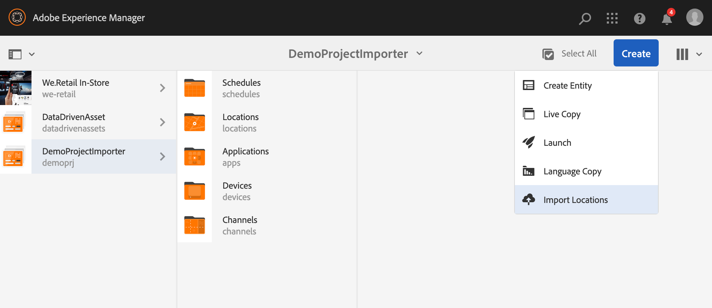

# Ny projektimporterare från fil {#new-project-importer-from-file}

I det här avsnittet beskrivs en funktion för att massimportera en uppsättning platser från ett CSV-/XLS-kalkylblad till ditt AEM Screens-projekt.

## Introduktion {#introduction}

När du skapar ett AEM Screens-projekt måste du skapa alla platser för första gången i organisationen. Om ditt projekt omfattar ett stort antal platser resulterar det i en långsam uppgift som innebär att du ofta klickar och väntar i användargränssnittet.

Målet med den här funktionen är att minska den tid som krävs för att ställa in projektet och därmed lösa budgeteringsproblem.

Genom att låta författaren tillhandahålla ett kalkylblad som en indatafil, och låta systemet automatiskt skapa platsträdet i bakänden, den här funktionen:

* *ger bättre prestanda än att klicka i användargränssnittet manuellt*
* *låter kunderna exportera de platser de har från sitt eget system och enkelt importera dem direkt till AEM*

Detta sparar både tid och pengar vid den första projektinstallationen eller vid utvidgning av den befintliga AEM Screens till nya platser.

## Arkitekturöversikt {#architectural-overview}

I följande diagram visas en översikt över arkitekturen för Project Importer-funktionen:

### Datamodell {#data-model}

Datamodellen för Project Importer beskrivs nedan:

>[!NOTE]
>
>Den aktuella versionen har bara stöd för importplatser.

| **Egenskap** | **Beskrivning** |
|---|---|
| ***path {string*}** | Resurssökvägen för platsen |
| ***[./jcr:title] {string*}** | Namnet på mallen som ska användas (d.v.s. platsen för *skärmar/core/templates/location*) |
| ***template {string}*** | Valfri titel att använda för sidan |
| ***[./jcr:description] {string}*** | Valfri beskrivning som ska användas för sidan |

Kalkylbladsfilen (CSV/XLS) kräver därför följande kolumner:

* **sökväg {string}** Sökvägen till platsen som ska importeras, där sökvägen är platsmappen för projektet (d.v.s.  */* foto importeras till  */content/screens/&lt;project>/locations/foo*)

* **mall {string}** Den mall som ska användas för den nya platsen är för närvarande det enda tillåtna värdet&quot;location&quot;, men detta kommer att utökas till alla skärmmallar i framtiden (&quot;display&quot;,&quot;sequencechannel, o.s.v.)
* **[./*] {string}** Valfri egenskap som ska anges på platsen (det vill säga, ./jcr:title, ./jcr:description, ./foo, ./bar). Den aktuella versionen tillåter för närvarande ingen filtrering

>[!NOTE]
>
>Alla kolumner som inte matchar villkoren ovan ignoreras. Om du t.ex. har en annan definierad kolumn i din bladfil (CSV/XLS) som inte är **sökväg**,**mall**,**titel** och **beskrivning** i filen, kommer dessa fält att ignoreras och **projektimporteraren** kommer inte att validera ytterligare kolumner fält för import av projekt till ditt AEM Screens-projekt.

## Använda projektimporteraren {#using-project-importer}

I följande avsnitt beskrivs hur projektimporteraren används i ett AEM Screens-projekt.

>[!CAUTION]
>
>Begränsningar:
>
>* Andra filer än CSV/XLS/XLSX-tillägg stöds inte i den aktuella versionen.
>* Det finns ingen filtrering av egenskaperna för importerade filer och något som börjar med &quot;./&quot; importeras.

>

### Förutsättningar {#prerequisites}

* Skapa ett nytt projekt med namnet **DemoProjectImport**

* Använd en CSV-exempelfil eller Excel-fil som du behöver importera.

I demosyfte kan du ladda ned en Excel-fil från avsnittet nedan.

[Hämta fil](assets/minimal-file.xls)

### Importerar filen med minst obligatoriska fält {#importing-the-file-with-minimum-required-fields}

Följ stegen nedan för att importera en fil till platsmappen med obligatoriska fält:

>[!NOTE]
>
>I följande exempel visas de minst fyra fälten som krävs för att importera projektet:

1. Gå till ditt AEM Screens-projekt (**DemoProjectImport**).

   

1. Välj projektet,** DemoProjectImporter **—>** Create **—>** Import Locations** från sidofältet.

   

1. Guiden **Importera** är öppen. Välj den fil som du har för ditt projekt med platser eller välj den fil (***minimum-file.xls***) som du hämtade från *Förutsättningar*.

   När du har markerat filen klickar du på **Nästa**.

   

1. Kontrollera filens innehåll (platserna) i importguiden och klicka på **Importera**.

   

1. Därför kan du nu visa alla platser som importerats till ditt projekt.

   

