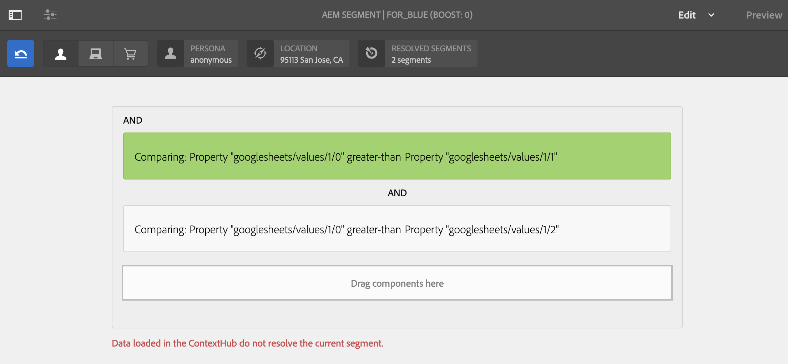

# Målinställd aktivering för butikslager {#retail-inventory-targeted-activation}

I följande exempel visas tre olika bilder baserat på värdena i Google-bladet.

## Beskrivning {#description}

Det här exemplet visar butikslagret för tre olika färgade tröjor. Beroende på hur många tröjor som finns i lager och som är inspelade i Google Sheets, visas bilden (röd, grön eller blå tröja) med det högsta antalet på skärmen.

I det här fallet visas den röda, gröna eller blå tröjan på skärmen baserat på det högsta antalet tröjor som är tillgängliga.

## Förhandsvillkor {#preconditions}

Innan du börjar implementera aktivering av lagerriktad marknadsföring (butik) ska du lära dig hur du ställer in ***Datalager***, ***Målgruppssegmentering*** och ***Aktivera mål för kanaler*** i ett AEM Screens-projekt.

Se [ContextHub konfigureras i AEM Screens](configuring-context-hub.md) för detaljerad information.

## Grundläggande flöde {#basic-flow}

Följ stegen nedan för att implementera användningsexemplet för butikslageraktivering:

1. **Fylla i Google-ark**

   1. Navigera till ContextHubDemo Google Sheet.
   1. Lägg till tre kolumner (röd, grön och blå) med motsvarande värden för tre olika tröjor.

   

1. **Konfigurera publikerna enligt kraven**

   1. Navigera till segmenten i målgruppen (se ***Steg 2: Konfigurera målgruppssegmentering*** in **[ContextHub konfigureras i AEM Screens](configuring-context-hub.md)** sida för mer information).

   1. Lägg till tre nya segment **For_Red**, **For_Green** och **För_blå**.

   1. Klicka **For_Red** och klicka **Redigera** i åtgärdsfältet.

   1. Dra och släpp **Comparison : Property - Property** till redigeraren.
   1. Klicka på **Konfiguration** -ikon.
   1. Klicka **googlesheets/value/1/2** från listrutan i **Första egenskapsnamnet**.
   1. Klicka på **Operator** as **större än** i listrutan.
   1. Klicka **Datatyp** as **tal**.
   1. Klicka **googlesheets/value/1/1** från listrutan i **Andra egenskapsnamnet**.
   1. Dra och släppa **en annan jämförelse: property - property** till redigeraren och klicka på **Konfiguration** -ikon.
   1. Klicka **googlesheets/value/1/2** från listrutan i **Första egenskapsnamnet**.
   1. Klicka på **Operator** as **större än** i listrutan.
   1. Klicka **Datatyp** as **tal**.
   1. Klicka **googlesheets/value/1/0** från listrutan i **Andra egenskapsnamnet**.

   

   På samma sätt kan du redigera och lägga till egenskapsregler för jämförelse i **För_blå** segmentet enligt figuren nedan:

   

   På samma sätt kan du redigera och lägga till egenskapsregler för jämförelse i **For_Green** segmentet enligt figuren nedan:

   

   >[!NOTE]
   >
   >Observera att för segment **For_Green** och **For_Green** går det inte att matcha data i redigeraren eftersom endast den första jämförelsen är giltig från och med nu enligt värdena i Google Sheet.

1. Navigera och klicka på **DataDrivenRetail** kanal (en sekvenskanal).
1. Klicka **Redigera** i åtgärdsfältet.

   

   >[!CAUTION]
   >
   >Du borde ha konfigurerat **ContextHub** **Konfigurationer** använda kanalen **Egenskaper** > **Personalisering** -fliken.

   

   >[!NOTE]
   >
   >Klicka på båda **Varumärke** och **Område** för att aktiviteterna ska visas korrekt när du startar målprocessen.

1. **Lägga till en standardbild**

   1. Lägg till en standardbild i kanalen och klicka på **Målinriktning**.
   1. Klicka **Varumärke** och **Aktivitet** i listrutan och klicka på **Börja målinrikta**.
   1. Klicka **Börja målinrikta**.

   

   >[!NOTE]
   >
   >Lägg till segmenten innan du börjar målinrikta (**For_Green**, **For_Red** och **För_blå**) genom att välja **+ Lägg till Experience Targeting** från sidospåret enligt figuren nedan.

   

1. Lägg till bilderna i alla tre olika scenarier enligt nedan.

   

1. **Kontrollera förhandsvisningen**

   1. Klicka **Förhandsgranska.** Du kan även öppna Google Sheet och uppdatera värdet.
   1. Ändra värdet för alla tre olika kolumner. Lägg märke till att visningsbilden uppdateras enligt det högsta värdet i lagret.

   
