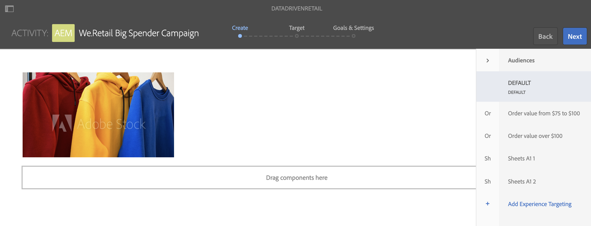

# Målinställd aktivering för butikslager {#retail-inventory-targeted-activation}

I följande exempel visas tre olika bilder baserat på värdena i Google-bladet.

## Beskrivning {#description}

Det här exemplet visar butikslagret för tre olika färgade tröjor. Beroende på hur många tröjor som finns i lager och som finns i Google Sheets, visas bilden (röd, grön eller blå tröja) med det högsta antalet.

Den röda, gröna eller blå tröjan visas baserat på det högsta värdet av antalet tillgängliga tröjor.

## Förhandsvillkor {#preconditions}

Innan du börjar implementera aktiveringen av målinriktningen för detaljhandelslager ska du lära dig hur du konfigurerar ***datalagret***, ***målgruppssegmentering*** och ***Aktivera målinriktning för kanaler*** i ett AEM Screens-projekt.

Mer information finns i [Konfigurera ContextHub i AEM Screens](configuring-context-hub.md).

## Grundläggande flöde {#basic-flow}

Följ stegen nedan för att implementera användningsexemplet för butikslageraktivering:

1. **Fylla i Google-blad**

   1. Navigera till ContextHubDemo Google Sheet.
   1. Lägg till tre kolumner (röd, grön och blå) med motsvarande värden för tre olika tröjor.

   

1. **Konfigurera målgrupperna enligt kraven**

   1. Navigera till segmenten i målgruppen (mer information finns i ***Steg 2: Konfigurera målgruppssegmentering*** i **[Konfigurera ContextHub på AEM Screens](configuring-context-hub.md)** -sidan).

   1. Lägg till tre nya segment, **For_Red**, **For_Green** och **For_Blue**.

   1. Klicka på **For_Red** och klicka på **Redigera** i åtgärdsfältet.

   1. Dra och släpp **Jämförelse: Egenskap - Egenskap** till redigeraren.
   1. Klicka på ikonen **Konfiguration** .
   1. Klicka på **Googlesheets/value/1/2** i listrutan i **First Property name**.
   1. Klicka på **Operator** och som **större än** i listrutan.
   1. Klicka på **Datatyp** och som **nummer**.
   1. Klicka på **Googlesheets/value/1/1** i listrutan i **Andra egenskapsnamnet**.
   1. Dra och släpp **en annan jämförelse: Egenskap - Egenskap** till redigeraren och klicka på ikonen **Konfiguration** .
   1. Klicka på **Googlesheets/value/1/2** i listrutan i **First Property name**.
   1. Klicka på **Operator** och som **större än** i listrutan.
   1. Klicka på **Datatyp** och som **nummer**.
   1. Klicka på **Googlesheets/value/1/0** i listrutan i **Andra egenskapsnamnet**.

   

   Du kan på liknande sätt redigera och lägga till egenskapsregler för jämförelse i segmentet **For_Blue** enligt bilden nedan:

   

   Du kan på liknande sätt redigera och lägga till egenskapsregler för jämförelse i segmentet **For_Green** enligt bilden nedan:

   

   >[!NOTE]
   >
   >Observera att för segmenten **For_Green** och **For_Green** går det inte att matcha data i redigeraren eftersom endast den första jämförelsen är giltig från och med nu enligt värdena i Google Sheet.

1. Navigera och klicka på din **DataDrivenRetail**-kanal (en sekvenskanal).
1. Klicka på **Redigera** i åtgärdsfältet.

   

   >[!CAUTION]
   >
   >Du bör redan ha konfigurerat din **ContextHub** **Configurations** med kanalens **Egenskaper** > **Personalization**-flik.

   

   >[!NOTE]
   >
   >Klicka på både **Varumärke** och **Område** för att aktiviteterna ska visas korrekt när du startar målprocessen.

1. **Lägger till en standardbild**

   1. Lägg till en standardbild i kanalen och klicka på **Mål**.
   1. Klicka på **Varumärke** och **Aktivitet** i listrutan och klicka på **Starta målgruppsanpassning**.
   1. Klicka på **Starta målanpassning**.

   

   >[!NOTE]
   >
   >Innan du börjar målinrikta lägger du till segmenten (**For_Green**, **For_Red** och **For_Blue**) genom att välja **+ Add Experience Targeting** från sidospåret enligt bilden nedan.

   

1. Lägg till bilderna i alla tre olika scenarier enligt nedan.

   

1. **Kontrollerar förhandsvisningen**

   1. Klicka på **Förhandsgranska.** Öppna även Google-bladet och uppdatera värdet.
   1. Ändra värdet för alla tre olika kolumner. Lägg märke till att visningsbilden uppdateras enligt det högsta värdet i lagret.

   
