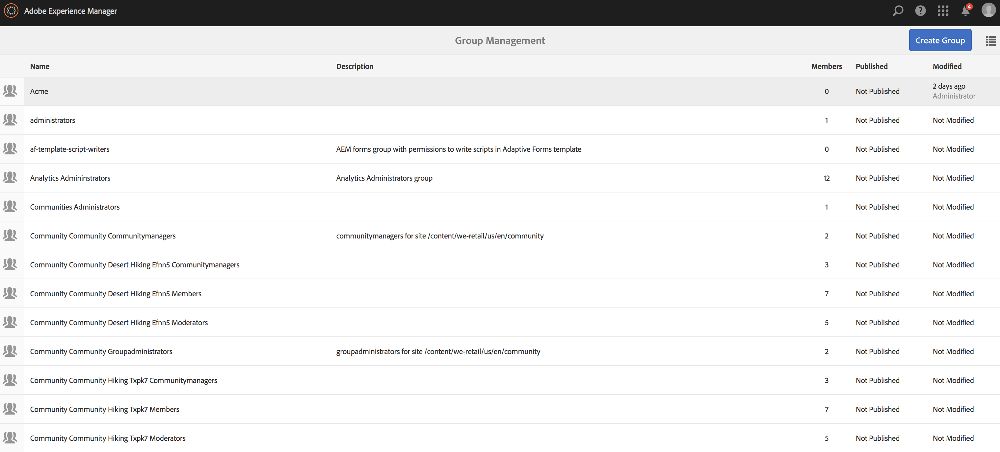

# Konfigurera åtkomstkontrollistor {#setting-up-acls}

I följande avsnitt beskrivs hur du skiljer ut projekt med hjälp av åtkomstkontrollistor så att varje enskild person eller grupp hanterar sitt eget projekt.

Som AEM-administratör vill du se till att teammedlemmar i ett projekt inte stör andra projekt och att var och en av användarna tilldelas särskilda roller enligt projektkraven.

## Konfigurera behörigheter {#setting-up-permissions}

I följande steg sammanfattas proceduren för att konfigurera åtkomstkontrollistor för ett projekt:

1. Logga in på AEM och gå till **Verktyg** > **Säkerhet**.

   

1. Klicka på **Grupper** och ange ett ID (till exempel Acme).

   Du kan också använda den här länken `http://localhost:4502/libs/granite/security/content/groupadmin.html`.

   Klicka sedan på **Spara**.

   

1. Välj **Medarbetare** i listan och dubbelklicka på den.

   

1. Lägg till **Acme** (projekt du skapat) i **Lägg till medlemmar i grupp**. Click **Save**.

   

   >[!NOTE]
   >
   >Om du vill att projektgruppsmedlemmar ska registrera spelare (vilket innebär att en användare skapas för varje spelare), söker du efter gruppanvändaradministratörerna och lägger till ACME-gruppen i användaradministratörerna

1. Lägg till alla användare som ska arbeta med **Acme** -projektet i **Acme** -gruppen.

   

1. Ange behörigheter för gruppen **Acme** med hjälp av det här `(http://localhost:4502/useradmin)`.

   Markera gruppen **Acme** och klicka på **behörigheterna**.

   

### Behörigheter {#permissions}

I följande tabell sammanfattas sökvägen med behörigheter på projektnivå:

| **Bana** | **Behörighet** | **Beskrivning** |
|---|---|---|
| `/apps/<project>` | LÄS | Ger åtkomst till projektfiler (om tillämpligt) |
| `/content/dam/<project>` | ALLA | Ger åtkomst till att lagra projektresurser som bilder eller video i DAM |
| `/content/screens/<project>` | ALLA | Tar bort åtkomst till alla andra projekt under /content/screens |
| `/content/screens/svc` | LÄS | Ger åtkomst till registreringstjänsten |
| `/libs/screens` | LÄS | Ger åtkomst till DCC |
| `/var/contentsync/content/screens/` | ALLA | Tillåter att offlineinnehåll för projektet uppdateras |

>[!NOTE]
>
>I vissa fall kan du separera författarfunktioner (som att hantera resurser och skapa kanaler) från administratörsfunktioner (som att registrera spelare). I ett sådant scenario skapar du två grupper och lägger till gruppen författare till medverkande och administratörsgruppen till både medverkande och användare-administratörer.

### Skapa grupper {#creating-groups}

När du skapar ett nytt projekt bör du även skapa standardanvändargrupper med en grundläggande uppsättning behörigheter. Du bör utöka behörigheterna till de typiska roller vi har för AEM-skärmar.

Du kan till exempel skapa följande projektspecifika grupper:

* Skärmar projektadministratörer
* Skärmar Projektledare (registrera spelare och hantera platser och enheter)
* Skärmar Projektanvändare (arbeta med kanaler, scheman och kanaltilldelningar)

I följande tabell sammanfattas grupperna med beskrivning och behörigheter för ett AEM Screens-projekt:

<table>
 <tbody>
  <tr>
   <td><strong>Gruppnamn</strong></td>
   <td><strong>Beskrivning</strong></td>
   <td><strong>Behörigheter</strong></td>
  </tr>
  <tr>
   <td>Skärmadministratörer  <em>skärmadministratörer</em></td>
   <td>Åtkomst på administratörsnivå för AEM-skärmar</td>
   <td>
    <ul>
     <li>Medverkande medlem</li>
     <li>Medlem av användaradministratörer</li>
     <li>ALL /content/screens</li>
     <li>ALL /content/dam</li>
     <li>ALL /content/experience-fragments</li>
     <li>ALL /etc/design/screens</li>
    </ul> </td>
  </tr>
  <tr>
   <td>Skärmar Användare  <em>skärmanvändare</em></td>
   <td>Skapa och uppdatera kanaler och tidsplaner och tilldela till platser i AEM-skärmar</td>
   <td>
    <ul>
     <li>Medverkande medlem</li>
     <li>&lt;project&gt; /content/screens</li>
     <li>&lt;project&gt; /content/dam</li>
     <li>&lt;project&gt; /content/experience-fragments</li>
    </ul> </td>
  </tr>
  <tr>
   <td>Skärmoperatorer  , <em>skärmoperatorer</em></td>
   <td>Skapa och uppdatera platsstruktur och registrera spelare på AEM-skärmar</td>
   <td>
    <ul>
     <li>Medverkande medlem</li>
     <li>jcr:all /home/users/screens</li>
     <li>jcr:all /home/groups/screens</li>
     <li>&lt;project&gt; /content/screens</li>
    </ul> </td>
  </tr>
  <tr>
   <td>Skärmspelare  <em>screens-we-retail-devices</em></td>
   <td>Grupperar alla spelare och alla spelare/enheter automatiskt.</td>
   <td>
 Medverkande medlem
 </td>
  </tr>
 </tbody>
</table>

