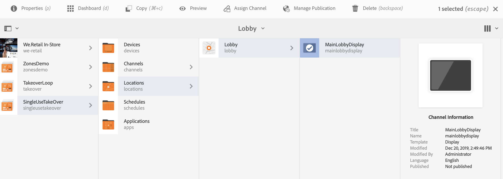

# Ta över kanal för engångsbruk {#single-use-takeover-channel}

På följande sida visas ett exempel på hur du använder ett projekt för att skapa en Single TakeOver-kanal som spelas upp en gång för en viss tid.

## Använd fallbeskrivning {#use-case-description}

I det här Use Case-exemplet beskrivs hur du skapar en kanal som *tar över* från den normala uppspelningskanalen för en visning eller grupp av skärmar. Övertagandet sker endast en gång och för en viss tid.

Det finns till exempel en Single TakeOver-kanal som spelas upp fredag 9:00 till 10:00. Under den här tiden ska ingen annan kanal spelas upp. Före och efter den här gången spelas kanalen för engångsbruk inte upp. I följande exempel visas hur en enda köpkanal skapas som gör att innehållet kan spelas upp i 2 minuter före 12:00 den 31 december till 12:01.

### Förhandsvillkor {#preconditions}

Innan du börjar med det här användningsexemplet måste du förstå hur du gör:

* **[Skapa och hantera kanaler](managing-channels.md)**
* **[Skapa och hantera platser](managing-locations.md)**
* **[Skapa och hantera scheman](managing-schedules.md)**
* **[Enhetsregistrering](device-registration.md)**

### Primära aktörer {#primary-actors}

Innehållsförfattare

## Konfigurera projektet {#setting-up-the-project}

Följ stegen nedan för att konfigurera ett projekt:

**Konfigurera kanaler och visning**

1. Skapa ett AEM Screens-projekt med namnet **SingleUseTakeOver**, vilket visas nedan.

   

1. Skapa en **MainAdChannel** i **Kanaler** mapp.

   

1. Välj **MainAdChannel** och klicka **Redigera** i åtgärdsfältet. Dra och släpp resurser (bilder, videoklipp, inbäddade sekvenser) i kanalen.

   

   >[!NOTE]
   >The **MainAdChannel** i det här exemplet demonstrerar en sekvenskanal som spelar upp innehåll kontinuerligt.

   

1. Skapa en **TakeOver** kanal som tar över innehållet i **MainAdChannel** och spelas endast upp för en viss dag och tid.

1. Välj **TakeOver** och klicka **Redigera** i åtgärdsfältet. Dra och släpp resurser i kanalen. I följande exempel visas en enzonsbild som lagts till i den här kanalen.

   

1. Konfigurera en plats och visning för kanalerna. Till exempel följande **Lobby** plats och  **MainLobbyDisplay** visas för det här projektet.

   

**Tilldela kanaler till en visning**

1. Välj visning **MainLobbyDisplay** från **Platser** mapp. Klicka **Tilldela kanal** i åtgärdsfältet.

   

   >[!NOTE]
   >Mer information om hur du tilldelar en kanal till en skärm finns i **[Kanaltilldelning](channel-assignment.md)**.

1. Fyll i fälten (**Kanalsökväg**, **Prioritet** och **Händelser som stöds**) från **Kanaltilldelning** och klicka **Spara**. Du har nu tilldelat **MainAdChannel** på skärmen.

   

1. Välj visning **TakeOver** från **Platser** mapp. Klicka **Tilldela kanal** från åtgärdsfältet så att du kan tilldela en övertagningskanal för engångsbruk.

1. Tilldela **TakeOver** kanal till din skärm vid en schemalagd tidpunkt och fyll i följande fält från **Kanaltilldelning** och klicka **Spara**:

   * **Kanalsökväg**: Välj sökvägen till TakeOver-kanalen
   * **Prioritet**: Ange den här kanalens prioritet som är högre än **MainAdChannel**. Prioriteten i det här exemplet är till exempel 8.

     >[!NOTE]
     >Prioriteten kan vara vilket värde som helst som är högre än prioritetsvärdet för den normala uppspelningskanalen.
   * **Händelser som stöds**: Välj **Inaktiv skärm** och **Timer**.
   * **Schema**: Ange texten för schemat som du vill att den här kanalen ska köra visningen. Texten här tillåter till exempel att innehållet spelas upp 2 minuter före 12:00 den 31 december till 12:01. Texten i **Schema** som nämns i det här exemplet *den 31 december efter 23.58 och även den 1 januari före 00.01*.

     

     Navigera till visningen från **SingleUseTakeOver** > **Platser** > **Lobby** > **MainLobbyDisplay** och klicka **Kontrollpanel** i åtgärdsfältet så att du kan visa de tilldelade kanalerna med deras prioriteringar, vilket visas nedan.

     >[!NOTE]
     >Det är obligatoriskt att ange övertagskanalens högsta prioritet.

     

>[!NOTE]
>
>Det är bäst att ta bort kanalen för enskild användning när den spelas upp.
