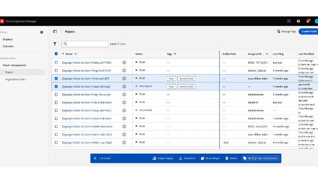

# Tagga på Screens Cloud {#tagging-on-Screens-Cloud}

>[!CAUTION]
>
>Funktionen **Taggning** är bara tillgänglig om den är aktiverad för din klientorganisation. Kontakta AEM Screens Engineering för att aktivera.

## Introduktion {#introduction}

Användare kan skapa taggar i Screens Cloud och använda dem för att klassificera skärmar och spelare.

## Skapa och hantera taggar {#create-and-manage-tags}

.

Använd samma åtgärdsmeny för att byta namn på en tagg eller ta bort dem.

>[!NOTE]
> 
> Totalt tillåts 500 taggar för en klient

## Hantera taggtilldelningar {#manage-tags-assignments}

Använd skapade taggar på bildskärmar och spelare.

.

>[!NOTE]
>
> En skärm eller spelare kan ha maximalt 30 taggar tilldelade.
> &#x200B;> Högst 30 objekt kan taggas på en gång.

## Filtrera efter taggar {#filter-by-tags}

Välj taggar om du vill filtrera listan med skärmar eller spelare.

.

>[!NOTE]
> 
> Taggar som definieras i Screens Cloud är inte relaterade till/synkroniserade med taggar som definieras i AEM.
> 
