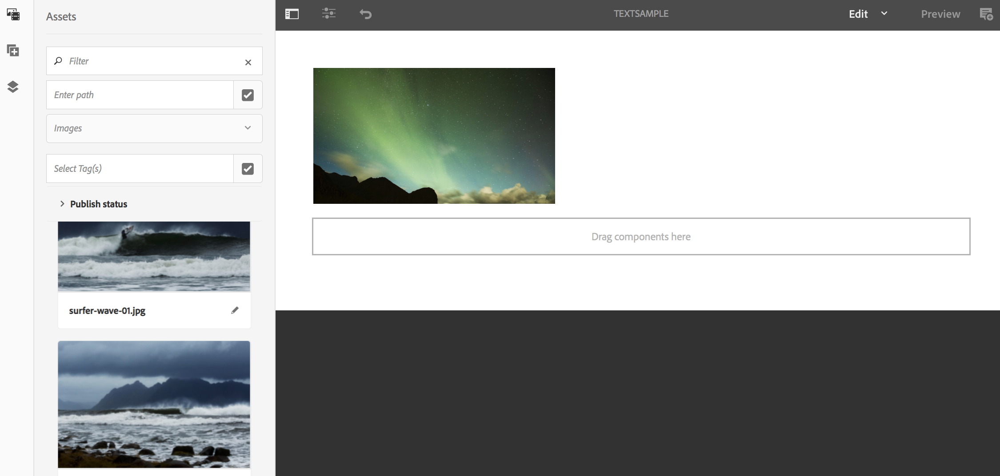

# Textövertäckning {#text-overlay}

Detta avsnitt behandlar följande ämnen:

* **Översikt**
* **Använda textövertäckning**
* **Förstå egenskaper för textövertäckning**
* **Använda ContextHub-värden i textövertäckning**

>[!CAUTION]
>
>The **Textövertäckning** finns bara om du har AEM 6.3 Feature Pack 5 eller AEM 6.4 Feature Pack 3.

## Ökning {#overview}

Textövertäckning är en funktion i AEM Screens som gör att du kan skapa en övertygande upplevelse i en sekvenskanal genom att ange en rubrik eller en beskrivning som läggs ovanpå en bild.

Mer information om hur du skapar en egen anpassad komponent finns i **Utöka en AEM Screens-komponent**.

I det här avsnittet visas bara hur du använder och använder förhandsgranskningskomponenten i ett AEM Screens-projekt och använder den som textövertäckning i en av sekvenskanalerna.

## Använda textövertäckning {#using-text-overlay}

I följande avsnitt beskrivs hur du använder textövertäckning i ett AEM Screens-projekt.

**Förutsättningar**

Innan du börjar implementera den här funktionen bör du kontrollera att du har konfigurerat ett projekt som en förutsättning för att börja implementera textövertäckning. Exempel:

* Skapa ett AEM Screens-projekt (i det här exemplet **TextOverlayDemo**)

* Skapa en sekvenskanal med namnet **TextExempel** under **Kanaler** mapp

* Lägg till innehåll i **TextExempel** Kanal

Följande bild visar **TextOverlayDemo** projekt med **TextExempel** kanal in **Kanaler** mapp.

Följ stegen nedan för att använda textövertäckning i en AEM Screens-kanal:

1. Navigera till **TextOverlayDemo** > **Kanaler** > **TextExempel** och klicka **Redigera** i åtgärdsfältet för att öppna redigeraren.

   

1. Markera bilden och klicka på **Konfigurera** (skiftnyckelsikon) för att öppna dialogrutan Egenskaper.

   

1. Välj **Textövertäckning** i navigeringsfältet i dialogrutan, vilket visas i bilden nedan.

   

### Förstå egenskaper för textövertäckning {#understanding-text-overlay-properties}

Med hjälp av egenskaperna för textövertäckning kan du lägga till text i någon av komponenterna i skärmprojektet. I följande avsnitt ges en översikt över de egenskaper som är tillgängliga i Textövertäckning:

Du kan lägga till en text i textrutan och lägga till typografisk betoning som fet, kursiv och understrykning.

**Färgvariant** Med det här alternativet kan texten antingen vara mörk (text i svart färg) eller Ljus (text i vit färg).

**Storlek och placering** Med det här alternativet kan användaren justera texten vågrätt eller lodrätt eller också använda finkorniga verktyg för textjustering.

>[!NOTE]
>
>Om du vill använda finkorniga verktyg på rätt sätt måste du se till att identifiera rätt position i pixlar med (px) som suffix, till exempel 200 px. Resultatet av det här uttrycket är 200 pixlar från startpunkten.

## Använda ContextHub-värden i textövertäckning {#using-text-overlay-context-hub}

I följande avsnitt beskrivs användningen av värden från ett datalager, till exempel Google sheets i textövertäckningskomponenten.

**Förutsättningar**

Konfigurera ContextHub för ditt AEM Screens-projekt.

Mer information om hur du konfigurerar och hanterar datadrivna resursändringar med hjälp av ett datalager finns i [ContextHub konfigureras i AEM Screens](https://experienceleague.adobe.com/docs/experience-manager-screens/user-guide/developing/configuring-context-hub.html).

När du har ställt in de konfigurationer som krävs för ditt projekt följer du stegen nedan för att använda värden från Google Sheets:

1. Navigera till **TextOverlayDemo** > **Kanaler** > **TextExempel** och klicka **Egenskaper** i åtgärdsfältet.

1. Välj **Personalisering** för att konfigurera ContextHub-konfigurationer.

   1. Välj **ContextHub-sökväg** as **libs** > **inställningar** > **molninställningar** > **standard** > **ContextHub-konfigurationer** och klicka **Välj**.

   1. Välj **Segmentsökväg** as **conf** > **skärmar** > **inställningar** > **wcm** > **segment** och klicka **Välj**.

   1. Klicka **Spara och stäng**.

      >[!NOTE]
      >
      >Använd ContextHub och Segments-sökvägen, där du först sparade dina kontextnavkonfigurationer och segment.

      

1. Navigera till **TextOverlayDemo** > **Kanaler** > **TextExempel** och klicka **Redigera** i åtgärdsfältet för att öppna redigeraren.

   

1. Lägga till en bild- och textövertäckningskomponent i bilden enligt beskrivningen i [Använda textövertäckning](/help/user-guide/text-overlay.md#using-text-overlay) på den här sidan.

1. Klicka på **Konfigurera** (skiftnyckelsikon) för att öppna **Bild** -dialogrutan.

   

1. Navigera till **ContextHub** -fliken från **Bild** -dialogrutan. Klicka **Lägg till**.

   >[!NOTE]
   >Om du inte har konfigurerat dina ContextHub-konfigurationer inaktiveras det här alternativet för ditt projekt.

1. Retur **Värde** i **Platshållare** fält. Markera raden där du vill hämta värdet från ditt Google-blad i **ContextHub-variabel**. I det här fallet hämtas värdet från rad 2 och kolumn 1 från Google-bladen. Nu öppnar du **Standardvärde** as **20**, vilket visas i bilden nedan. När du är klar klickar du på bockmarkeringen.

   

   >[!NOTE]
   >Följande bild visar det värde som hämtas från Google Sheets:

   

1. Navigera tillbaka till **Textövertäckning** i dialogrutan Bild och lägga till texten *Aktuell temperatur {Value}*, vilket visas i figuren nedan.

   

1. Klicka på **Förhandsgranska** för att visa önskade utdata.

   
