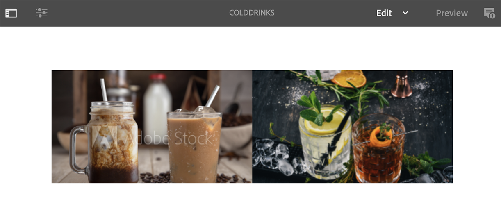
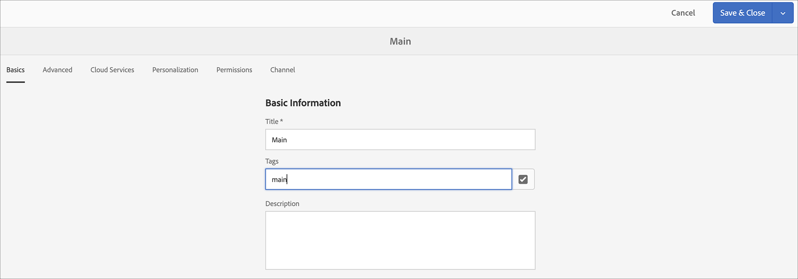
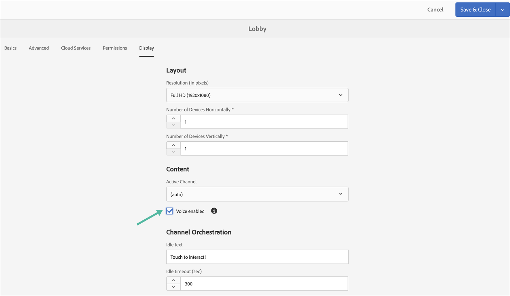

# Röstigenkänning i AEM Screens {#voice-recognition}

>[!IMPORTANT]
>
>**Viktig sekretessinformation**
>
>När du använder funktionen för röstigenkänning ska du följa alla tillämpliga juridiska och etiska riktlinjer för din region (inklusive, men inte begränsat till, att ge slutanvändarna ett synligt meddelande om att spelaren använder röstigenkänning). Adobe Inc., tar inte emot, lagrar eller bearbetar någon röstrelaterad information. AEM Screens-spelarna använder det standardwebbtal-API som är inbyggt i webbläsarmotorn. Bakom kulisserna skickar denna API en vågform av ditt tal till Googles servrar för konvertering från tal till text och den här texten matchas av spelaren mot konfigurerade nyckelord.
>
>Mer information finns i [Googles rapport om sekretess om API](https://www.google.com/chrome/privacy/whitepaper.html#speech) för webbtal.

Röstigenkänningsfunktionen tillåter innehållsändringar i en AEM Screens-kanal som styrs av röstinteraktion.

En innehållsförfattare kan konfigurera en visning som röstaktiverad. Syftet med den här funktionen är att ge kunderna möjlighet att använda tal som sätt att interagera med sina bildskärmar. Exempel på liknande användningsområden är att hitta produktrekommendationer i butiker, beställa menyalternativ på materier och restauranger. Den här funktionen ökar tillgängligheten för användarna och kan förbättra kundupplevelsen avsevärt.

>[!NOTE]
>Spelarens maskinvara måste stödja röstindata, t.ex. en mikrofon.

## Implementera röstigenkänning {#implementing}

>[!IMPORTANT]
> Röstigenkänningsfunktionen är bara tillgänglig i Chrome OS- och Windows-spelare.

Om du vill implementera röstigenkänning i ditt AEM Screens-projekt måste du aktivera röstigenkänningen för bildskärmen och associera varje kanal med en unik tagg för att utlösa en kanalövergång.

I följande avsnitt beskrivs hur du kan aktivera och använda funktionen Röstigenkänning i ett AEM Screens-projekt.

## Visa innehåll i helskärmsläge eller kanalbyte för delad skärm {#sequence-channel}

Innan du använder funktionen för röstigenkänning bör du kontrollera att du har ett projekt och en kanal med innehåll som har konfigurerats för ditt projekt.

1. I följande exempel visas ett demoprojekt med namnet **VoiceDemo** och tre sekvenskanaler **Main**, **ColdDrinks** och **HotDrinks**, vilket visas i bilden nedan.

   

   >[!NOTE]
   >
   >Mer information om hur du skapar en kanal eller lägger till innehåll i en kanal finns i [Skapa och hantera kanaler](/help/user-guide/managing-channels.md)

   Eller

   Du kan skapa tre sekvenskanaler: **Main**, **ColdDrinks** och **HotDrinks**, samt ytterligare en 1x2 Split Screen-kanal **SplitScreen** enligt bilden nedan.

   

1. Navigera till varje kanal och lägg till innehåll. Navigera till **VoiceDemo** —> **Kanaler** —> **Main** och markera kanalen. Klicka på **Redigera** i åtgärdsfältet för att öppna redigeraren och lägga till innehåll (bilder/videor) efter behov. Lägg på samma sätt till innehåll i både **ColdDrinks** och **HotDrinks** -kanalen.

   Kanalerna innehåller nu resurser (bilder), vilket visas i figurerna nedan.

   **Huvud**:

   

   **ColdDrinks**:

   

   **HotDrinks**:

   

   Om du har lagt till kanalen Dela skärmar i ditt projekt går du till **SplitScreen** och drar och släpper två inbäddade sekvenser och lägger till banor i både **ColdDrinks** - och **HotDrinks** -kanalen enligt bilden nedan.
   

### Konfigurera taggar för kanaler {#setting-tags}

När du har lagt till innehåll i kanalerna måste du navigera till var och en av kanalerna och lägga till lämpliga taggar som skulle utlösa röstigenkänningen.

Följ stegen nedan för att lägga till taggar i din kanal:

1. Navigera till varje kanal och lägg till innehåll. Navigera till **VoiceDemo** —> **Kanaler** —> **Main** och markera kanalen.

1. Klicka på **Egenskaper** i åtgärdsfältet.

   

1. Navigera till fliken **Grunderna** och markera en tagg som redan finns i fältet **Taggar** eller skapa en ny.

   Du kan antingen skapa en ny tagg genom att ange ett nytt namn för taggen och `return` träfftangenten, vilket visas i bilden nedan:

   

   Eller

   Du kan skapa taggar från AEM i förväg för ditt projekt och sedan välja dem också. När du har följt stegen som beskrivs i [Skapa taggar](#creating-tags)kan du markera taggen från platsen och lägga till den i kanalen, vilket visas i bilden nedan:

   

1. Lägg på samma sätt till taggen **hot** i **HotDrinks** -kanalen.

1. Om du använder en kanal för Delad skärm lägger du till båda taggarna (**hot** och **cold**) i kanalegenskaperna för **SplitScreen** .

   

1. Klicka på **Spara och stäng** när du är klar.

### Skapa taggar {#creating-tags}

Skapa taggar genom att följa stegen nedan:

1. Navigera till AEM.

1. Klicka på verktygen —> **Taggning**.
   

1. Klicka på **Skapa** —> **Skapa namnutrymme**.
   

1. Ange namnet på projektet, till exempel **Röstdemo** , och klicka på **Skapa**.

1. Välj projektet **VoiceDemo** och klicka på **Skapa tagg** i åtgärdsfältet.
   

1. Ange namnet på taggen och klicka på **Skicka**.
   

Nu kan du använda dessa taggar i ditt AEM Screens-projekt.

### Tilldela kanal till en bildskärm och aktivera röstigenkänning {#channel-assignment}

1. Skapa en visning i mappen **Platser** , som bilden nedan visar.

   

   >[!NOTE]
   >Mer information om hur du tilldelar en kanal till en skärm finns i [Skapa och hantera skärmar](/help/user-guide/managing-displays.md).

1. Tilldela kanalerna **Main**, **ColdDrinks** och **HotDrinks** till **LobbyDisplay**.

   >[!NOTE]
   >Om du har skapat en delad skärmkanal tilldelar du **SplitScreen** -kanalen till skärmen.

1. Ange följande egenskaper för varje kanal när du tilldelar kanalen.

   | **Kanalnamn** | **Prioritet** | **Händelser som stöds** |
   |---|---|---|
   | Huvud | 2 | Inledande inläsning, inaktiv skärm, timer |
   | HotDrinks | 1 | Användarinteraktion |
   | ColdDrinks | 1 | Användarinteraktion |

   >[!NOTE]
   >
   >Mer information om hur du tilldelar en kanal till en skärm finns i [Skapa och hantera skärmar](/help/user-guide/managing-displays.md).

1. När du har tilldelat kanaler till en visning går du till **LobbyDisplay** och väljer visningen. Välj **Egenskaper** i åtgärdsfältet.

1. Navigera till fliken **Visning** och aktivera alternativet **Röstaktiverat** under **Innehåll**.

   

   >[!IMPORTANT]
   >Det är obligatoriskt att aktivera funktionen för röstigenkänning från skärmen.

### Visa innehållet i Chrome Player {#viewing-content}

När de föregående stegen är slutförda kan du registrera din fönsterenhet för att visa utdata.

>[!NOTE]
>Läs mer i [Device Registration](device-registration.md) om hur du registrerar en enhet i en AEM Screens-spelare.

I det här exemplet visas utdata på en Chrome Player.

Huvudkanalen **** spelar upp innehållet, men när du använder ord med nyckelord som är **aktiva** , som *jag skulle vilja ha en het drink*, börjar kanalen spela upp innehållet i **HotDrinks** -kanalen.

Om du använder ord med ett nyckelord som **jag** skulle vilja ha något kallt *börjar kanalen spela upp innehållet i* ColdDrinks **** -kanalen.

I det här exemplet visas utdata på en Chrome Player.

Huvudkanalen spelar upp **huvudinnehållet** , men när du använder ord med nyckelord som är **varma** och **kalla** , som *jag skulle vilja se menyn för varma och kalla drycker*, börjar kanalen spela upp innehållet i **SplitScreen** -kanalen. Om du går tillbaka *till huvudmenyn* växlar den tillbaka till huvudkanalen.

