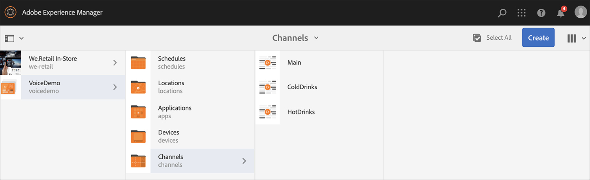

# Röstigenkänning i AEM Screens {#voice-recognition}

>[!IMPORTANT]
>
>**Viktig sekretessinformation**
>
>När du använder funktionen för röstigenkänning ska du följa alla tillämpliga juridiska och etiska riktlinjer för din region (inklusive, men inte begränsat till, att ge slutanvändarna ett synligt meddelande om att spelaren använder röstigenkänning). Adobe Inc., tar inte emot, lagrar eller bearbetar någon röstrelaterad information. AEM Screens-spelarna använder det standardwebbtal-API som är inbyggt i webbläsarmotorn. Bakom kulisserna skickar denna API en vågform av ditt tal till Google-servrar för konvertering från tal till text och den här texten matchas av spelaren mot konfigurerade nyckelord.
>
>Se [Google sekretessrapport om webbtalets-API](https://www.google.com/chrome/privacy/whitepaper.html#speech) för mer information.

Röstigenkänningsfunktionen tillåter innehållsändringar i en AEM Screens-kanal som styrs av röstinteraktion.

En innehållsförfattare kan konfigurera en visning som röstaktiverad. Syftet med den här funktionen är att ge kunderna möjlighet att använda tal som sätt att interagera med sina bildskärmar. Exempel på liknande användningsområden är att hitta produktrekommendationer i butiker, beställa menyalternativ på materier och restauranger. Den här funktionen ökar tillgängligheten för användarna och kan förbättra kundupplevelsen avsevärt.

>[!NOTE]
>Spelarens maskinvara måste stödja röstindata, t.ex. en mikrofon.

## Implementera röstidentifiering {#implementing}

>[!IMPORTANT]
> Röstigenkänningsfunktionen är bara tillgänglig i Chrome OS- och Windows-spelare.

Om du vill implementera röstigenkänning i ditt AEM Screens-projekt måste du aktivera röstigenkänningen för bildskärmen och associera varje kanal med en unik tagg för att utlösa en kanalövergång.

I följande avsnitt beskrivs hur du kan aktivera och använda funktionen för röstigenkänning i ett AEM Screens-projekt.

## Visa innehåll i helskärmsläge eller kanalbyte för delad skärm {#sequence-channel}

Innan du använder funktionen för röstigenkänning bör du kontrollera att du har ett projekt och en kanal med innehåll som har konfigurerats för ditt projekt.

1. I följande exempel visas ett demoprojekt med namnet **VoiceDemo** och tre sekvenskanaler **Huvud**, **ColdDrinks** och **HotDrinks**, vilket visas i figuren nedan.

   

   >[!NOTE]
   >
   >Mer information om hur du skapar en kanal eller lägger till innehåll i en kanal finns i [Skapa och hantera kanaler](/help/user-guide/managing-channels.md)

   Eller

   Du kan skapa tre sekvenskanaler **Huvud**, **ColdDrinks** och **HotDrinks** och ytterligare en 1 x 2-kanal för delade skärmar **SplitScreen** som visas i figuren nedan.

   

1. Navigera till varje kanal och lägg till innehåll. Navigera till exempel **VoiceDemo** > **Kanaler** > **Huvud** och markera kanalen. Klicka **Redigera** i åtgärdsfältet för att öppna redigeraren och lägga till innehåll (bilder/videor) efter behov. Lägg på samma sätt till innehåll i båda **ColdDrinks** och **HotDrinks** kanal.

   Kanalerna innehåller nu resurser (bilder), vilket visas i figurerna nedan.

   **Huvud**:

   

   **ColdDrinks**:

   

   **HotDrinks**:

   

   Om du har lagt till kanalen Dela skärmar i ditt projekt går du till **SplitScreen** och dra och släpp två inbäddade sekvenser och lägg till banor i båda **ColdDrinks** och **HotDrinks** kanal enligt bilden nedan.
   

### Konfigurera taggar för kanaler {#setting-tags}

När du har lagt till innehåll i kanalerna måste du navigera till var och en av kanalerna och lägga till lämpliga taggar som skulle utlösa röstigenkänningen.

Följ stegen nedan för att lägga till taggar i din kanal:

1. Navigera till varje kanal och lägg till innehåll. Navigera till exempel **VoiceDemo** > **Kanaler** > **Huvud** och markera kanalen.

1. Klicka **Egenskaper** i åtgärdsfältet.

   

1. Navigera till **Grunderna** och väljer en tagg som redan finns i **Taggar** eller skapa ett nytt fält.

   Du kan antingen skapa en ny tagg genom att ange ett nytt namn för taggen och trycka på `return` enligt figuren nedan:

   

   Eller

   Du kan också skapa taggar från AEM i förväg för ditt projekt och sedan markera dem. När du har följt de steg som beskrivs i [Skapa taggar](#creating-tags)kan du markera taggen från platsen och lägga till den i kanalen, vilket visas i bilden nedan:

   

1. På samma sätt lägger du till taggen med namnet som **hot** till **HotDrinks** kanal.

1. Om du använder en kanal för delade skärmar lägger du till båda taggarna (**hot** och **kall**) till **SplitScreen** kanalegenskaper, vilket visas i bilden nedan.

   

1. Klicka **Spara och stäng** när du är klar.

### Skapa taggar {#creating-tags}

Skapa taggar genom att följa stegen nedan:

1. Navigera till AEM.

1. Klicka på verktygsikonen > **Taggning**.
   

1. Klicka **Skapa** > **Skapa namnutrymme**.
   

1. Ange namnet på projektet, till exempel **VoiceDemo** och klicka **Skapa**.

1. Välj **VoiceDemo** projekt och klicka på **Skapa tagg** i åtgärdsfältet.
   

1. Ange namnet på taggen och klicka på **Skicka**.
   

Nu kan du använda de här taggarna i ditt AEM Screens-projekt.

### Tilldela kanal till en bildskärm och aktivera röstigenkänning {#channel-assignment}

1. Skapa en visning i **Platser** enligt bilden nedan.

   

   >[!NOTE]
   >Mer information om hur du tilldelar en kanal till en skärm finns i [Skapa och hantera skärmar](/help/user-guide/managing-displays.md).

1. Tilldela kanalerna **Huvud**, **ColdDrinks** och **HotDrinks** till **LobbyDisplay**. Om du använder **SplitScreen** för projektet, se till att du tilldelar även den till visningen.

   >[!NOTE]
   >Om du har skapat en delad skärmkanal tilldelar du **SplitScreen** till webbkanalen.

1. Ange följande egenskaper för varje kanal när du tilldelar kanalen.

   | **Kanalnamn** | **Prioritet** | **Händelser som stöds** |
   |---|---|---|
   | Huvud | 2 | Inledande inläsning, inaktivitetsskärm, timer |
   | HotDrinks | 1 | Användarinteraktion |
   | ColdDrinks | 1 | Användarinteraktion |
   | SplitScreen | 1 | Användarinteraktion |

   >[!NOTE]
   >
   >Mer information om hur du tilldelar en kanal till en skärm finns i [Skapa och hantera skärmar](/help/user-guide/managing-displays.md).

1. När du har tilldelat kanaler till en skärm går du till **LobbyDisplay** och väljer visningen. Välj **Egenskaper** i åtgärdsfältet.

1. Navigera till **Visa** och aktivera **Röstaktivering** option under **Innehåll**.

   

   >[!IMPORTANT]
   >Det är obligatoriskt att aktivera funktionen för röstigenkänning från skärmen.

### Visa innehållet i Chrome Player {#viewing-content}

När de föregående stegen är slutförda kan du registrera din fönsterenhet för att visa utdata.

>[!NOTE]
>Se [Enhetsregistrering](device-registration.md) om du vill lära dig hur du registrerar en enhet på en AEM Screens-spelare.

**Önskad utdata för sekvenskanal**

The **Huvud** innehållet spelas upp i kanalen, men när du använder ord med nyckelord **hot** som *Jag skulle vilja ta en drink.* börjar kanalen spela upp innehållet i **HotDrinks** kanal.

På samma sätt om du använder ord med ett nyckelord **kall** som *Jag skulle vilja ha någonting kallt* börjar kanalen spela upp innehållet i **ColdDrinks** kanal.

**Önskad utdata för kanalen för delade skärmar**

The **Huvud** innehållet spelas upp i kanalen, men när du använder ord med nyckelord **hot** och **kall** tillsammans med *Jag vill se menyn för varma och kalla drycker* börjar kanalen spela upp innehållet i **SplitScreen** kanal. Om du säger *tillbaka till huvudmenyn*, går den tillbaka till huvudkanalen.
