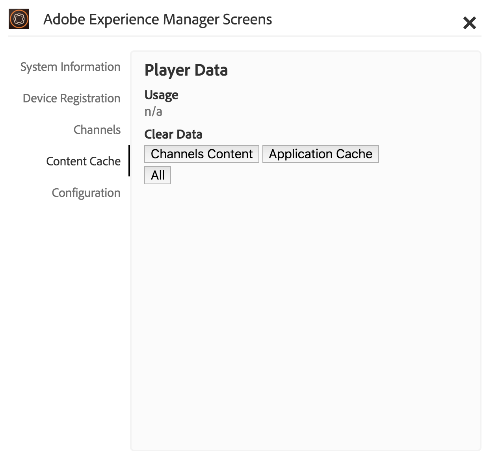

# Arbeta med AEM Screens Player

Du kan hantera kanalinnehållet och andra inställningar i AEM Screens Player.

>[!NOTE]
>
>Tryck ***Ctrl+Cmd+F*** så att du kan avsluta helskärmsläget för OS X AEM Screens Player.

När du har tilldelat en kanal till en skärm visas innehållet i AEM Screens Player. Du kan antingen konfigurera inställningar för spelaren med hjälp av inställningarna för administratörsgränssnittet (från kontrollpanelen) eller från spelaren.

## Använda enhetskontrollpanelen {#using-the-device-dashboard}

Du kan konfigurera inställningar för enheten från enhetskontrollpanelen, som du kommer åt via AEM.

1. Navigera till kontrollpanelen för enheten från ditt projekt, till exempel ***Testa projekt*** > ***Enheter***.

   Välj **Enheter** och **Enhetshanteraren** i åtgärdsfältet.

   

1. Klicka på enheten så att du kan öppna enhetens kontrollpanel.

   

1. Kontrollera **INSTÄLLNINGAR** -panelen. Du kan aktivera/inaktivera **Administratörsgränssnitt** och **Kanalväljare** för din spelare av dessa två alternativ.

   

### Användargränssnittet för administratörer {#the-admin-ui}

Aktivera **Administratörsgränssnitt** på inställningspanelen kan användaren öppna administratörsinställningarna från skärmspelaren. Om du inaktiverar det här alternativet från enhetens kontrollpanel kan användaren inte öppna administratörsgränssnittet från spelaren.

Om du vill visa administratörsgränssnittet från skärmspelaren trycker du länge på det övre vänstra hörnet för att öppna Admin-menyn, på den beröringsaktiverade AEM Screens-spelaren eller med en mus. Informationen visas när registreringen är klar och kanalerna har lästs in.

>[!NOTE]
>
>Du kan även visa AEM Screens Player-appens drifttid för att kontrollera programmets hälsostatus.

#### Åtkomst till alternativen på menyn Konfiguration {#configuration-options}

Du kan uppdatera dina konfigurationer om du väljer **Konfiguration** från sidomenyn, enligt bilden nedan:

På menyn Konfiguration kan du ändra följande inställningar:

* Återställ **Firmware**, **Inställningar**, eller **Till fabrik** från den här dialogrutan.

* Ange det maximala antalet loggfiler som du vill behålla för en AEM Screens-spelare i **Max. nr av loggfiler som ska behållas**.

* Aktivera eller inaktivera **Admin-menyn**, **Kanalväljare** och **Aktivitetsgränssnitt** för skärmspelaren.

  Om **Aktivitetsgränssnitt** är aktiverat från **Konfiguration** visas AEM Screens-spelaren *meddelanden om spelaraktivitet* i det övre högra hörnet av spelaren, vilket visas i bilden nedan.

  

>[!NOTE]
>
>The **Uppdatera inbyggd programvara** fungerar bara på Cordova, till exempel Android™-spelare.

>[!NOTE]
>
>Vi rekommenderar att **Administratörsgränssnitt** inaktiveras i produktionsdistributioner.

#### Åtkomst till menyalternativ för innehållscache {#content-cache-options}

Du kan rensa cache för kanaler och program från administratörsgränssnittet i AEM Screens Player.

Välj **Innehållscache** från sidospåret så att du kan uppdatera cachen.

### Kanalväxlaren {#the-channel-switcher}

Aktivera **Kanalväljare** på panelen Inställningar kan användaren öppna kanalvalet/inställningarna från Skärmspelaren.

Om du inaktiverar det här alternativet från kontrollpanelen för enheter kan användaren inte styra kanalinställningarna från skärmspelaren.

Du kan växla och styra inställningarna för kanalen från skärmspelaren.

Om du vill visa kanalväljaren från spelaren trycker du länge på det nedre vänstra hörnet för att öppna kanalväljaren som tillåter att kanaler och andra funktioner växlas.

>[!NOTE]
>
>Du kan också aktivera eller inaktivera admin-menyn och kanalväljaren för spelaren från skärmspelaren.
>
>(Se *Ändra inställningar från Skärmspelaren* (se avsnittet nedan).

### Hantera inställningar från AEM Screens Player

Du kan också ändra inställningarna för administratörsgränssnittet och kanalväljaren från själva spelaren.

Så här ändrar du inställningar från spelaren:

1. Tryck länge på det övre vänstra hörnet i den inaktiva kanalen för att öppna administratörspanelen.
1. Navigera till **Konfiguration** från den vänstra åtgärdsmenyn.
1. Aktivera/inaktivera konfiguration för **Administratörsgränssnitt** eller **Kanalväljare**.

## Felsöka AEM Screens Player

Du kan felsöka olika problem som rör AEM Screens Player (maskinvara och programvara):

| **Problem** | **Recommendations** |
|---|---|
| Spelarlagringen är full | Eliminera onödiga filer |
| Spelaren förlorade nätverket | Använd katt-5/katt-6-kabel. För wifi ska du minska avståndet från routern till spelarenheten |
| AEM Screens Player kraschade | Vi rekommenderar att du har en app som kontrollerar att AEM Screens Player alltid körs |
| Inställningar för förlorad AEM Screens Player | Kontrollera anslutning till AEM server |
| AEM Screens Player startar inte automatiskt efter omstart/omstart av spelaren | Kontrollera operativsystemets startmapp eller initieringsprocedur |
| AEM Screens Player visar fel/gammalt innehåll | Kontrollera nätverksanslutning |

### Uppdateringar för AEM Screens Player

Det finns två typer av uppdateringar för AEM Screens Player:

| **Metod** | **Information** | **via fjärr** | **Automatiserad** | **0 Driftavbrott** |
|---|---|---|---|---|
| Uppdatering av inbyggd programvara | Används på befintliga installerade spelare med hjälp av fjärrkommando. Efter uppdateringen läses spelaren in automatiskt igen med det befintliga innehållet. | Ja | Egen | Nästan - 1-3 sekunder |
| Uppdateringar för spelargränssnitt | Det här är en ny körbar fil som ska distribueras på spelaren. Detta kräver att du fjärrkopierar en ny binär fil i spelaren och stoppar den pågående körningen och startar den nya versionen. Detta kan kräva att du hämtar förinläsningen av paketen igen. | Ja (via fjärrgränssnitt) | Egen | Nej |

## Riktlinjer för val av maskinvara för spelarenhet {#hardware-selection-guidelines-for-player-device}

Följande avsnitt innehåller riktlinjer för val av maskinvara för ett skärmsprojekt:

* Alltid källa ***Kommersiellt*** eller ***Industriindustri*** Betygsätt komponenter för både PC Player och Display Panel eller Projector.

* Samarbeta alltid med leverantörer som levererar digitala signaturer.
* Ta alltid hänsyn till miljöfaktorer som omgivningstemperatur och relativ luftfuktighet.
* Granska alltid effektkrav och energikonditionering.
* Granska noggrant prestandabehov och I/O-portar som krävs för programmet.

I följande tabell sammanfattas maskinvarukonfigurationerna med typiska användningsfall för ett AEM Screens-projekt:

<table>
 <tbody>
  <tr>
   <td>Spelarkonfiguration</td>
   <td>Processor</td>
   <td>Minne</td>
   <td>Lagring SSD</td>
   <td>GPU</td>
   <td>Visa</td>
   <td>I/O</td>
   <td>Vanliga användningsfall</td>
  </tr>
  <tr>
   <td>Grundläggande</td>
   <td>Intel® Atom-processor med dubbla kärnor, i3 eller fyra kärnor på ingångsnivå</td>
   <td>
4 GB minne
 
2 MB cache
 </td>
   <td>
*ChromeOS 32 GB
 
*Windows 128 GB
 </td>
   <td>OnBoard</td>
   <td>1920 x 1080</td>
   <td>DVI  Ethernet/trådlöst  2 x USB</td>
   <td>
    <ul>
     <li>Helskärmsloop som standard  </li>
     <li>Dag-parsning</li>
    </ul> </td>
  </tr>
  <tr>
   <td>Standard</td>
   <td>Intel® Core™ i5-processor med fyra kärnor</td>
   <td>
8 GB minne
 
4 MB cache
 </td>
   <td>128 GB</td>
   <td>OnBoard</td>
   <td>3840x2160 (<code>4K</code>)</td>
   <td>DVI, HDMI  Ethernet/trådlöst,  2 x USB</td>
   <td>
    <ul>
     <li>Dynamiskt innehåll med en källa</li>
     <li>Enkel interaktiv</li>
     <li>1-3 zonlayouter</li>
    </ul> </td>
  </tr>
  <tr>
   <td>Avancerat</td>
   <td>Intel® Core™ i7-processor med fyra kärnor och hypertrådning</td>
   <td>
16 GB minne
 
8 MB cache
 </td>
   <td>256 GB</td>
   <td>Dedikerad grafikprocessor</td>
   <td>3840x2160 (<code>4K</code>)</td>
   <td>DVI, HDMI  Ethernet/trådlöst,  4xUSB</td>
   <td>
    <ul>
     <li>4 eller fler innehållszoner, samtidiga videouppspelningar</li>
     <li>Flersidig interaktiv</li>
     <li>Datautlösare med flera källor</li>
    </ul> </td>
  </tr>
 </tbody>
</table>
